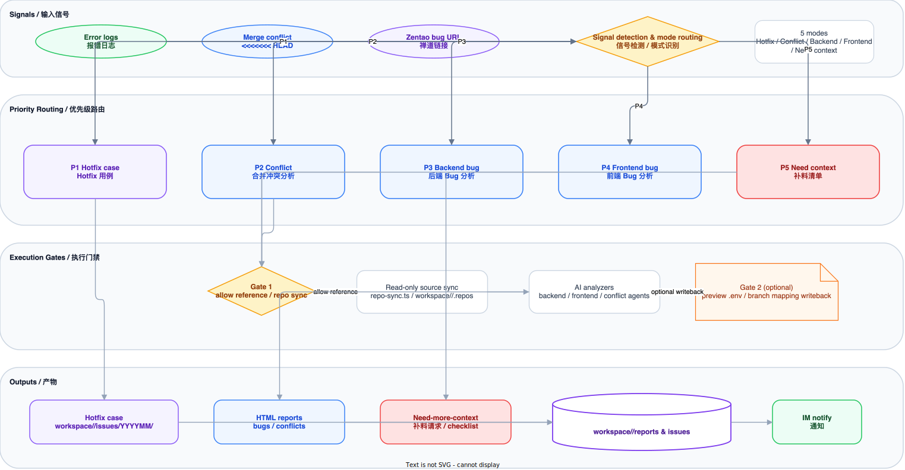

<div align="center">

# QAFlow - 2.0

### AI-Powered QA Workflow Engine

<br />

An intelligent QA workflow engine built on **Claude Code Skills**
From requirements to test cases, from bug analysis to UI automation — all-in-one QA coverage

<br />

[](https://nodejs.org/)
[](https://claude.com/claude-code)
[](https://playwright.dev/)
[](./LICENSE)
[](./package.json)

<br />

**English** | **[Chinese](./README.md)**

<br />

```
PRD / Lanhu / historical cases ── /test-case-gen ──> XMind (A) + Archive MD (B)
Error logs / conflicts / Zentao ─ /code-analysis ──> HTML reports / Hotfix cases
Existing XMind ────────────────── /xmind-editor ────> Preview → Confirm → Write
Archive MD + URL ──────────────── /ui-autotest ─────> Self-healing regression → Reports / Notifications
```

</div>

<br />

---

## Table of Contents

- [Features](#features)
- [Architecture Overview](#architecture-overview)
- [Quick Start](#quick-start)
- [Workflow Details](#workflow-details)
  - [Test Case Generation](#1-test-case-generation-test-case-gen)
  - [Code Analysis](#2-code-analysis-code-analysis)
  - [XMind Editor](#3-xmind-editor-xmind-editor)
  - [UI Automation](#4-ui-automation-ui-autotest)
- [Plugin System](#plugin-system)
- [Project Structure](#project-structure)
- [Script CLI Reference](#script-cli-reference)
- [Configuration](#configuration)
- [Contributing](#contributing)
- [License](#license)

---

## Features

| Feature                        | Description                                                                                                      |
| ------------------------------ | ---------------------------------------------------------------------------------------------------------------- |
| **7 Skills / 5 Core Workflows** | `qa-flow` Router + `setup` + 5 primary execution workflows from initialization to delivery                      |
| **13-Agent Architecture**      | Specialized agents declare model/tools in frontmatter and are dispatched by Skills based on task complexity     |
| **Project-Scoped Workspace**   | All artifacts are written into `workspace/&lt;project&gt;/...`, keeping projects isolated                        |
| **A/B Artifact Contract**      | XMind / intermediate artifacts use Contract A; Archive MD / display titles use Contract B                       |
| **Preview-before-Write**       | XMind `patch` / `add` / `delete` always run `--dry-run` first, then require confirmation                        |
| **Self-healing UI Regression** | UI automation verifies each script individually, repairs up to 3 rounds, and can emit bug reports or fix hints |
| **Plugin Hooks**               | Lanhu import, Zentao integration, and IM notifications are attached via lifecycle hooks                         |
| **Safety Gates**               | Read-only source repos, explicit side-effect confirmation, and separate reference vs writeback gates            |

---

## Architecture Overview


<details>
<summary><b>Architecture Description</b></summary>

qa-flow uses a **Router + Skill + Agent + Plugin Hook** architecture:

- **qa-flow Router** — Entry routing layer; first-run, no-project, or `/qa-flow init` requests are routed to `setup`
- **7 Skills** — `qa-flow` / `setup` / `test-case-gen` / `code-analysis` / `xmind-editor` / `ui-autotest` / `playwright-cli`
- **5 primary user workflows** — `setup`, `test-case-gen`, `code-analysis`, `xmind-editor`, `ui-autotest`
- **13 standalone agents** — Each agent declares its model/tools in frontmatter and is orchestrated by a Skill
- **Cross-cutting capabilities** — project-level preferences, breakpoint resume, read-only source repos, and plugin hooks span the workflow
- **Project-scoped output** — artifacts are written to `workspace/<project>/`, including XMind, Archive MD, HTML reports, and Playwright assets

</details>

---

## Quick Start

### Prerequisites

- **Node.js** >= 22
- **Claude Code CLI** — [Installation Guide](https://claude.com/claude-code)

### Installation

```bash
# 1. Clone the repo
git clone https://github.com/your-org/qa-flow.git
cd qa-flow

# 2. Install dependencies
bun install

# 3. Install Playwright skill (required for UI automation)
bunx skills add playwright-cli

# 4. Create environment config
cp .env.example .env
```

### Initialize

In Claude Code, start with:

```
/qa-flow init
```

`/setup` still works as a direct alias, but `/qa-flow init` is the recommended unified entrypoint.

A 6-step interactive wizard will guide you through:

| Step | Description                                                              |
| ---- | ------------------------------------------------------------------------ |
| 1    | Environment detection — Node.js, Bun, config files, and core scripts    |
| 2    | Project management — Select an existing project or create a new one      |
| 3    | Workspace setup — Create the standard `workspace/<project>/` structure   |
| 4    | Source repo configuration — Clone Git repos into `workspace/<project>/.repos/` (optional) |
| 5    | Plugin configuration — Check for plugin credentials in `.env` (optional) |
| 6    | Environment verification — Comprehensive validation of all config items  |

### Quick Commands

The current user-facing trigger phrases are Chinese-first; the examples below are the actual commands used in Claude Code.

```bash
# Show feature menu
/qa-flow

# Initialize the workspace
/qa-flow init

# Generate test cases from PRD
为 {{requirement_name}} 生成测试用例

# Quick mode (skip interactions, 1-round review)
为 {{requirement_name}} --quick 生成测试用例

# Import from Lanhu URL
生成测试用例 https://lanhuapp.com/web/#/item/project/product?tid={{tid}}&docId={{docId}}

# Analyze error logs
帮我分析这个报错

# Edit existing XMind cases
修改用例 "Verify export only exports filtered results"

# Standardize legacy XMind / CSV into Archive MD
标准化归档 workspace/<project>/historys/legacy-cases.xmind

# UI automation test
UI自动化测试 {{requirement_name}} https://your-app.example.com

# Switch active project
切换项目
```

---

## Workflow Details

### 1. Test Case Generation (`/test-case-gen`)

Transforms PRD / Story documents into structured XMind and Archive Markdown test cases.

#### Pipeline


#### 7 Nodes

| Node | Name          | Description                                                                 | Key Scripts                               |
| ---- | ------------- | --------------------------------------------------------------------------- | ----------------------------------------- |
| 1    | **init**      | Parse input, restore state, and load project/plugin context                 | `state.ts`, `plugin-loader.ts`            |
| 2    | **transform** | Source code analysis + PRD structuring, with structured `clarify_envelope`  | `repo-profile.ts`, `repo-sync.ts`         |
| 3    | **enhance**   | Image recognition, frontmatter normalization, and health pre-check          | `image-compress.ts`, `prd-frontmatter.ts` |
| 4    | **analyze**   | Historical case retrieval + QA brainstorming &rarr; test point checklist    | `archive-gen.ts search`                   |
| 5    | **write**     | Parallel Writer Sub-Agents generate Contract A cases by module              | Parallel sub-agents                       |
| 6    | **review**    | Quality-gate review (threshold < 15% / 15-40% / > 40%), up to 2 rounds      | Quality gate                              |
| 7    | **output**    | Generate XMind (A) + Archive MD (B), send notifications, and clean state    | `xmind-gen.ts`, `archive-gen.ts`          |

#### Quality Gate (Review Node)

| Threshold    | Action                            |
| ------------ | --------------------------------- |
| < 15% issues | Silent fix — Fix directly         |
| 15% - 40%    | Auto-fix + Warning — Fix and warn |
| > 40%        | Block — Reject and rewrite        |

#### Run Modes

```bash
# Normal mode (full pipeline with interactions)
为 {{requirement_name}} 生成测试用例

# Quick mode (skip interactions, 1-round review)
为 {{requirement_name}} --quick 生成测试用例

# Resume from breakpoint
继续 {{requirement_name}} 的用例生成

# Re-run specific module
重新生成 {{requirement_name}} 的「List Page」模块用例
```

#### Sub-Flows

<details>
<summary><b>Standardize Archive Flow</b> (XMind/CSV input)</summary>

Standardize existing XMind or CSV files into normalized Archive MD format:

```
S1: Parse source file → S2: AI standardize rewrite → S3: Quality review → S4: Output
```

</details>

<details>
<summary><b>Reverse Sync Flow</b> (XMind → Archive MD)</summary>

Reverse-sync XMind test cases into Archive Markdown with preview / confirm / write controls:

```
RS1: Confirm XMind → RS2: Parse → RS3: Locate Archive MD → RS4: Preview or Write → RS5: Report
```

</details>

---

### 2. Code Analysis (`/code-analysis`)

Transforms error logs, merge conflicts, or Zentao bug links into structured HTML reports or Hotfix test cases.

#### Routing



#### 5 Modes (Priority-based)

| Priority | Mode                  | Signal                                     | Output                |
| -------- | --------------------- | ------------------------------------------ | --------------------- |
| P1       | **Hotfix Case**       | Zentao Bug URL                             | MD test case          |
| P2       | **Merge Conflict**    | `<<<<<<< HEAD` markers                     | HTML conflict report  |
| P3       | **Backend Bug**       | Java stack trace, `Exception`, `Caused by` | HTML bug report       |
| P4       | **Frontend Bug**      | `TypeError`, `ChunkLoadError`, React error | HTML bug report       |
| P5       | **Insufficient Info** | Vague description                          | Information checklist |

#### Processing Pipeline

```
Signal detection → Mode routing → reference/sync confirmation → AI analysis → report / Hotfix output → optional notification
```

- **Gate 1** — Confirm repo / branch / path before source reference or repo sync
- **Gate 2** — If `.env` or branch mapping should be written back, preview it and confirm separately

#### Usage

```bash
# Paste error logs directly
帮我分析这个报错

# Zentao Bug URL triggers Hotfix case generation
{{ZENTAO_BASE_URL}}/zentao/bug-view-{{bug_id}}.html
```

#### Output Directories

| Type             | Path                                    |
| ---------------- | --------------------------------------- |
| Bug Reports      | `workspace/<project>/reports/bugs/YYYYMMDD/`      |
| Conflict Reports | `workspace/<project>/reports/conflicts/YYYYMMDD/` |
| Hotfix Cases     | `workspace/<project>/issues/YYYYMM/`              |

---

### 3. XMind Editor (`/xmind-editor`)

Perform local edits on existing XMind files without re-reading PRDs. All write operations now follow **preview-first**: `--dry-run` preview, user confirmation, then real write. Preference learning runs after the write is confirmed.

#### Operations

| Operation | Command                                    | Preview / execution flow                                                              |
| --------- | ------------------------------------------ | ------------------------------------------------------------------------------------- |
| Search    | `搜索用例 "export"`                        | `xmind-edit.ts search "keyword"`                                                      |
| Show      | `查看用例 "Verify list page default load"` | `xmind-edit.ts show --file X --title "Y"`                                             |
| Modify    | `修改用例 "Verify export filters"`         | `xmind-edit.ts patch --file X --title "Y" --case-json '{...}' --dry-run` → confirm   |
| Add       | `新增用例 到 "Rule List Page" 分组`        | `xmind-edit.ts add --file X --parent "Y" --case-json '{...}' --dry-run` → confirm    |
| Delete    | `删除用例 "Verify xxx"`                    | `xmind-edit.ts delete --file X --title "Y" --dry-run` → confirm                       |

#### Preference Learning

After modifications, the AI automatically extracts reusable writing rules and persists them to `preferences/case-writing.md`, influencing future test-case-gen output style.

---

### 4. UI Automation (`/ui-autotest`)

Transforms Archive MD test cases into Playwright TypeScript scripts, executes by priority in parallel, and auto-generates bug reports on failure.

#### Pipeline


#### 9 Steps

| Step | Name                  | Description                                                                          |
| ---- | --------------------- | ------------------------------------------------------------------------------------ |
| 1    | **Parse Input**       | Extract `md_path` and `url`, parse Archive MD via `parse-cases.ts`                  |
| 2    | **Select Scope**      | Only prompt when scope is unclear: smoke / full / custom                            |
| 3    | **Session Prep**      | Check/create login session via `session-login.ts`                                   |
| 4    | **Script Generation** | Up to 5 parallel Sub-Agents generate `.ts` code blocks                              |
| 5    | **Per-case Verify**   | Each script is executed individually and self-healed for up to 3 rounds             |
| 6    | **Merge Specs**       | `merge-specs.ts` assembles `smoke.spec.ts` and `full.spec.ts`                       |
| 7    | **Run Regression**    | `bunx playwright test` executes the merged smoke / full specs                       |
| 8    | **Process Results**   | Generate Playwright reports, bug reports, and Archive MD correction suggestions      |
| 9    | **Send Notifications**| Plugin sends pass/fail summary via IM                                               |

#### Test Scope

| Mode   | Cases         | Command                                     |
| ------ | ------------- | ------------------------------------------- |
| Smoke  | P0 only       | `UI自动化测试 {{requirement_name}} {{url}}` |
| Full   | P0 + P1 + P2  | `执行UI测试 {{archive_md_path}} {{url}}`    |
| Custom | User-selected | Interactive selection after parsing         |

#### Output

| Type                 | Path                                                          |
| -------------------- | ------------------------------------------------------------- |
| Temporary UI blocks  | `workspace/<project>/.temp/ui-blocks/`                        |
| E2E specs            | `workspace/<project>/tests/YYYYMM/<suite_name>/`              |
| Playwright reports   | `workspace/<project>/reports/playwright/YYYYMM/<suite_name>/` |
| Bug reports          | `workspace/<project>/reports/bugs/YYYYMM/`                    |

---

## Plugin System


### Built-in Plugins

| Plugin     | Hook                 | Function                                            | Activation                                          |
| ---------- | -------------------- | --------------------------------------------------- | --------------------------------------------------- |
| **lanhu**  | `test-case-gen:init` | Crawl PRD documents and screenshots from Lanhu URLs | Configure `LANHU_COOKIE` in `.env`                  |
| **zentao** | `code-analysis:init` | Read Zentao bug details and related information     | Configure `ZENTAO_BASE_URL` + credentials in `.env` |
| **notify** | `*:output`           | DingTalk / Feishu / WeCom / Email notifications     | Configure any channel's Webhook or SMTP in `.env`   |

### Lifecycle Hooks

| Hook           | Phase                  | Type                                           |
| -------------- | ---------------------- | ---------------------------------------------- |
| `<skill>:init` | Skill initialization   | `input-adapter` — Adapt input format           |
| `*:output`     | After any Skill output | `post-action` — Notifications, archiving, etc. |

### Developing Custom Plugins

Create a `plugin.json` under `plugins/<plugin-name>/`:

```json
{
  "name": "my-plugin",
  "description": "Plugin description",
  "version": "1.0.0",
  "env_required": ["MY_PLUGIN_API_KEY"],
  "hooks": {
    "test-case-gen:init": "input-adapter"
  },
  "commands": {
    "fetch": "bun run plugins/my-plugin/fetch.ts --url {{url}} --output {{output_dir}}"
  },
  "url_patterns": ["example.com"]
}
```

---

## Project Structure

```text
qa-flow/
├── .claude/
│   ├── agents/                   # 13 standalone agent definitions
│   ├── scripts/                  # Core TypeScript CLI scripts
│   │   ├── state.ts              # Breakpoint/resume state management
│   │   ├── xmind-gen.ts          # XMind file generation
│   │   ├── xmind-edit.ts         # XMind CRUD operations
│   │   ├── archive-gen.ts        # Archive MD generation + search
│   │   ├── plugin-loader.ts      # Plugin detection & dispatch
│   │   ├── repo-sync.ts          # Source repo sync
│   │   ├── repo-profile.ts       # Repo profile matching
│   │   ├── image-compress.ts     # Image compression (>2000px auto-resize)
│   │   ├── prd-frontmatter.ts    # PRD frontmatter normalization
│   │   ├── config.ts             # Environment config reader
│   │   ├── lib/                  # Shared helpers and types
│   │   └── __tests__/            # Unit tests
│   └── skills/
│       ├── qa-flow/              # Entry menu router
│       ├── setup/                # 6-step initialization wizard
│       ├── test-case-gen/        # Test case generation orchestrator
│       │   └── references/       # Format specs & protocols
│       ├── code-analysis/        # Bug / conflict analysis orchestrator
│       │   └── references/       # Env vs code guidance
│       ├── xmind-editor/         # Local XMind editing
│       ├── ui-autotest/          # Playwright UI automation orchestrator
│       │   └── scripts/          # parse-cases / merge-specs / session-login
│       └── playwright-cli/       # Playwright CLI integration
├── plugins/
│   ├── lanhu/                    # Lanhu PRD import plugin
│   ├── zentao/                   # Zentao Bug integration plugin
│   └── notify/                   # IM notification plugin
├── workspace/                    # Multi-project runtime workspace
│   ├── dataAssets/
│   │   ├── prds/                 # PRD / Story documents
│   │   ├── xmind/                # Generated XMind files
│   │   ├── archive/              # Archive Markdown test cases
│   │   ├── issues/               # Hotfix test cases
│   │   ├── historys/             # Legacy CSV / XMind inputs
│   │   ├── reports/              # Bug / conflict / Playwright reports
│   │   ├── tests/                # Generated Playwright specs
│   │   ├── preferences/          # Project-level overrides
│   │   ├── .repos/               # Cloned source repos (read-only)
│   │   └── .temp/                # Temporary state and UI blocks
│   └── xyzh/
│       └── ...                   # Same project structure as above
├── preferences/                  # User preference rules (auto-written)
│   ├── case-writing.md           # Test case writing conventions
│   ├── data-preparation.md       # Test data preparation rules
│   ├── prd-recognition.md        # PRD recognition patterns
│   └── xmind-structure.md        # XMind structure preferences
├── templates/                    # Handlebars report templates
├── tests/                        # E2E test specs
│   └── e2e/YYYYMM/              # Playwright test files
├── assets/
│   └── diagrams/                 # Architecture & workflow diagrams
├── config.json                   # Repo profile mappings
├── .env.example                  # Environment variable template
├── biome.json                    # Code style config
├── playwright.config.ts          # Playwright configuration
└── package.json
```

---

## Script CLI Reference

All scripts are located at `.claude/scripts/`, executed with `bun run`:

| Script               | Commands                                       | Description                                          |
| -------------------- | ---------------------------------------------- | ---------------------------------------------------- |
| `state.ts`           | `init` / `resume` / `update` / `clean`         | Breakpoint state init, resume, update, and cleanup   |
| `xmind-gen.ts`       | `--input <json> --output <dir>`                | Generate XMind files from JSON intermediate format   |
| `xmind-edit.ts`      | `search` / `show` / `patch` / `add` / `delete` | XMind test case CRUD                                 |
| `archive-gen.ts`     | `--input <json> --output <dir>` / `search`     | Generate Archive MD or keyword search                |
| `image-compress.ts`  | `--dir <dir>`                                  | Batch image compression (>2000px auto-resize)        |
| `plugin-loader.ts`   | `check` / `notify`                             | Plugin availability check and notification dispatch  |
| `repo-sync.ts`       | `--url <url> --branch <branch>`                | Source repo branch sync/clone                        |
| `repo-profile.ts`    | `match` / `save` / `sync-profile`              | Smart matching between requirements and source repos |
| `prd-frontmatter.ts` | `--file <path>`                                | PRD frontmatter normalization                        |
| `config.ts`          | (no args)                                      | Read `.env` and output project configuration         |

---

## Configuration

Copy `.env.example` to `.env` and configure:

### Core Settings

| Variable        | Required | Description                                       |
| --------------- | -------- | ------------------------------------------------- |
| `WORKSPACE_DIR` | No       | Workspace directory name, defaults to `workspace` |
| `SOURCE_REPOS`  | No       | Source repo Git URLs (comma-separated)            |

### Plugin: Lanhu

| Variable       | Required | Description        |
| -------------- | -------- | ------------------ |
| `LANHU_COOKIE` | No       | Lanhu login Cookie |

### Plugin: Zentao

| Variable          | Required | Description                                                 |
| ----------------- | -------- | ----------------------------------------------------------- |
| `ZENTAO_BASE_URL` | No       | Zentao system URL (e.g., `http://zenpms.example.cn/zentao`) |
| `ZENTAO_ACCOUNT`  | No       | Zentao account                                              |
| `ZENTAO_PASSWORD` | No       | Zentao password                                             |

### Plugin: Notify (choose any channel)

| Variable               | Required | Description                                      |
| ---------------------- | -------- | ------------------------------------------------ |
| `DINGTALK_WEBHOOK_URL` | No       | DingTalk bot Webhook                             |
| `DINGTALK_KEYWORD`     | No       | DingTalk security keyword, defaults to `qa-flow` |
| `FEISHU_WEBHOOK_URL`   | No       | Feishu bot Webhook                               |
| `WECOM_WEBHOOK_URL`    | No       | WeCom bot Webhook                                |
| `SMTP_HOST`            | No       | Email server host                                |
| `SMTP_PORT`            | No       | Email server port, defaults to `587`             |
| `SMTP_USER`            | No       | Email account                                    |
| `SMTP_PASS`            | No       | Email password / authorization code              |
| `SMTP_FROM`            | No       | Sender address                                   |
| `SMTP_TO`              | No       | Recipient addresses (comma-separated)            |

---

## Contributing

Issues and Pull Requests are welcome.

### Development Workflow

```bash
# 1. Fork and create feature branch
git checkout -b feat/my-feature

# 2. Code (immutable data, functions < 50 lines, files < 800 lines)

# 3. Lint (Biome)
bun run check

# 4. Auto-fix style issues
bun run check:fix

# 5. Run core script tests
bun run test

# 6. Submit PR
```

### Commit Convention

```
<type>: <description>

Types: feat / fix / refactor / docs / test / chore / perf / ci
```

### Testing

```bash
# Run core script unit tests
bun run test

# Watch mode
bun run test:watch

# Run plugin tests as needed
bun test ./plugins/zentao/__tests__/fetch.test.ts
```

Core script tests live in `.claude/scripts/__tests__/`; plugin tests live in `plugins/*/__tests__/`, with an 80%+ coverage target.

---

## License

[MIT](./LICENSE) &copy; 2026 qa-flow contributors
