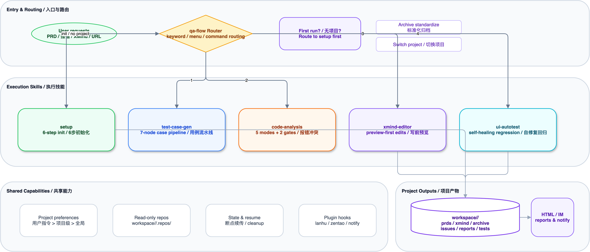
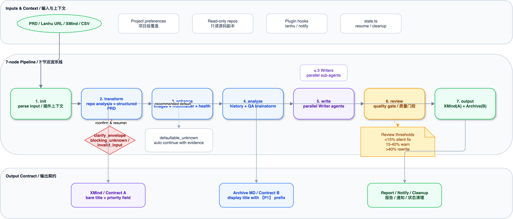
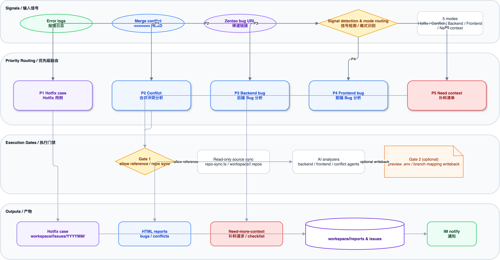
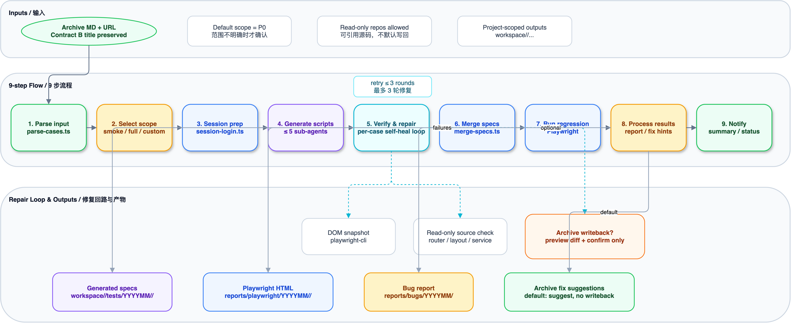
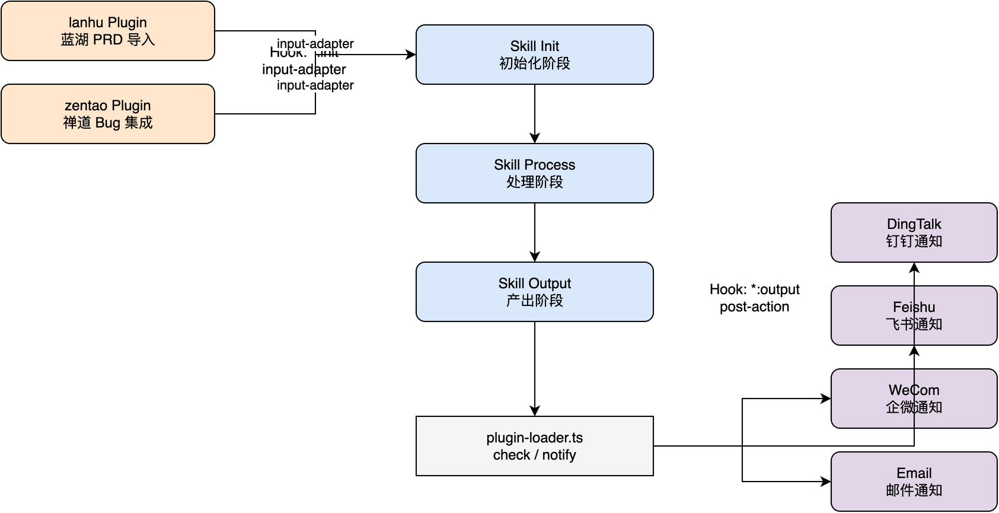

<div align="center">

# QAFlow - 2.0

### AI-Powered QA Workflow Engine

<br />

基于 **Claude Code Skills** 构建的智能 QA 工作流引擎
从需求文档到测试用例，从 Bug 分析到 UI 自动化 —— 一站式覆盖 QA 日常场景

<br />

[](https://nodejs.org/)
[](https://claude.com/claude-code)
[](https://playwright.dev/)
[](./LICENSE)
[](./package.json)

<br />

**[English](./README-EN.md)** | **Chinese**

<br />

```
PRD  ──>  测试用例生成  ──>  XMind + Archive MD  ──>  UI 自动化验证
报错日志     ──>  智能分析      ──>  HTML 报告 + IM 通知
```

</div>

<br />

---

## 目录

- [核心特性](#核心特性)
- [架构总览](#架构总览)
- [快速开始](#快速开始)
- [工作流详解](#工作流详解)
  - [测试用例生成](#1-测试用例生成-test-case-gen)
  - [报错/冲突分析](#2-报错冲突分析-code-analysis)
  - [XMind 用例编辑](#3-xmind-用例编辑-xmind-editor)
  - [UI 自动化测试](#4-ui-自动化测试-ui-autotest)
- [插件系统](#插件系统)
- [项目结构](#项目结构)
- [脚本 CLI 参考](#脚本-cli-参考)
- [环境配置](#环境配置)
- [贡献指南](#贡献指南)
- [License](#license)

---

## 核心特性

| 特性              | 说明                                                                                        |
| ----------------- | ------------------------------------------------------------------------------------------- |
| **7 节点流水线**  | PRD &rarr; Transform &rarr; Enhance &rarr; Analyze &rarr; Write &rarr; Review &rarr; Output |
| **多 Agent 并行** | Writer Sub-Agents 按模块并行生成用例，大型需求效率显著提升                                  |
| **插件化集成**    | 蓝湖 PRD 导入、禅道 Bug 集成、IM 通知，按需启用，不侵入核心流程                             |
| **交互式流程**    | 每个关键节点提供推荐选项 + 自由输入，支持 `--quick` 快速模式和断点续传                      |
| **偏好学习**      | 用户反馈自动沉淀到 `preferences/` 目录，持续修正生成风格                                    |
| **全链路覆盖**    | 测试用例生成 + Bug 分析 + XMind 编辑 + Playwright UI 自动化                                 |

---

## 架构总览



<details>
<summary><b>架构说明</b></summary>

qa-flow 采用 **Skill 路由 + 插件钩子** 架构：

- **qa-flow Router** — 入口路由层，根据用户输入的关键词或编号分发到对应 Skill
- **5 个核心 Skill** — `setup` / `test-case-gen` / `code-analysis` / `xmind-editor` / `ui-autotest`
- **Plugin System** — 通过生命周期 Hook（`*:init` / `*:output`）无侵入接入
- **Cross-cutting** — 状态管理（断点续传）、偏好学习、IM 通知贯穿全流程
- **Output** — 统一输出到 `workspace/` 目录，支持 XMind / Archive MD / HTML 报告

</details>

---

## 快速开始

### 前置条件

- **Node.js** >= 22
- **Claude Code CLI** — [安装指南](https://claude.com/claude-code)

### 安装

```bash
# 1. 克隆仓库
git clone https://github.com/your-org/qa-flow.git
cd qa-flow

# 2. 安装依赖
bun install

# 3. 安装 Playwright skill（UI 自动化功能需要）
npx skills add playwright-cli

# 4. 创建环境配置
cp .env.example .env
```

### 初始化

在 Claude Code 中输入：

```
/setup
```

5 步交互向导自动完成：

| 步骤 | 说明                                             |
| ---- | ------------------------------------------------ |
| 1    | 环境检测 — Node.js, npm, tsx 可用性              |
| 2    | 工作区创建 — `workspace/` 子目录结构             |
| 3    | 源码仓库配置 — 克隆 Git 仓库到 `.repos/`（可选） |
| 4    | 插件配置 — 检测 `.env` 中的插件凭证（可选）      |
| 5    | 环境验证 — 综合校验所有配置项                    |

### 常用命令

```bash
# 查看功能菜单
/qa-flow

# 为需求文档生成完整测试用例
为 {{需求名称}} 生成测试用例

# 快速模式（跳过部分交互，1 轮 Review）
为 {{需求名称}} --quick 生成测试用例

# 从蓝湖 URL 直接导入需求并生成用例
生成测试用例 https://lanhuapp.com/web/#/item/project/product?tid={{tid}}&docId={{docId}}

# 直接粘贴报错日志进行 Bug 分析
帮我分析这个报错

# 局部修改已有 XMind 用例
修改用例 "验证导出仅导出当前筛选结果"

# UI 自动化测试
UI自动化测试 {{需求名称}} https://your-app.example.com
```

---

## 工作流详解

### 1. 测试用例生成 (`/test-case-gen`)

将 PRD / Story 文档转化为结构化 XMind 和 Archive Markdown 测试用例。

#### 流水线



#### 7 个节点

| 节点 | 名称          | 说明                                                    | 关键脚本                                  |
| ---- | ------------- | ------------------------------------------------------- | ----------------------------------------- |
| 1    | **init**      | 解析输入、检测断点、加载插件                            | `state.ts`, `plugin-loader.ts`            |
| 2    | **transform** | 源码分析 + PRD 结构化，含 CLARIFY 交互协议（最多 3 轮） | `repo-profile.ts`, `repo-sync.ts`         |
| 3    | **enhance**   | 图片识别、frontmatter 标准化、页面高亮提取              | `image-compress.ts`, `prd-frontmatter.ts` |
| 4    | **analyze**   | 历史用例检索 + QA 头脑风暴 &rarr; 测试点清单            | `archive-gen.ts search`                   |
| 5    | **write**     | 按模块拆分并行 Writer Sub-Agents 生成用例               | Parallel sub-agents                       |
| 6    | **review**    | 质量门控审查（阈值 < 15% / 15-40% / > 40%），最多 2 轮  | Quality gate                              |
| 7    | **output**    | 生成 XMind + Archive MD，发送 IM 通知，清理状态         | `xmind-gen.ts`, `archive-gen.ts`          |

#### 质量门控 (Review 节点)

| 阈值       | 动作                            |
| ---------- | ------------------------------- |
| < 15% 问题 | Silent fix — 直接修复           |
| 15% - 40%  | Auto-fix + Warning — 修复并警告 |
| > 40%      | Block — 打回重写                |

#### 运行模式

```bash
# 普通模式（全节点 + 交互确认）
为 {{需求名称}} 生成测试用例

# 快速模式（跳过交互，1 轮 Review）
为 {{需求名称}} --quick 生成测试用例

# 续传（自动检测断点）
继续 {{需求名称}} 的用例生成

# 模块重跑
重新生成 {{需求名称}} 的「列表页」模块用例
```

#### 子流程

<details>
<summary><b>标准化归档流程</b>（XMind/CSV 输入）</summary>

将已有 XMind 或 CSV 文件标准化为规范的 Archive MD 格式：

```
S1: 解析源文件 → S2: AI 标准化重写 → S3: 质量审查 → S4: 输出
```

</details>

<details>
<summary><b>逆向同步流程</b>（XMind → Archive MD）</summary>

将 XMind 用例逆向同步为 Archive Markdown：

```
RS1: 确认 XMind → RS2: 解析 → RS3: 定位 Archive MD → RS4: 转换 → RS5: 确认
```

</details>

---

### 2. 报错/冲突分析 (`/code-analysis`)

将报错日志、合并冲突或禅道 Bug 链接转化为结构化 HTML 报告或 Hotfix 测试用例。

#### 路由



#### 5 种模式（优先级路由）

| 优先级 | 模式            | 信号特征                                   | 输出          |
| ------ | --------------- | ------------------------------------------ | ------------- |
| P1     | **Hotfix 用例** | 禅道 Bug URL                               | MD 测试用例   |
| P2     | **合并冲突**    | `<<<<<<< HEAD` markers                     | HTML 冲突报告 |
| P3     | **后端 Bug**    | Java stack trace, `Exception`, `Caused by` | HTML Bug 报告 |
| P4     | **前端 Bug**    | `TypeError`, `ChunkLoadError`, React error | HTML Bug 报告 |
| P5     | **信息不足**    | 模糊描述                                   | 补料清单      |

#### 处理流程

```
信号检测 → 模式路由 → [源码同步] → AI 分析 → 报告生成 → IM 通知
```

#### 使用示例

```bash
# 直接粘贴错误日志
帮我分析这个报错

# 禅道 Bug 链接触发 Hotfix 用例生成
{{ZENTAO_BASE_URL}}/zentao/bug-view-{{bug_id}}.html
```

#### 输出目录

| 类型        | 路径                                    |
| ----------- | --------------------------------------- |
| Bug 报告    | `workspace/reports/bugs/YYYYMMDD/`      |
| 冲突报告    | `workspace/reports/conflicts/YYYYMMDD/` |
| Hotfix 用例 | `workspace/issues/YYYYMM/`              |

---

### 3. XMind 用例编辑 (`/xmind-editor`)

直接在已有 XMind 文件上进行局部操作，无需重新读取 PRD。修改完成后自动触发偏好学习流程。

#### 操作列表

| 操作 | 命令示例                                | 脚本                                                           |
| ---- | --------------------------------------- | -------------------------------------------------------------- |
| 搜索 | `搜索用例 "导出"`                       | `xmind-edit.ts search "keyword"`                               |
| 查看 | `查看用例 "验证列表页默认加载"`         | `xmind-edit.ts show --file X --title "Y"`                      |
| 修改 | `修改用例 "验证导出仅导出当前筛选结果"` | `xmind-edit.ts patch --file X --title "Y" --case-json '{...}'` |
| 新增 | `新增用例 到 "规则列表页" 分组`         | `xmind-edit.ts add --file X --parent "Y" --case-json '{...}'`  |
| 删除 | `删除用例 "验证xxx"`                    | `xmind-edit.ts delete --file X --title "Y"`                    |

#### 偏好学习

修改完成后，AI 自动提取可复用的编写规则并写入 `preferences/case-writing.md`，影响后续 test-case-gen 的生成风格。

---

### 4. UI 自动化测试 (`/ui-autotest`)

将 Archive MD 测试用例转化为 Playwright TypeScript 脚本，按优先级并行执行，失败时自动生成 Bug 报告。

#### 流水线



#### 8 个步骤

| 步骤 | 名称         | 说明                                                      |
| ---- | ------------ | --------------------------------------------------------- |
| 1    | **解析输入** | 提取 `md_path` 和 `url`，通过 `parse-cases.ts` 解析用例   |
| 2    | **交互确认** | 用户选择范围：smoke (P0) / full (P0+P1+P2) / custom       |
| 3    | **会话准备** | 通过 `session-login.ts` 检查/创建登录 session             |
| 4    | **脚本生成** | 最多 5 个并行 Sub-Agents 生成 `.ts` 代码块                |
| 5    | **合并脚本** | `merge-specs.ts` 合并为 `smoke.spec.ts` 和 `full.spec.ts` |
| 6    | **执行测试** | `npx playwright test` with HTML reporter                  |
| 7    | **结果处理** | 失败用例触发 Bug Reporter Sub-Agents 生成报告             |
| 8    | **发送通知** | 通过 Plugin 发送通过/失败摘要                             |

#### 测试范围

| 模式   | 用例范围     | 命令                                     |
| ------ | ------------ | ---------------------------------------- |
| Smoke  | 仅 P0        | `UI自动化测试 {{需求名称}} {{url}}`      |
| Full   | P0 + P1 + P2 | `执行UI测试 {{archive_md_path}} {{url}}` |
| Custom | 用户自选     | 解析后交互选择                           |

#### 输出

| 类型            | 路径                                     |
| --------------- | ---------------------------------------- |
| E2E 用例脚本    | `tests/e2e/YYYYMM/<suite_name>/`         |
| Playwright 报告 | `workspace/reports/playwright/YYYYMMDD/` |

---

## 插件系统



### 内置插件

| 插件       | Hook                 | 功能                           | 启用条件                                  |
| ---------- | -------------------- | ------------------------------ | ----------------------------------------- |
| **lanhu**  | `test-case-gen:init` | 从蓝湖 URL 爬取 PRD 文档和截图 | `.env` 配置 `LANHU_COOKIE`                |
| **zentao** | `code-analysis:init` | 读取禅道 Bug 详情和关联信息    | `.env` 配置 `ZENTAO_BASE_URL` + 账号密码  |
| **notify** | `*:output`           | 钉钉 / 飞书 / 企微 / 邮件通知  | `.env` 配置任意一个通道的 Webhook 或 SMTP |

### 生命周期 Hook

| Hook           | 时机              | 类型                                 |
| -------------- | ----------------- | ------------------------------------ |
| `<skill>:init` | Skill 初始化阶段  | `input-adapter` — 适配输入格式       |
| `*:output`     | 任意 Skill 产出后 | `post-action` — 通知、归档等后置动作 |

### 开发自定义插件

在 `plugins/<plugin-name>/` 下创建 `plugin.json`：

```json
{
  "name": "my-plugin",
  "description": "插件描述",
  "version": "1.0.0",
  "env_required": ["MY_PLUGIN_API_KEY"],
  "hooks": {
    "test-case-gen:init": "input-adapter"
  },
  "commands": {
    "fetch": "npx tsx plugins/my-plugin/fetch.ts --url {{url}} --output {{output_dir}}"
  },
  "url_patterns": ["example.com"]
}
```

---

## 项目结构

```text
qa-flow/
├── .claude/
│   ├── scripts/                  # 核心 TypeScript CLI 脚本
│   │   ├── state.ts              # 断点续传状态管理
│   │   ├── xmind-gen.ts          # XMind 文件生成
│   │   ├── xmind-edit.ts         # XMind 增删改查
│   │   ├── archive-gen.ts        # Archive MD 生成 + 搜索
│   │   ├── plugin-loader.ts      # 插件加载与调度
│   │   ├── repo-sync.ts          # 源码仓库同步
│   │   ├── repo-profile.ts       # 仓库 Profile 匹配
│   │   ├── image-compress.ts     # 图片压缩（>2000px 自动缩放）
│   │   ├── prd-frontmatter.ts    # PRD frontmatter 标准化
│   │   ├── config.ts             # 环境配置读取
│   │   └── __tests__/            # 单元测试（80%+ 覆盖率）
│   └── skills/
│       ├── qa-flow/              # 入口菜单路由
│       ├── setup/                # 5 步初始化向导
│       ├── test-case-gen/        # 测试用例生成（核心流水线）
│       │   ├── prompts/          # 每节点 AI Prompt
│       │   └── references/       # 格式规范与协议
│       ├── code-analysis/        # 报错 / 冲突分析
│       │   ├── prompts/          # 模式专用 Prompt
│       │   └── references/       # 环境 vs 代码指南
│       ├── xmind-editor/         # XMind 局部编辑
│       ├── ui-autotest/          # Playwright UI 自动化
│       │   ├── scripts/          # parse-cases / merge-specs / session-login
│       │   └── prompts/          # script-writer & bug-reporter Prompt
│       └── playwright-cli/       # Playwright CLI 集成
├── plugins/
│   ├── lanhu/                    # 蓝湖 PRD 导入插件
│   ├── zentao/                   # 禅道 Bug 集成插件
│   └── notify/                   # IM 通知插件
├── workspace/                    # 工作区（运行时输出目录）
│   ├── prds/                     # PRD / Story 文档
│   ├── xmind/                    # XMind 输出（YYYYMM/）
│   ├── archive/                  # 归档 Markdown（YYYYMM/）
│   ├── issues/                   # 线上问题用例
│   ├── reports/                  # Bug / 冲突 / Playwright 报告
│   └── .repos/                   # 源码仓库（只读）
├── preferences/                  # 用户偏好规则（自动写入）
│   ├── case-writing.md           # 用例编写规范
│   ├── data-preparation.md       # 数据准备规则
│   ├── prd-recognition.md        # PRD 识别模式
│   └── xmind-structure.md        # XMind 结构偏好
├── templates/                    # Handlebars 报告模板
├── tests/                        # E2E 测试用例
│   └── e2e/YYYYMM/              # Playwright 测试文件
├── assets/
│   └── diagrams/                 # 架构与工作流图
├── config.json                   # 仓库 Profile 映射
├── .env.example                  # 环境变量模板
├── biome.json                    # 代码风格配置
├── playwright.config.ts          # Playwright 配置
└── package.json
```

---

## 脚本 CLI 参考

所有脚本位于 `.claude/scripts/`，使用 `npx tsx` 执行：

| 脚本                 | 核心子命令                                     | 说明                               |
| -------------------- | ---------------------------------------------- | ---------------------------------- |
| `state.ts`           | `init` / `resume` / `update` / `clean`         | 断点状态初始化、续传、更新与清理   |
| `xmind-gen.ts`       | `--input <json> --output <dir>`                | 从 JSON 中间格式生成 XMind 文件    |
| `xmind-edit.ts`      | `search` / `show` / `patch` / `add` / `delete` | XMind 用例增删改查                 |
| `archive-gen.ts`     | `--input <json> --output <dir>` / `search`     | 生成 Archive MD 或关键词搜索       |
| `image-compress.ts`  | `--dir <dir>`                                  | 批量压缩图片（超 2000px 自动缩放） |
| `plugin-loader.ts`   | `check` / `notify`                             | 插件可用性检测与通知调度           |
| `repo-sync.ts`       | `--url <url> --branch <branch>`                | 源码仓库分支同步/克隆              |
| `repo-profile.ts`    | `match` / `save` / `sync-profile`              | 需求与源码仓库智能匹配             |
| `prd-frontmatter.ts` | `--file <path>`                                | PRD frontmatter 标准化             |
| `config.ts`          | (无参数)                                       | 读取 `.env` 输出项目配置           |

---

## 环境配置

复制 `.env.example` 为 `.env` 并配置：

### 核心配置

| 变量            | 必填 | 说明                           |
| --------------- | ---- | ------------------------------ |
| `WORKSPACE_DIR` | 否   | 工作区目录名，默认 `workspace` |
| `SOURCE_REPOS`  | 否   | 源码仓库 Git URL（逗号分隔）   |

### 插件: 蓝湖

| 变量           | 必填 | 说明            |
| -------------- | ---- | --------------- |
| `LANHU_COOKIE` | 否   | 蓝湖登录 Cookie |

### 插件: 禅道

| 变量              | 必填 | 说明                                                 |
| ----------------- | ---- | ---------------------------------------------------- |
| `ZENTAO_BASE_URL` | 否   | 禅道系统地址（如 `http://zenpms.example.cn/zentao`） |
| `ZENTAO_ACCOUNT`  | 否   | 禅道账号                                             |
| `ZENTAO_PASSWORD` | 否   | 禅道密码                                             |

### 插件: 通知（任选一个通道）

| 变量                   | 必填 | 说明                           |
| ---------------------- | ---- | ------------------------------ |
| `DINGTALK_WEBHOOK_URL` | 否   | 钉钉群机器人 Webhook           |
| `DINGTALK_KEYWORD`     | 否   | 钉钉安全关键词，默认 `qa-flow` |
| `FEISHU_WEBHOOK_URL`   | 否   | 飞书群机器人 Webhook           |
| `WECOM_WEBHOOK_URL`    | 否   | 企业微信群机器人 Webhook       |
| `SMTP_HOST`            | 否   | 邮件服务器地址                 |
| `SMTP_PORT`            | 否   | 邮件端口，默认 `587`           |
| `SMTP_USER`            | 否   | 邮件账号                       |
| `SMTP_PASS`            | 否   | 邮件密码 / 授权码              |
| `SMTP_FROM`            | 否   | 发件人地址                     |
| `SMTP_TO`              | 否   | 收件人地址（逗号分隔）         |

---

## 贡献指南

欢迎提交 Issue 和 Pull Request。

### 开发流程

```bash
# 1. Fork 仓库并创建特性分支
git checkout -b feat/my-feature

# 2. 编写代码（不可变数据原则，函数 < 50 行，文件 < 800 行）

# 3. 代码风格检查（Biome）
bun run check

# 4. 自动修复风格问题
bun run check:fix

# 5. 运行测试
bun run test

# 6. 提交 PR
```

### 提交规范

```
<type>: <description>

类型：feat / fix / refactor / docs / test / chore / perf / ci
```

### 测试

```bash
# 运行所有单元测试
bun run test

# 监听模式
bun run test:watch
```

测试文件位于 `.claude/scripts/__tests__/`，覆盖率目标 80%+。

---

## License

[MIT](./LICENSE) &copy; 2026 qa-flow contributors
