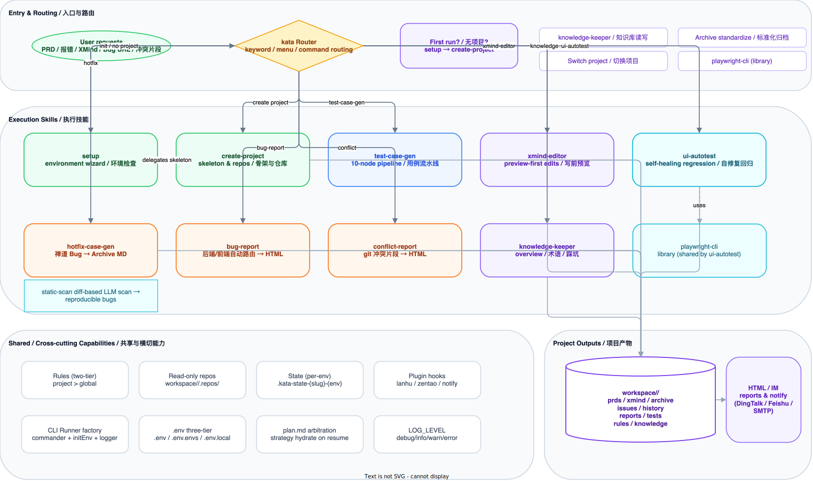
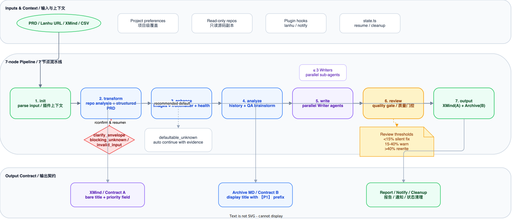
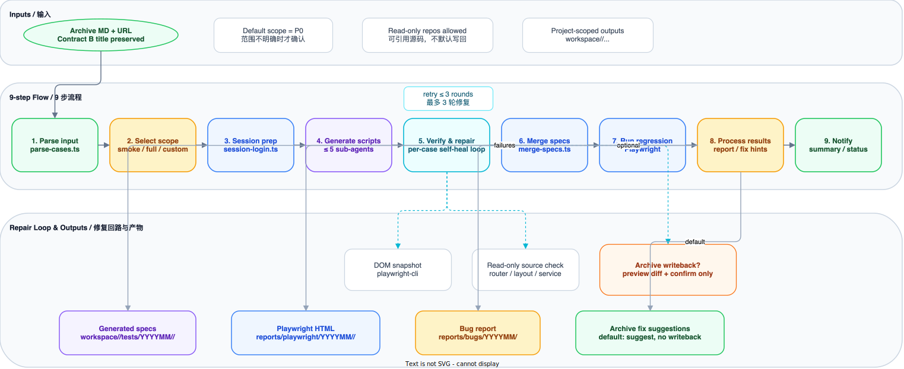

<div align="center">

<picture>
  <source media="(prefers-color-scheme: dark)" srcset="https://img.shields.io/badge/Kata-3.0-7C3AED?style=for-the-badge&logo=data:image/svg+xml;base64,PHN2ZyB4bWxucz0iaHR0cDovL3d3dy53My5vcmcvMjAwMC9zdmciIHdpZHRoPSIyNCIgaGVpZ2h0PSIyNCIgdmlld0JveD0iMCAwIDI0IDI0IiBmaWxsPSJ3aGl0ZSI+PHBhdGggZD0iTTkgMTYuMTdMNC44MyAxMmwtMS40MiAxLjQxTDkgMTkgMjEgN2wtMS40MS0xLjQxeiIvPjwvc3ZnPg==&logoColor=white">
  
</picture>

# 🚀 Kata

### AI-Powered QA Workflow Engine

<br />

**一句话说清**：把 PRD 丢给它，自动出用例；把报错丢给它，自动出报告。

基于 **Claude Code Skills** 构建的智能 QA 工作流引擎，覆盖测试全链路。

<br />

🧪 测试用例生成 &nbsp;·&nbsp; 🐛 Bug 智能分析 &nbsp;·&nbsp; 📝 XMind 用例编辑 &nbsp;·&nbsp; 🤖 UI 自动化 &nbsp;·&nbsp; 📣 IM 通知

<br />

[](https://nodejs.org/)
[](https://claude.com/claude-code)
[](https://playwright.dev/)
[](./LICENSE)
[](./engine/package.json)

<br />

**[English](./README-EN.md)** &nbsp;|&nbsp; **中文**

<br />

```
📄 PRD / 蓝湖 / 历史文件 ── /test-case-gen ───→ 🗺️ XMind (A) + 📝 Archive MD (B)
🤖 Archive MD + URL ──── /ui-autotest ─────→ ♻️ 自修复回归 → 🐛 报告 / 📣 通知
📋 现有 XMind ─────────── /case-format ─────→ 👀 预览 → ✅ 确认 → ✏️ 写入
🔗 禅道 Bug 链接 ─────── /daily-task hotfix → 🔧 Hotfix Archive MD
🔥 报错 / 异常 ───────── /daily-task bug ───→ 📊 后端/前端 Bug HTML 报告
⚡ git 冲突片段 ───────── /daily-task conflict → 📊 合并冲突 HTML 报告
```

</div>

<br />

---

## 目录

- [核心特性](#核心特性)
- [架构总览](#架构总览)
- [快速开始](#快速开始)
- [工作流详解](#工作流详解)
  - [测试用例生成](#1-测试用例生成-test-case-gen)
  - [Hotfix / Bug / 冲突分析](#2-hotfix--bug--冲突分析)
  - [XMind 用例编辑](#3-xmind-用例编辑-case-format)
  - [UI 自动化测试](#4-ui-自动化测试-ui-autotest)
- [插件系统](#插件系统)
- [项目结构](#项目结构)
- [脚本 CLI 参考](#脚本-cli-参考)
- [环境配置](#环境配置)
- [贡献指南](#贡献指南)
- [License](#license)

---

## 核心特性

| 特性                            | 说明                                                                                                                                                         |
| ------------------------------- | ------------------------------------------------------------------------------------------------------------------------------------------------------------ |
| **7 个 Skill / 5 个核心工作流** | `using-kata` + `playwright-cli` + 5 个核心执行工作流，覆盖菜单/初始化、生成、分析、格式转换、Bug/冲突/Hotfix 诊断和回归                                      |
| **7 Skill 四件套**              | 每个 skill 含 SKILL.md / workflow.md / rules.md / references/；sub-agent prompts 通过 `owner_skill:` frontmatter 归属 skill；`kata-cli skill audit` 验证契约 |
| **项目级工作区**                | 所有产物统一输出到 `workspace/&lt;project&gt;/...`，多项目互不污染                                                                                           |
| **A/B 双契约**                  | XMind / intermediate 使用 Contract A；Archive MD / 展示标题使用 Contract B                                                                                   |
| **写前预览**                    | XMind `patch` / `add` / `delete` 统一先 `--dry-run` 预览，再确认真实写入                                                                                     |
| **自修复 UI 回归**              | UI 自动化逐条自测，失败后最多 3 轮修复，可生成 Bug 报告或 Archive MD 校正建议                                                                                |
| **插件化集成**                  | 蓝湖 PRD 导入、禅道 Bug 集成、IM 通知按 Hook 接入，按需启用，不侵入核心流程                                                                                  |
| **安全门禁**                    | 只读源码、副作用分级确认、源码引用/同步与配置写回双门禁，避免误写和误判                                                                                      |

---

## 架构总览



<details>
<summary><b>架构说明</b></summary>

kata 采用 **Router + Skill + Agent + Plugin Hook** 分层架构：

- **kata Router** — 入口路由层；首次使用、无项目或安装向导由 `using-kata` skill 承接
- **7 个 Skill** — `using-kata` / `playwright-cli` / `test-case-gen` / `ui-autotest` / `case-format` / `daily-task` / `knowledge-keeper`
- **5 个核心用户工作流** — `test-case-gen` / `ui-autotest` / `case-format` / `daily-task`（bug/conflict/hotfix）/ `knowledge-keeper`（`using-kata` + `create-project` 为入口与初始化工作流）
- **16 个独立 Agent** — 每个 Agent 通过 frontmatter 声明 model/tools，由 Skill 作为编排器调度；含 Phase 3 新增 `pattern-analyzer-agent` / `script-fixer-agent` / `convergence-agent` / `regression-runner-agent` / `source-scanner-agent`
- **Cross-cutting 能力** — CLI Runner 工厂、三段式 `.env`、多环境 `kata-state` 隔离、`plan.md` 仲裁、`LOG_LEVEL` 日志分级、项目级规则、只读源码副本、Plugin Hooks
- **Project-scoped Output** — 统一输出到 `workspace/<project>/`，支持 XMind / Archive MD / HTML 报告 / Playwright + Allure 产物

</details>

---

## 快速开始

### 前置条件

- **Node.js** >= 22
- **Claude Code CLI** — [安装指南](https://claude.com/claude-code)

### 安装部署

推荐交由 Coding Agent（Claude Code / Cursor / Codex 等）自动完成。克隆仓库后，在 Agent 中**复制粘贴**以下触发语：

```text
请阅读仓库根目录的 INSTALL.md，严格按照里面的 Execution Plan 为我安装并验证 kata。
任一步骤失败立即停下来告诉我错误，不要自行降级或跳过。
```

手工安装：

```bash
git clone https://github.com/your-org/kata.git
cd kata
bun install
cp .env.example .env
cp .env.envs.example .env.envs
kata-cli config            # 配置校验
bun test --cwd engine                         # 单元测试必须全绿
bunx playwright install                       # 仅 UI 自动化场景需要
```

### 初始化

按仓库根目录 `INSTALL.md` 指引完成环境初始化，或在 Claude Code 中输入：

```
/using-kata
```

6 步交互向导自动完成：

| 步骤 | 说明                                                                 |
| ---- | -------------------------------------------------------------------- |
| 1    | 环境检测 — Node.js、bun、配置文件、核心脚本可用性                    |
| 2    | 项目管理 — 选择已有项目或创建新项目                                  |
| 3    | 工作区配置 — 创建 `workspace/<project>/` 标准结构                    |
| 4    | 源码仓库配置 — 克隆 Git 仓库到 `workspace/<project>/.repos/`（可选） |
| 5    | 插件配置 — 检测 `.env` 中的插件凭证（可选）                          |
| 6    | 环境验证 — 综合校验所有配置项                                        |

### 常用命令

```bash
# 查看功能菜单
/using-kata

# 为需求文档生成完整测试用例
为 {{需求名称}} 生成测试用例

# 快速模式（跳过部分交互，1 轮 Review）
为 {{需求名称}} --quick 生成测试用例

# 从蓝湖 URL 直接导入需求并生成用例
生成测试用例 https://lanhuapp.com/web/#/item/project/product?tid={{tid}}&docId={{docId}}

# 直接粘贴报错日志进行 Bug 分析
帮我分析这个报错

# 局部修改已有 XMind 用例
修改用例 "验证导出仅导出当前筛选结果"

# 标准化历史 XMind / CSV 为 Archive MD
标准化归档 workspace/<project>/history/旧用例.xmind

# UI 自动化测试
UI自动化测试 {{需求名称}} https://your-app.example.com

# 切换当前项目
切换项目
```

---

## 工作流详解

### 1. 测试用例生成 (`/test-case-gen`)

将 PRD / Story 文档转化为结构化 XMind 和 Archive Markdown 测试用例。

#### 流水线



#### 10 个节点

| 节点 | 名称          | 说明                                                               | 关键脚本                                              |
| ---- | ------------- | ------------------------------------------------------------------ | ----------------------------------------------------- |
| 1    | **init**      | 解析输入、恢复状态、加载项目/插件上下文                            | `kata-state.ts`, `plugin-loader.ts`, `rule-loader.ts` |
| 2    | **discuss**   | 主 agent 主持需求讨论，落盘 `plan.md`，对齐范围与策略              | `discuss.ts`, `plan.ts`                               |
| 3    | **probe**     | 4 维信号探针（bug / regression / feature-magnitude / reuse-score） | `case-signal-analyzer.ts`                             |
| 4    | **strategy**  | 5 策略派发（S1–S5，S5 外转 `hotfix-case-gen`）                     | `case-strategy-resolver.ts`                           |
| 5    | **transform** | 源码分析 + PRD 结构化，使用结构化 `clarify_envelope` 表达阻断项    | `repo-profile.ts`, `repo-sync.ts`                     |
| 6    | **enhance**   | 图片识别、frontmatter 标准化、健康度预检                           | `image-compress.ts`, `prd-frontmatter.ts`             |
| 7    | **analyze**   | 历史用例检索 + QA 头脑风暴 → 测试点清单（含 `knowledge` 注入）     | `archive-gen.ts search`, `writer-context-builder.ts`  |
| 8    | **write**     | 按模块拆分并行 Writer Sub-Agents 生成 Contract A 用例              | Parallel sub-agents                                   |
| 9    | **review**    | 质量门控审查（阈值 < 15% / 15–40% / > 40%），最多 2 轮             | Quality gate                                          |
| 10   | **output**    | 生成 XMind（A）+ Archive MD（B）、发送通知并清理状态               | `xmind-gen.ts`, `archive-gen.ts`                      |

#### 质量门控 (Review 节点)

| 阈值       | 动作                            |
| ---------- | ------------------------------- |
| < 15% 问题 | Silent fix — 直接修复           |
| 15% - 40%  | Auto-fix + Warning — 修复并警告 |
| > 40%      | Block — 打回重写                |

#### 运行模式

```bash
# 普通模式（全节点 + 交互确认）
为 {{需求名称}} 生成测试用例

# 快速模式（跳过交互，1 轮 Review）
为 {{需求名称}} --quick 生成测试用例

# 续传（自动检测断点）
继续 {{需求名称}} 的用例生成

# 模块重跑
重新生成 {{需求名称}} 的「列表页」模块用例
```

#### 子流程

<details>
<summary><b>标准化归档流程</b>（XMind/CSV 输入）</summary>

将已有 XMind 或 CSV 文件标准化为规范的 Archive MD 格式：

```
S1: 解析源文件 → S2: AI 标准化重写 → S3: 质量审查 → S4: 输出
```

</details>

<details>
<summary><b>逆向同步流程</b>（XMind → Archive MD）</summary>

将 XMind 用例逆向同步为 Archive Markdown（遵循 preview / confirm / write）：

```
 RS1: 确认 XMind → RS2: 解析 → RS3: 定位 Archive MD → RS4: 预览或写回 → RS5: 报告
```

</details>

---

### 2. Hotfix / Bug / 冲突分析

code-analysis 的一体化路由已按业务边界拆成三个专职 skill，触发词独立、前置守卫精确，agent 层不变：

| Skill                      | 输入信号                                           | 派发 Agent                                                | 输出                                                    |
| -------------------------- | -------------------------------------------------- | --------------------------------------------------------- | ------------------------------------------------------- |
| **`/daily-task hotfix`**   | 禅道 Bug URL（含 `bug-view-`）或 Bug ID            | `hotfix-case-agent`                                       | `workspace/<project>/issues/YYYYMM/hotfix_*.md`         |
| **`/daily-task bug`**      | Java 堆栈 / HTTP 错误 / 前端 Console 报错          | `backend-bug-agent`（后端）/ `frontend-bug-agent`（前端） | `workspace/<project>/reports/bugs/YYYYMMDD/*.html`      |
| **`/daily-task conflict`** | 含 `<<<<<<< HEAD` / `=======` / `>>>>>>>` 冲突片段 | `conflict-agent`                                          | `workspace/<project>/reports/conflicts/YYYYMMDD/*.html` |

#### 双门策略

`bug-report` / `hotfix-case-gen` 在需要读取源码时遵循**双门禁**：

- **门禁 1**：引用源码或执行 repo sync 前，先确认 repo / branch / path 摘要
- **门禁 2**：若拟写回 `.env` 或 repo branch mapping，再单独展示变更预览并确认

`conflict-report` 直接基于用户粘贴的冲突片段分析，无需同步源码。

#### 使用示例

```bash
# 禅道 Bug 链接自动触发 Hotfix 用例生成
{{ZENTAO_BASE_URL}}/zentao/bug-view-{{bug_id}}.html

# 粘贴后端 / 前端报错文本，自动按信号路由到后端 / 前端分析分支
帮我分析这个报错
<粘贴 Exception in thread "main" java.lang.NullPointerException ... / TypeError: Cannot read ...>

# 粘贴 git 冲突片段
分析冲突
<<<<<<< HEAD
...
=======
...
>>>>>>>
```

---

### 3. XMind 用例编辑 (`/case-format`)

直接在已有 XMind 文件上进行局部操作，无需重新读取 PRD。所有写操作遵循 **preview-first**：先 `--dry-run` 预览，再确认，最后真实写入；修改完成后再触发偏好学习流程。

#### 操作列表

| 操作 | 命令示例                                | 预览 / 执行方式                                                                        |
| ---- | --------------------------------------- | -------------------------------------------------------------------------------------- |
| 搜索 | `搜索用例 "导出"`                       | `xmind-patch.ts search "keyword"`                                                      |
| 查看 | `查看用例 "验证列表页默认加载"`         | `xmind-patch.ts show --file X --title "Y"`                                             |
| 修改 | `修改用例 "验证导出仅导出当前筛选结果"` | `xmind-patch.ts patch --file X --title "Y" --case-json '{...}' --dry-run` → 确认后执行 |
| 新增 | `新增用例 到 "规则列表页" 分组`         | `xmind-patch.ts add --file X --parent "Y" --case-json '{...}' --dry-run` → 确认后执行  |
| 删除 | `删除用例 "验证xxx"`                    | `xmind-patch.ts delete --file X --title "Y" --dry-run` → 确认后执行                    |

#### 偏好学习

修改完成后，AI 自动提取可复用的编写规则并写入 `rules/case-writing.md`，影响后续 test-case-gen 的生成风格。

---

### 4. UI 自动化测试 (`/ui-autotest`)

将 Archive MD 测试用例转化为 Playwright TypeScript 脚本，按优先级并行执行，失败时自动生成 Bug 报告。

#### 流水线



#### 9 个步骤

| 步骤 | 名称         | 说明                                                                     |
| ---- | ------------ | ------------------------------------------------------------------------ |
| 1    | **解析输入** | 提取 `md_path` 和 `url`，通过 `parse-cases.ts` 解析 Archive MD           |
| 2    | **执行范围** | 仅在范围未明确时确认 smoke / full / custom                               |
| 3    | **会话准备** | 通过 `session-login.ts` 检查/创建登录 session（按 `ACTIVE_ENV` 隔离）    |
| 4    | **脚本生成** | 最多 5 个并行 Sub-Agents 生成 `.ts` 代码块                               |
| 5    | **逐条自测** | 每条脚本单独执行验证，失败时最多 3 轮自修复                              |
| 5.5  | **共性收敛** | `pattern-analyzer-agent` 归纳失败共性、抽出共享 helpers，避免重复修复    |
| 6    | **合并脚本** | `merge-specs.ts` 合并为 `smoke.spec.ts` 和 `full.spec.ts`                |
| 7    | **执行回归** | `bunx playwright test` 执行合并后的 smoke / full spec                    |
| 8    | **结果处理** | 生成 **Allure 报告**、Bug 报告，并输出 Archive MD 校正建议（默认不写回） |
| 9    | **发送通知** | 通过 Plugin 发送通过/失败摘要                                            |

#### 测试范围

| 模式   | 用例范围     | 命令                                     |
| ------ | ------------ | ---------------------------------------- |
| Smoke  | 仅 P0        | `UI自动化测试 {{需求名称}} {{url}}`      |
| Full   | P0 + P1 + P2 | `执行UI测试 {{archive_md_path}} {{url}}` |
| Custom | 用户自选     | 解析后交互选择                           |

#### 输出

| 类型             | 路径                                                      |
| ---------------- | --------------------------------------------------------- |
| 临时代码块       | `workspace/<project>/.temp/ui-blocks/`                    |
| E2E 用例脚本     | `workspace/<project>/tests/YYYYMM/<suite_name>/`          |
| Allure HTML 报告 | `workspace/<project>/reports/allure/YYYYMM/<suite_name>/` |
| Bug 报告         | `workspace/<project>/reports/bugs/YYYYMM/`                |

---

## 插件系统


### 内置插件

| 插件       | Hook                   | 功能                           | 启用条件                                  |
| ---------- | ---------------------- | ------------------------------ | ----------------------------------------- |
| **lanhu**  | `test-case-gen:init`   | 从蓝湖 URL 爬取 PRD 文档和截图 | `.env` 配置 `LANHU_COOKIE`                |
| **zentao** | `hotfix-case-gen:init` | 读取禅道 Bug 详情和关联信息    | `.env` 配置 `ZENTAO_BASE_URL` + 账号密码  |
| **notify** | `*:output`             | 钉钉 / 飞书 / 企微 / 邮件通知  | `.env` 配置任意一个通道的 Webhook 或 SMTP |

### 生命周期 Hook

| Hook           | 时机              | 类型                                 |
| -------------- | ----------------- | ------------------------------------ |
| `<skill>:init` | Skill 初始化阶段  | `input-adapter` — 适配输入格式       |
| `*:output`     | 任意 Skill 产出后 | `post-action` — 通知、归档等后置动作 |

### 开发自定义插件

在 `plugins/<plugin-name>/` 下创建 `plugin.json`：

```json
{
  "name": "my-plugin",
  "description": "插件描述",
  "version": "1.0.0",
  "env_required": ["MY_PLUGIN_API_KEY"],
  "hooks": {
    "test-case-gen:init": "input-adapter"
  },
  "commands": {
    "fetch": "bun run plugins/my-plugin/fetch.ts --url {{url}} --output {{output_dir}}"
  },
  "url_patterns": ["example.com"]
}
```

---

## 横切基础设施

Phase 5 收敛了 CLI / 配置 / 状态 / 日志四条横切通道，新增脚本直接继承这些能力，无需重复实现 boilerplate。

### CLI Runner 工厂

`engine/src/lib/cli-runner.ts` 提供 `createCli({ name, description, commands })`，28 个 CLI 脚本中 27 个统一经由工厂构建入口，自动获得：

- `initEnv()` 三段式 `.env` 预加载
- `createLogger(name)` 注入日志实例
- 错误退出协议（stderr + `exitCode 1`）
- `LOG_LEVEL` 环境变量感知

### .env 三段式

| 文件         | 职责                                                         | git 状态                            |
| ------------ | ------------------------------------------------------------ | ----------------------------------- |
| `.env`       | 核心配置 + 插件凭证（DINGTALK / LANHU / ZENTAO / SMTP 等）   | gitignore（有 `.env.example`）      |
| `.env.envs`  | 多环境段（`ACTIVE_ENV` / `LTQCDEV_*` / `CI63_*` / `CI78_*`） | gitignore（有 `.env.envs.example`） |
| `.env.local` | 用户本地覆盖（临时 token / cookie）                          | gitignore（无模板）                 |

加载优先级：`process.env > .env.local > .env.envs > .env`（高者胜）。

### 多环境 State 隔离

`kata-state` 文件名附加 `ACTIVE_ENV` 后缀：`workspace/<project>/.temp/.kata-state-<slug>-<env>.json`。

- 多 CC 实例并行跑不同环境互不污染
- `resume` 时以 `plan.md` frontmatter 为权威源 hydrate `strategy_resolution`
- 旧版无后缀文件首次 resume 时自动迁移

### LOG_LEVEL 分级

`LOG_LEVEL=debug` / `info` / `warn` / `error` 运行时切换日志级别。`cli-runner` 入口自动调用 `initLogLevel()`。

---

## 项目结构

```text
kata/
├── .claude/
│   ├── agents/                   # 16 个独立 Agent 定义（frontmatter: model/tools）
│   │   ├── analyze-agent.md      #   测试点分析（opus）
│   │   ├── writer-agent.md       #   用例编写（sonnet）
│   │   ├── reviewer-agent.md     #   质量审查（opus）
│   │   ├── format-checker-agent.md #  格式检查（haiku）
│   │   ├── standardize-agent.md  #   历史用例标准化（sonnet）
│   │   ├── backend-bug-agent.md  #   后端 Bug 分析（sonnet）
│   │   ├── frontend-bug-agent.md #   前端 Bug 分析（sonnet）
│   │   ├── conflict-agent.md     #   合并冲突分析（sonnet）
│   │   ├── hotfix-case-agent.md  #   Hotfix 用例生成（sonnet）
│   │   ├── script-writer-agent.md #  Playwright 脚本生成（sonnet）
│   │   ├── script-fixer-agent.md #   Playwright 脚本自修复（sonnet）
│   │   ├── pattern-analyzer-agent.md # 共性收敛/抽取 helpers（opus）
│   │   ├── bug-reporter-agent.md #   Bug 报告生成（haiku）
│   │   ├── convergence-agent.md  #   共性收敛（sonnet）
│   │   ├── regression-runner-agent.md # 回归执行（sonnet）
│   │   └── source-scanner-agent.md #  源码扫描（sonnet）
├── engine/
│   ├── src/                      # 核心 TypeScript CLI 脚本
│   │   ├── state.ts              # 断点续传状态管理（含文件锁）
│   │   ├── xmind-gen.ts          # XMind 文件生成
│   │   ├── xmind-patch.ts        # XMind 增删改查
│   │   ├── archive-gen.ts        # Archive MD 生成 + 搜索
│   │   ├── plugin-loader.ts      # 插件加载与调度（含 shellEscape）
│   │   ├── repo-sync.ts          # 源码仓库同步
│   │   ├── repo-profile.ts       # 仓库 Profile 匹配
│   │   ├── image-compress.ts     # 图片压缩（>2000px 自动缩放）
│   │   ├── prd-frontmatter.ts    # PRD frontmatter 标准化
│   │   ├── config.ts             # 环境配置读取
│   │   ├── lib/                  # 共享模块
│   │   │   ├── types.ts          #   共享类型定义
│   │   │   ├── paths.ts          #   路径工具（含 validateFilePath）
│   │   │   ├── plugin-utils.ts   #   插件加载工具
│   │   │   ├── rules.ts          #   规则读取工具
│   │   │   ├── model-tiers.ts    #   Agent 模型层级策略
│   │   │   ├── quality-layers.ts #   L1-L5 质量检查层
│   │   │   └── logger.ts         #   统一日志
│   └── tests/                    # 单元测试（80%+ 覆盖率）
│   └── skills/
│       ├── using-kata/           # 功能菜单 + 项目管理入口
│       ├── playwright-cli/       # Playwright CLI 集成
│       ├── test-case-gen/        # 测试用例生成（编排器，派发 Agent）
│       │   └── references/       # 格式规范与协议
│       ├── case-format/          # XMind 编辑 / 格式转换 / 双向同步
│       ├── daily-task/           # Bug / 冲突 / Hotfix 三模式
│       ├── knowledge-keeper/     # 业务知识库读写
│       ├── ui-autotest/          # Playwright UI 自动化（编排器，派发 Agent）
│       │   └── scripts/          # parse-cases / merge-specs / session-login
│       └── playwright-cli/       # Playwright CLI 集成
├── plugins/
│   ├── lanhu/                    # 蓝湖 PRD 导入插件
│   ├── zentao/                   # 禅道 Bug 集成插件
│   └── notify/                   # IM 通知插件
├── workspace/                    # 多项目工作区（按项目隔离）
│   ├── dataAssets/
│   │   ├── features/{ym}-{slug}/ # PRD / XMind / Archive 按 feature 聚合
│   │   ├── issues/               # 线上问题用例
│   │   ├── history/              # 历史 CSV / XMind 原始资料
│   │   ├── reports/              # Bug / 冲突 / Playwright 报告
│   │   ├── tests/                # Playwright 生成脚本
│   │   ├── rules/               # 项目级规则（覆盖全局）
│   │   ├── knowledge/           # 项目级业务知识库
│   │   ├── shared/               # 项目级共享资源
│   │   ├── .repos/               # 源码仓库（只读）
│   │   └── .temp/                # 临时状态与 UI blocks
│   └── xyzh/
│       └── ...                   # 与上面相同的项目结构
├── rules/                       # 编写规则库（覆盖优先级：项目 > 全局）
│   ├── case-writing.md           # 用例编写规范
│   ├── data-preparation.md       # 数据准备规则
│   ├── prd-recognition.md        # PRD 识别模式
│   └── xmind-structure.md        # XMind 结构规则
├── templates/                    # Handlebars 报告模板
├── tests/                        # E2E 测试用例
│   └── e2e/YYYYMM/              # Playwright 测试文件
├── assets/
│   └── diagrams/                 # 架构与工作流图
├── config.json                   # 仓库 Profile 映射
├── .env.example                  # 环境变量模板
├── biome.json                    # 代码风格配置
├── playwright.config.ts          # Playwright 配置
└── package.json
```

---

## 脚本 CLI 参考

所有脚本位于 `engine/src/`，统一通过 `lib/cli-runner.ts` 工厂创建入口，使用 `bun run` 执行：

| 脚本                        | 核心子命令                                     | 说明                                     |
| --------------------------- | ---------------------------------------------- | ---------------------------------------- |
| `kata-state.ts`             | `init` / `resume` / `update` / `clean`         | 断点状态管理（按 `ACTIVE_ENV` 隔离）     |
| `plan.ts`                   | `read` / `write-strategy` / `hydrate`          | `plan.md` frontmatter 读写与仲裁         |
| `discuss.ts`                | `start` / `close`                              | 主 agent 主持的需求讨论会话              |
| `case-signal-analyzer.ts`   | `run` / `cache-read`                           | 4 维信号探针（bug/regression/mag/reuse） |
| `case-strategy-resolver.ts` | `resolve`                                      | 5 策略派发（S1–S5）                      |
| `writer-context-builder.ts` | `--module <name>`                              | Writer 上下文组装（含 knowledge 注入）   |
| `xmind-gen.ts`              | `--input <json> --output <dir>`                | 从 JSON 中间格式生成 XMind               |
| `xmind-patch.ts`            | `search` / `show` / `patch` / `add` / `delete` | XMind 用例增删改查                       |
| `archive-gen.ts`            | `--input <json> --output <dir>` / `search`     | 生成 Archive MD 或关键词搜索             |
| `knowledge-keeper.ts`       | `index` / `read` / `write`                     | 业务知识库索引、读写                     |
| `rule-loader.ts`            | `load --project <name>`                        | 双层规则加载（全局 + 项目级）            |
| `create-project.ts`         | `scan` / `create` / `clone-repo`               | 项目骨架创建与补齐、源码仓库克隆         |
| `image-compress.ts`         | `--dir <dir>`                                  | 批量压缩图片（超 2000px 自动缩放）       |
| `plugin-loader.ts`          | `check` / `notify`                             | 插件可用性检测与通知调度                 |
| `repo-sync.ts`              | `--url <url> --branch <branch>`                | 源码仓库分支同步/克隆                    |
| `repo-profile.ts`           | `match` / `save` / `sync-profile`              | 需求与源码仓库智能匹配                   |
| `prd-frontmatter.ts`        | `--file <path>`                                | PRD frontmatter 标准化                   |
| `config.ts`                 | (无参数)                                       | 读取 `.env` 输出项目配置                 |

---

## 环境配置

复制 `.env.example` 为 `.env` 并配置；如需多环境切换，另行复制 `.env.envs.example` 为 `.env.envs`。

### 核心配置

| 变量            | 必填 | 说明                           |
| --------------- | ---- | ------------------------------ |
| `WORKSPACE_DIR` | 否   | 工作区目录名，默认 `workspace` |
| `SOURCE_REPOS`  | 否   | 源码仓库 Git URL（逗号分隔）   |

### 多环境（ACTIVE_ENV）

`.env.envs` 存放多套环境凭证，通过 `ACTIVE_ENV` 切换当前激活环境：

| 变量             | 必填 | 说明                                                        |
| ---------------- | ---- | ----------------------------------------------------------- |
| `ACTIVE_ENV`     | 是   | 激活环境 slug（如 `ltqcdev` / `ci63` / `ci78`），小写 kebab |
| `{ENV}_BASE_URL` | 是   | 对应环境的 Web 入口（如 `CI63_BASE_URL`）                   |
| `{ENV}_USERNAME` | 否   | 对应环境的账号                                              |
| `{ENV}_PASSWORD` | 否   | 对应环境的密码                                              |
| `{ENV}_COOKIE`   | 否   | 对应环境的 session cookie（UI 自动化复用）                  |

切换环境时直接改 `.env.envs` 中的 `ACTIVE_ENV`，或通过 shell 注入：

```bash
ACTIVE_ENV=ci63 kata-cli kata-state resume --project dataAssets --prd-slug myPrd
```

`kata-state` 文件名会附加 `-{env}` 后缀，多实例并行不互扰。

### 插件: 蓝湖

| 变量           | 必填 | 说明            |
| -------------- | ---- | --------------- |
| `LANHU_COOKIE` | 否   | 蓝湖登录 Cookie |

### 插件: 禅道

| 变量              | 必填 | 说明                                                 |
| ----------------- | ---- | ---------------------------------------------------- |
| `ZENTAO_BASE_URL` | 否   | 禅道系统地址（如 `http://zenpms.example.cn/zentao`） |
| `ZENTAO_ACCOUNT`  | 否   | 禅道账号                                             |
| `ZENTAO_PASSWORD` | 否   | 禅道密码                                             |

### 插件: 通知（任选一个通道）

| 变量                   | 必填 | 说明                        |
| ---------------------- | ---- | --------------------------- |
| `DINGTALK_WEBHOOK_URL` | 否   | 钉钉群机器人 Webhook        |
| `DINGTALK_KEYWORD`     | 否   | 钉钉安全关键词，默认 `kata` |
| `FEISHU_WEBHOOK_URL`   | 否   | 飞书群机器人 Webhook        |
| `WECOM_WEBHOOK_URL`    | 否   | 企业微信群机器人 Webhook    |
| `SMTP_HOST`            | 否   | 邮件服务器地址              |
| `SMTP_PORT`            | 否   | 邮件端口，默认 `587`        |
| `SMTP_USER`            | 否   | 邮件账号                    |
| `SMTP_PASS`            | 否   | 邮件密码 / 授权码           |
| `SMTP_FROM`            | 否   | 发件人地址                  |
| `SMTP_TO`              | 否   | 收件人地址（逗号分隔）      |

---

## 贡献指南

欢迎提交 Issue 和 Pull Request。

### 开发流程

```bash
# 1. Fork 仓库并创建特性分支
git checkout -b feat/my-feature

# 2. 编写代码（不可变数据原则，函数 < 50 行，文件 < 800 行）

# 3. 代码风格检查（Biome）
bun run check

# 4. 自动修复风格问题
bun run check:fix

# 5. 运行核心脚本测试
bun run test

# 6. 提交 PR
```

### 提交规范

```
<type>: <description>

类型：feat / fix / refactor / docs / test / chore / perf / ci
```

### 测试

```bash
# 运行核心脚本单元测试
bun run test

# 监听模式
bun run test:watch

# 按需运行插件测试
bun test ./plugins/zentao/__tests__/fetch.test.ts
```

核心脚本测试文件位于 `engine/tests/`；插件测试位于 `plugins/*/__tests__/`，覆盖率目标 80%+。

---

## License

[MIT](./LICENSE) &copy; 2026 kata contributors
