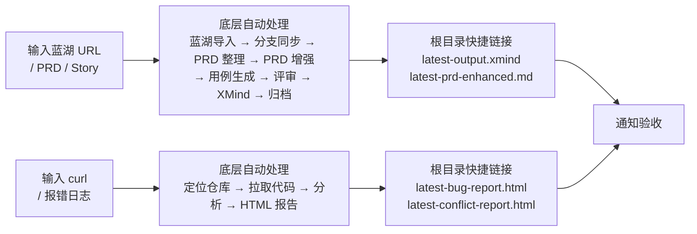
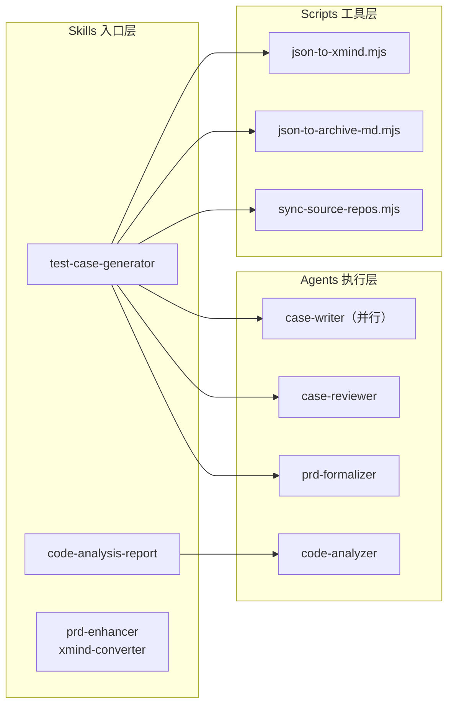
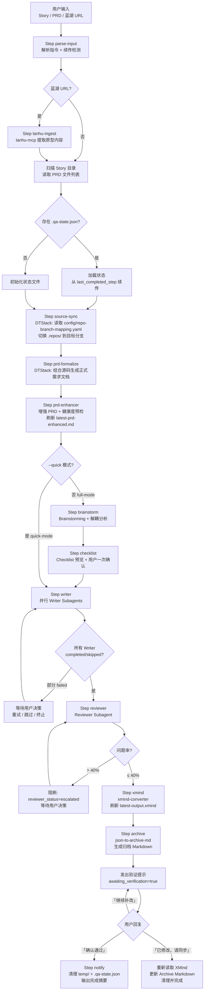
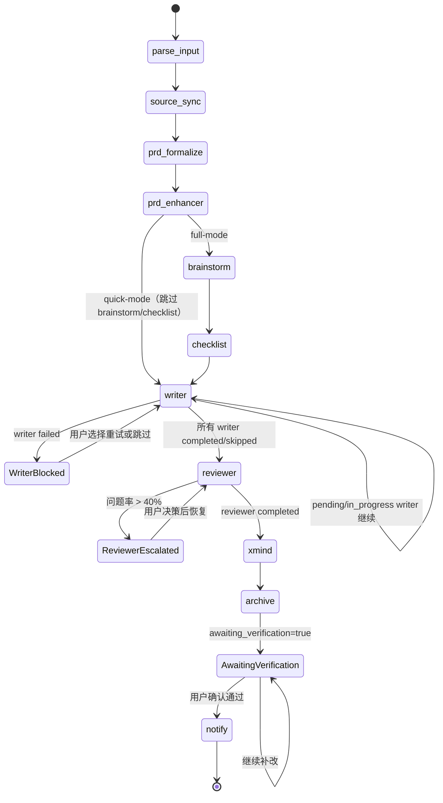
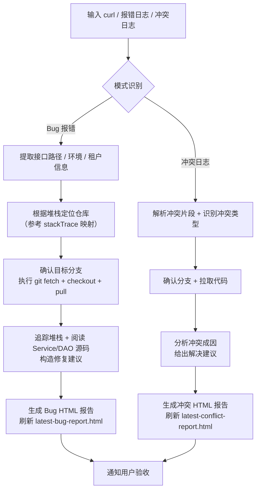

# qa-flow

本仓库用于 QA 测试用例生成、蓝湖 URL 自动导入、历史归档转化与代码分析。

完整工作流、命名 contract 和路径规则以 `CLAUDE.md` 为准；`README.md` 仅作入口导览。

> 不知道从哪开始？输入 `/using-qa-flow` 查看功能菜单；首次使用输入 `/using-qa-flow init` 初始化环境。

---

## 快速开始

```bash
# 生成测试用例（完整流程）
为 Story-20260322 生成测试用例
生成测试用例 https://lanhuapp.com/web/#/item/project/product?tid=...&pid=...&docId=...

# 快速模式（跳过 Brainstorming/Checklist/确认）
为 Story-20260322 --quick 生成测试用例

# 续传 / 模块重跑
继续 Story-20260322 的用例生成
重新生成 Story-20260322 的「列表页」模块用例

# 单独使用各 Skill
帮我增强这个 PRD：<PRD文件路径>
帮我分析这个报错（附报错日志 + curl）
转化所有历史用例
```

> `--quick` 是推荐的快速模式写法；自然语言"快速生成测试用例"也会被识别为同一模式。

---

## 用户视角极简流程



---

## 架构概览



---

## 测试用例生成详细流程



---

## 状态续传图



---

## 代码分析报告流程



---

## 快捷验收入口

| 输入类型               | 主要输出                            | 根目录快捷链接                                  | 建议回复                                   |
| ---------------------- | ----------------------------------- | ----------------------------------------------- | ------------------------------------------ |
| 蓝湖 URL / PRD / Story | 增强 PRD + XMind + Archive Markdown | `latest-prd-enhanced.md`、`latest-output.xmind` | `确认通过` / `已修改，请同步` / `继续补改` |
| curl / 报错日志        | Bug HTML 报告                       | `latest-bug-report.html`                        | `报告通过` / `继续补充分析`                |
| Jenkins 冲突日志       | 冲突 HTML 报告                      | `latest-conflict-report.html`                   | `报告通过` / `继续补充分析`                |

---

---

## 目录结构

```text
qa-flow/
├── config/
│   └── repo-branch-mapping.yaml   # DTStack repo/branch 映射
├── CLAUDE.md                      # 权威工作流手册
├── README.md                      # 本文件（入口导览）
├── latest-output.xmind            # 符号链接：最新 XMind 输出
├── latest-prd-enhanced.md         # 符号链接：最新增强 PRD
├── latest-bug-report.html         # 符号链接：最新 Bug 报告
├── latest-conflict-report.html    # 符号链接：最新冲突报告
├── cases/
│   ├── xmind/                     # XMind 输出（按模块）
│   ├── archive/                   # 归档 Markdown 根目录
│   ├── requirements/              # PRD / Story 工作目录
│   └── history/                   # 历史 CSV 等原始资料
├── .repos/                        # 隐藏源码仓库（只读）
├── reports/
│   ├── bugs/
│   └── conflicts/
├── assets/images/
├── tools/lanhu-mcp/               # 内置蓝湖 MCP 服务
└── .claude/
    ├── config.json                # 模块/仓库/路径 source of truth
    ├── rules/                     # 主题细则（用例/XMind/Archive 等）
    ├── shared/
    │   └── scripts/               # 共享 Node.js 工具脚本
    │       ├── load-config.mjs
    │       └── output-naming-contracts.mjs
    └── skills/                    # Skill 入口层
        ├── test-case-generator/
        │   ├── SKILL.md           # 编排协议
        │   └── prompts/           # per-step 行为指导文件
        ├── prd-enhancer/
        ├── xmind-converter/
        ├── archive-converter/
        └── code-analysis-report/
```

---

## 先读哪里

1. `CLAUDE.md` — 权威工作流手册（推荐先读）
2. `.claude/rules/*.md` — 主题细则（用例、XMind、Archive、仓库安全等）
3. `.claude/config.json` — 模块 / 仓库 / 报告路径 source of truth

## 详细规范入口

- `CLAUDE.md#测试用例编写规范`
- `CLAUDE.md#XMind 输出规范`
- `CLAUDE.md#历史用例维护`
- `CLAUDE.md#源码仓库详细清单`
- `CLAUDE.md#源码仓库安全规则`
- `.claude/rules/test-case-writing.md`
- `.claude/rules/xmind-output.md`
- `.claude/rules/archive-format.md`
- `.claude/rules/directory-naming.md`
- `.claude/rules/repo-safety.md`
