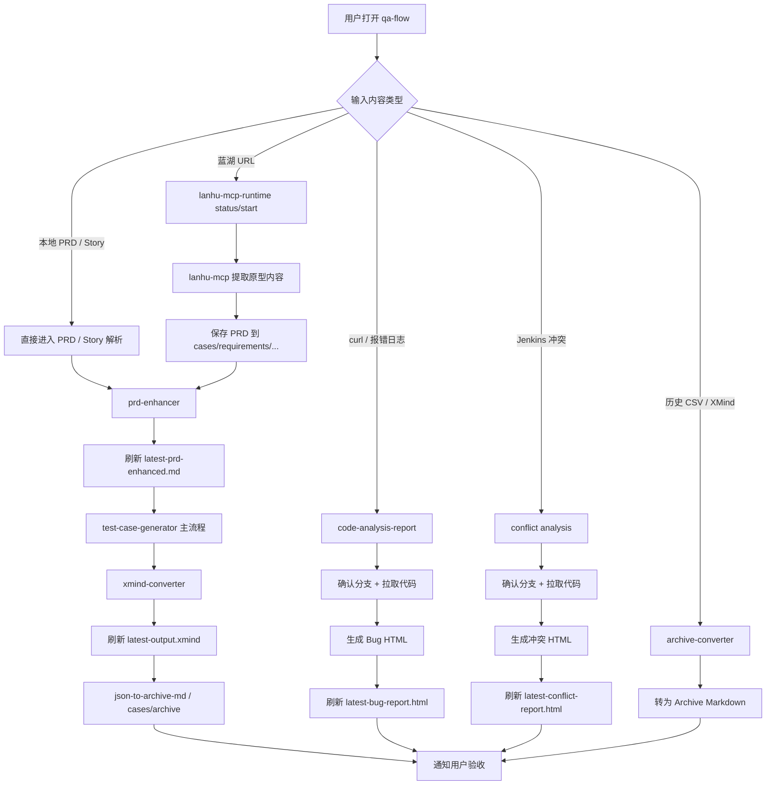
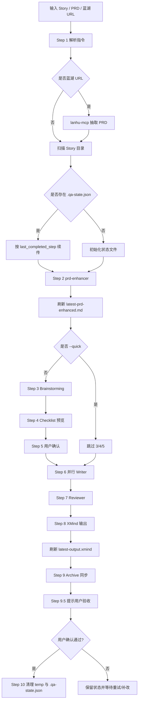
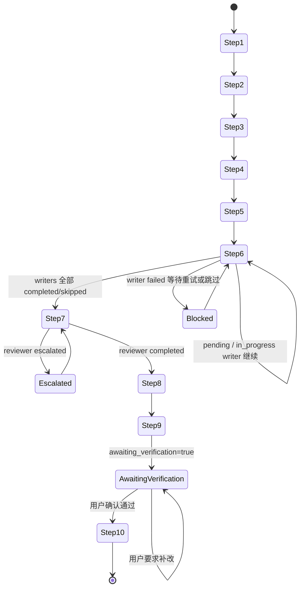
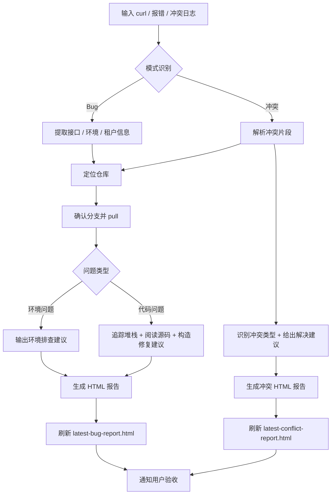

# qa-flow

本仓库用于 QA 测试用例生成、蓝湖 URL 自动导入、历史归档转化与代码分析。`README.md` 只保留**入口导览**；完整工作流、命名 contract 和路径规则请以 `CLAUDE.md` 为准。

> 不知道从哪开始？输入 `/start` 查看功能菜单。

## 先读哪里

1. `CLAUDE.md` — 权威工作流手册（推荐先读）
2. `.claude/rules/*.md` — 主题细则（用例、XMind、Archive、仓库安全等）
3. `.claude/config.json` — 模块 / 仓库 / 报告路径 source of truth
4. `.claude/harness/*.json` — Harness Phase 1 控制平面（workflow / delegate / contract）

## 常用指令

```bash
# 生成测试用例（完整流程）
生成用例 Story-20260322 PRD-26
为 <Story目录> 写测试用例
生成测试用例 https://lanhuapp.com/web/#/item/project/product?tid=...&pid=...&docId=...

# 快速模式 / 续传 / 重跑
为 <Story目录> 快速生成测试用例
继续 <Story> 的用例生成
重新生成 <Story> 的「列表页」模块用例

# 单独使用各 Skill
帮我增强这个 PRD：<PRD文件路径>
帮我分析这个报错
转化所有历史用例
```

## 关键约定速览

- Archive 根目录固定为 `cases/archive/`。
- `xyzh` 是模块 key；`custom/xyzh` 只是 `cases/xmind/` 与 `cases/archive/` 下的路径别名。
- 输出分两类：
  - PRD 级：`YYYYMM-<功能名>.xmind` / `YYYYMM-<功能名>.md`
  - Story 级：`YYYYMM-Story-YYYYMMDD.xmind` / `YYYYMM-Story-YYYYMMDD.md`
- 仓库中已存在旧文件名（如 `信永中和测试用例.xmind`）时，不要求为对齐新 contract 而批量改名。
- `repos/` 下源码仓库只读；详细限制见 `CLAUDE.md#源码仓库安全规则` 与 `.claude/rules/repo-safety.md`。
- 根目录快捷链接：
  - `latest-output.xmind`
  - `latest-prd-enhanced.md`
  - `latest-bug-report.html`
  - `latest-conflict-report.html`

## 快捷验收入口

| 输入类型 | 主要输出 | 根目录快捷链接 | 验收方式 |
| --- | --- | --- | --- |
| 蓝湖 URL / PRD / Story | 增强 PRD + XMind + Archive Markdown | `latest-prd-enhanced.md`、`latest-output.xmind` | 打开链接检查结构与内容 |
| curl / 报错日志 | Bug HTML 报告 | `latest-bug-report.html` | 在浏览器中打开，或复制到禅道 |
| Jenkins 冲突日志 | 冲突 HTML 报告 | `latest-conflict-report.html` | 检查冲突分类与建议 |

## Harness Phase 1 控制平面

- `Skill` 仍是**入口层**：负责理解用户输入并决定走哪条 workflow。
- `.claude/harness/workflows/*.json` 是**控制平面**：定义步骤顺序、依赖、resume 点、输出产物。
- `.claude/harness/delegates.json` 是**delegate 注册表**：把 workflow step 绑定到实际 script / Skill / agent。
- `.claude/harness/contracts.json` 是**治理层 contract**：统一 `.qa-state.json`、`latest-*` 快捷链接、质量阈值和恢复策略。
- `.claude/config.json` 继续只做**全局路径/映射 source of truth**，不再承载整条流程定义。

## Mermaid 流程图

### 1. 统一入口路由图



### 2. 测试用例生成详细交互图



### 3. 状态续传图



### 4. 代码分析报告交互图



## 目录入口

```text
qa-flow/
├── CLAUDE.md
├── README.md
├── cases/
│   ├── xmind/
│   ├── archive/
│   ├── requirements/
│   └── history/
├── repos/
├── reports/
├── assets/
└── .claude/
    ├── config.json
    ├── harness/
    │   ├── workflows/
    │   ├── delegates.json
    │   └── contracts.json
    └── rules/
```

## 详细规范入口

- `CLAUDE.md#测试用例编写规范`
- `CLAUDE.md#XMind 输出规范`
- `CLAUDE.md#历史用例维护`
- `CLAUDE.md#源码仓库详细清单`
- `CLAUDE.md#源码仓库安全规则`
- `.claude/rules/test-case-writing.md`
- `.claude/rules/xmind-output.md`
- `.claude/rules/archive-format.md`
- `.claude/rules/directory-naming.md`
- `.claude/rules/repo-safety.md`
