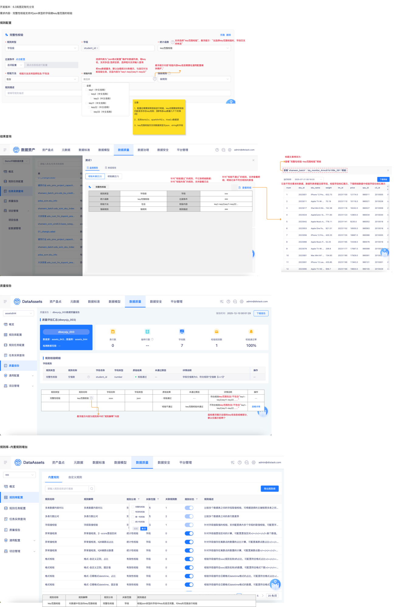

# 【内置规则丰富】完整性，json中key值范围校验

## 需求来源

- 蓝湖页面：`15693【内置规则丰富】完整性，json中key值范围校验`
- 文档版本：`数据资产V6.4.10`
- 依赖关系：本需求依赖 15696 的 `json格式校验管理` 数据作为 key 来源。
- 用户补充：15693 与 15694 后行，需在 15696 基础信息确认后再进入 Writer。

## 需求摘要

- 需求内容：在完整性校验中新增 `key范围校验`，用于校验 json 类型字段中的 key 是否满足范围要求。
- 页面目标：在规则配置页支持选择校验方法与校验内容，在结果页与质量报告中展示 key 范围校验结果。
- 页面入口：需先在 `数据质量 → 规则集管理` 创建规则集记录，再进入 `数据质量 → 规则任务管理` 点击 `新建监控规则`，在规则配置中选择 `key范围校验`。
- 页面范围：规则配置、结果查询、质量报告、规则库说明。

## 页面截图

## 需求澄清结果

- 已确认岚图定制化项目的实际入口不是标品中的 `规则任务配置 / 单表校验规则`。
- 已确认测试前需先在 `数据质量 → 规则集管理 → 新增规则集` 创建规则集记录。
- 已确认规则配置入口为 `数据质量 → 规则任务管理 → 新建监控规则`，后续在新建监控规则流程中选择 `key范围校验`。

## 页面关键模块

1. 规则配置区：支持选择 `key范围校验`，并设置 `包含 / 不包含`。
2. 校验内容选择区：数据来源于 `json格式配置` 页面维护的 key 列表，支持多选、全选、输入查询。
3. 结果查询区：失败时支持查看明细。
4. 质量报告区：显示规则类型、规则名称、字段名称、字段类型、质检结果、未通过原因、详情说明、操作。
5. 规则库区：新增 `key范围校验` 内置规则，并给出悬浮说明。

## 关键字段与交互规则

### 规则配置

- 当选择 `key范围校验` 时，悬浮提示：`当选择key范围校验时，字段仅支持单选`。
- `校验方法` 支持 `包含 / 不包含`。
- `校验内容` 为 `json格式配置` 维护的数据列表，展示格式为 `key（中文名称）`。

### key 选择与回显

- 选择框支持多选、全选、输入查询。
- key 数量较大时默认仅加载前 200 条。
- 勾选仅对当前层级生效。
- 回显格式为 `key1-key2;key11-key22`。
- 鼠标悬浮展示全部 key 名信息或部分内容，默认仅展示前两个。

### 校验范围

- 配置后需按层级进行校验，key 名需要按层级匹配是否存在 key 信息。
- 需要考虑 key 数量达到几千个的场景。
- 支持数据源：`doris3.x`、`sparkthrift2.x`、`hive2.x`。
- 仅支持字段类型：`json`、`string`。

### 结果展示

- 校验失败时支持查看明细，明细保留全部字段，校验字段标红，下载明细中的校验字段也标红。
- 校验通过时不记录明细数据。
- 校验失败时支持查看日志。

## 关键业务规则

1. 规则名称：`key范围校验`。
2. 规则解释：`对数据中包含的key范围校验`。
3. 规则分类：`完整性校验`，关联范围：`字段`。
4. 规则描述：`校验json类型的字段中key名是否完整，对key的范围进行校验`。
5. 规则库悬浮提示补充文案：`校验内容key信息需要在通用配置模块维护。`
6. 质量报告中的通过文案为“符合规则 key 范围包含/不包含 …”，失败文案为“key 范围校验未通过”。

## 回归与测试关注点

### P0 主路径

1. 选择 `包含` 并配置多级 key 后保存成功，运行结果正确。
2. 选择 `不包含` 并配置多级 key 后保存成功，运行结果正确。
3. 校验失败时能查看明细，明细字段标红正确。

### P1 核心规则

1. key 来源必须仅来自 15696 配置列表。
2. 仅支持 `json / string` 字段，其他字段类型不可配置该规则。
3. 层级 key 选择、回显与运行时匹配逻辑一致。
4. key 数量较多时仅加载前 200 条，但搜索与选择仍可正确定位目标 key。

### P2 扩展与边界

1. 几千个 key 场景下的勾选、搜索与回显表现。
2. 勾选当前层级 key 后切换层级时的选择保留策略。
3. 成功规则不落明细、失败规则落明细与日志的差异表现。

## 待澄清事项

1. `字段仅支持单选` 具体限制的是校验字段选择控件还是整个规则块仅允许配置一条字段记录，蓝湖文本仍需结合页面确认。
2. 回显格式 `key1-key2;key11-key22` 中分号与层级的精确映射规则未在文字中展开。
