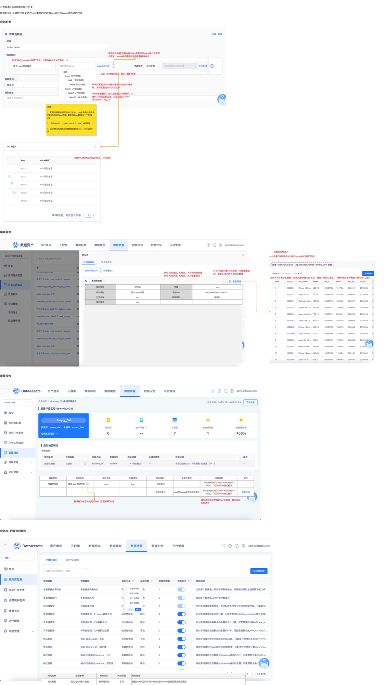

# 【内置规则丰富】有效性，json中key对应的value值格式校验

## 需求来源

- 蓝湖页面：`15694【内置规则丰富】有效性，json中key对应的value值格式校验`
- 文档版本：`数据资产V6.4.10`
- 依赖关系：本需求依赖 15696 中已维护的 key 与 value 格式配置。
- 用户补充：长图补足了规则配置页布局、`value格式预览` 弹窗、结果查询、质量报告和规则库新增入口位置。

## 需求摘要

- 需求内容：在有效性校验中新增 `格式-json格式校验`，用于校验 json 字段中指定 key 对应的 value 是否符合预设格式。
- 页面目标：支持按 key 选择、按 value 格式预览、按执行结果查看失败明细。
- 页面入口：需先在 `数据质量 → 规则集管理` 创建规则集记录，再进入 `数据质量 → 规则任务管理` 点击 `新建监控规则`，在规则配置中选择 `格式-json格式校验`。
- 页面范围：规则配置、key 选择、value 格式预览、结果查询、质量报告、规则库说明。

## 页面截图

## 需求澄清结果

- 已确认岚图定制化项目不使用标品中的 `规则任务配置 / 单表校验规则` 命名。
- 已确认测试前需先在 `数据质量 → 规则集管理 → 新增规则集` 创建规则集记录。
- 已确认规则配置入口为 `数据质量 → 规则任务管理 → 新建监控规则`，并在规则项中选择 `格式-json格式校验`。

## 页面关键模块

1. 规则配置区：新增 `格式-json格式校验` 选项。
2. 校验 key 选择区：支持多选、全选、输入查询，并按层级回显。
3. `value格式预览` 区：仅展示已选 key 对应的 value 格式信息，支持分页。
4. 结果查询区：失败时可查看明细，成功时不记录明细。
5. 质量报告区：展示 `格式-json格式校验` 的通过/失败结果。
6. 规则库区：规则解释、位置与悬浮提示文案需同步更新。

## 关键字段与交互规则

### 规则入口与规则说明

- 规则名称：`格式-json格式校验`。
- 规则在规则库中的位置：`自定义正则` 上方。
- 规则解释：`校验json类型的字段中key对应的value值是否符合规范要求`。

### 校验 key 选择

- key 来源于 15696 配置页面维护的数据。
- 选择列表展示 `key（中文名称）`。
- 仅**已配置 value 格式**的 key 可以被选择；未配置的 key 不支持选中。
- key 数量较大时默认仅加载前 200 条。
- 勾选仅对当前层级生效。
- 回显格式为 `key1-key2;key11-key22`。
- 鼠标悬浮展示全部 key 名信息，默认仅展示前两个。

### value 格式预览

- 点击 `value格式预览` 后展示弹窗。
- 弹窗仅展示当前已勾选 key 的 `key / value格式` 信息。
- 弹窗内容分页展示。
- 悬浮提示文案：`校验内容为key名对应的value格式是否符合要求，value格式需要在通用配置模块维护。`

### 校验范围与结果

- 配置后按层级进行校验，key 名需要按层级匹配是否存在 key 信息。
- 支持数据源：`doris3.x`、`sparkthrift2.x`、`hive2.x`。
- 仅支持字段类型：`json`、`string`。
- 校验失败时可查看明细；明细保留全部字段，校验字段标红。
- 校验通过时不记录明细；校验失败时支持查看日志。

## 关键业务规则

1. 规则分类：`有效性校验`，关联范围：`字段`。
2. 规则描述：`校验json类型的字段中key对应的value值是否符合规范要求`。
3. 质量报告通过文案：符合规则 key 对应的 value 格式要求。
4. 质量报告失败文案：`key对应value格式校验未通过`。
5. 规则库悬浮提示内容来源于规则解释，且页面补充图已确认有独立的规则库新增位置。

## 回归与测试关注点

### P0 主路径

1. 选择多个已配置 value 格式的 key 后保存成功，运行结果正确。
2. 打开 `value格式预览` 弹窗，分页内容仅展示已勾选 key。
3. 校验失败时可查看明细与日志。

### P1 核心规则

1. 未配置 value 格式的 key 不允许被选中。
2. 规则仅支持 `json / string` 字段，其他字段类型不允许配置。
3. 规则库位置、名称与悬浮提示文案正确。
4. 层级 key 的回显、悬浮展示与运行时匹配逻辑一致。

### P2 扩展与边界

1. 几千个 key 场景下的默认加载、搜索、分页与预览表现。
2. `value格式预览` 弹窗在无勾选 key、单个 key、多个 key 场景下的展示差异。
3. 成功不落明细、失败落明细与查看日志口径的一致性。

## 待澄清事项

1. `value格式预览` 弹窗是否支持搜索、复制或导出，蓝湖文本未明确。
2. 回显格式中分号对应的层级含义需要结合页面真实实现确认。
