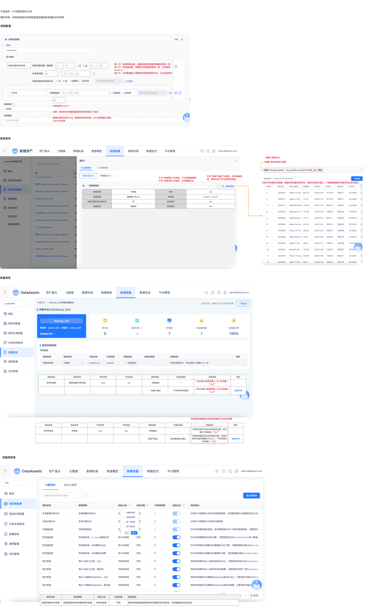

# 【内置规则丰富】有效性，支持设置字段多规则的且或关系

## 需求来源

- 蓝湖页面：`15695【内置规则丰富】有效性，支持设置字段多规则的且或关系`
- 文档版本：`数据资产V6.4.10`
- 依赖关系：本需求不依赖 15696，可独立并行产出。
- 用户补充：规则配置页、结果查询与质量报告细节已通过补充截图补全。

## 需求摘要

- 需求内容：在有效性校验中新增 `取值范围&枚举范围` 联合规则，支持配置 `且 / 或` 关系。
- 页面目标：把原有 `取值范围` 与 `枚举值` 两类规则合并为同一校验配置，并覆盖查询结果、质量报告与规则库展示。
- 页面入口：需先在 `数据质量 → 规则集管理` 创建规则集记录，再进入 `数据质量 → 规则任务管理` 点击 `新建监控规则` 配置联合规则。
- 页面范围：规则配置、结果查询、质量报告、规则库说明。

## 页面截图

## 需求澄清结果

- 已确认岚图定制化项目**不存在**标品中的 `规则任务配置`、`单表校验规则` 按钮名称。
- 已确认本需求测试链路为：先在 `数据质量 → 规则集管理 → 新增规则集` 创建规则集记录，再进入 `数据质量 → 规则任务管理` 点击 `新建监控规则`。
- 后续用例需以 `规则集管理 / 规则任务管理 / 新建监控规则` 为准，不得使用标品命名。

## 页面关键模块

1. 规则配置区：第一行配置取值范围，第二行配置枚举值，第三行配置二者关系与过滤条件。
2. 关系切换区：支持 `且`、`或` 两种关系。
3. 枚举值配置区：支持 `in`、`not in`。
4. 结果查询区：失败时可查看明细，成功时不记录明细。
5. 质量报告区：对联合规则、纯枚举规则、`not in` 场景分别给出说明文案。
6. 规则库区：新增 `取值范围&枚举范围` 规则说明。

## 关键字段与交互规则

### 联合规则配置

- 第一行：取值范围设置，逻辑与现有取值范围规则保持一致。
- 第二行：枚举值设置，逻辑与现有枚举值规则保持一致，支持 `in / not in`。
- 第三行：配置取值范围与枚举值之间的关系，并支持填写过滤条件。
- 关系项支持 `且 / 或`，配置结果需在结果查询和质量报告中回显。

### 字段类型与计算规则

- 新增联合规则支持 `string` 与数值类型字段。
- `string` 类型默认按 `double` 强转后参与判断。
- 原有枚举值规则也同步新增 `in / not in` 选项。

### 结果展示

- 失败规则支持查看明细，明细仅记录不符合规则的数据，并对校验字段标红。
- 成功规则不记录明细数据，仅保留日志口径。
- 质量报告需要覆盖以下说明：
  - 联合规则通过：符合 `取值范围` 与 `枚举值` 组合规则；
  - 联合规则失败：不符合联合规则；
  - 纯枚举值规则通过/失败；
  - 枚举值 `not in` 场景的说明文案。

## 关键业务规则

1. 联合规则名称为 `取值范围&枚举范围`，规则解释为 `取值范围和枚举范围的联合校验`。
2. 规则分类归属 `有效性校验`，关联范围为 `字段`。
3. 规则描述为：`校验字段值取值范围和枚举范围是否符合要求，支持配置规则且或关系`。
4. 结果页与质量报告中，失败规则支持 `查看详情`，并记录失败数据。
5. 蓝湖文本已明确：标题文案统一为“校验通过不记录明细；校验失败支持查看日志”。

## 回归与测试关注点

### P0 主路径

1. 配置 `取值范围 + 枚举值 + 且` 后保存成功，并在结果页正确展示。
2. 配置 `取值范围 + 枚举值 + 或` 后保存成功，并在结果页正确展示。
3. 使用 `in`、`not in` 两种枚举关系分别执行，结果文案正确。

### P1 核心规则

1. `string` 类型字段默认强转 `double` 后能正确参与联合判断。
2. 原有枚举值规则同步支持 `in / not in`，旧能力不回退。
3. 联合规则失败时仅失败数据进入明细，成功不落明细。
4. 质量报告中 `取值范围&枚举范围`、纯枚举值、`not in` 的详情说明一致。

### P2 扩展与边界

1. 仅配置取值范围或仅配置枚举值时，页面交互是否允许保存。
2. 联合关系切换后历史输入值的保留与清空策略。
3. 过滤条件叠加联合规则后的执行结果口径。

## 待澄清事项

1. 联合规则是否允许只配置取值范围或只配置枚举值，蓝湖文本未明确。
2. 历史已存在的枚举值规则在编辑态下如何回显 `in / not in`，蓝湖文本未说明。
