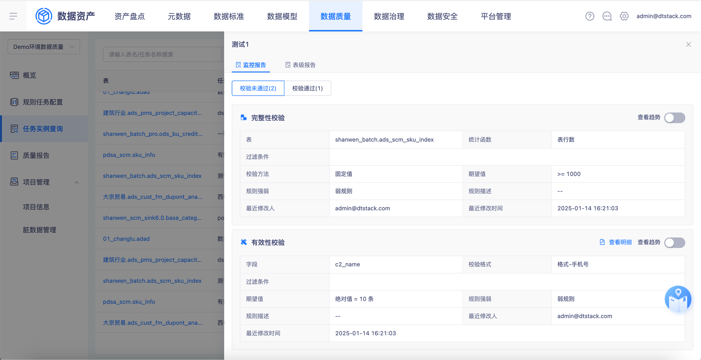
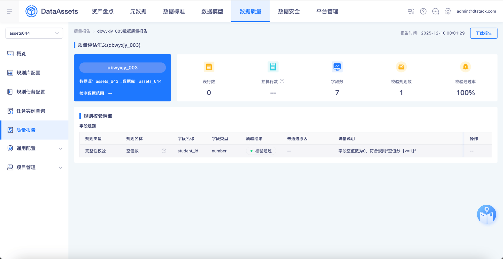
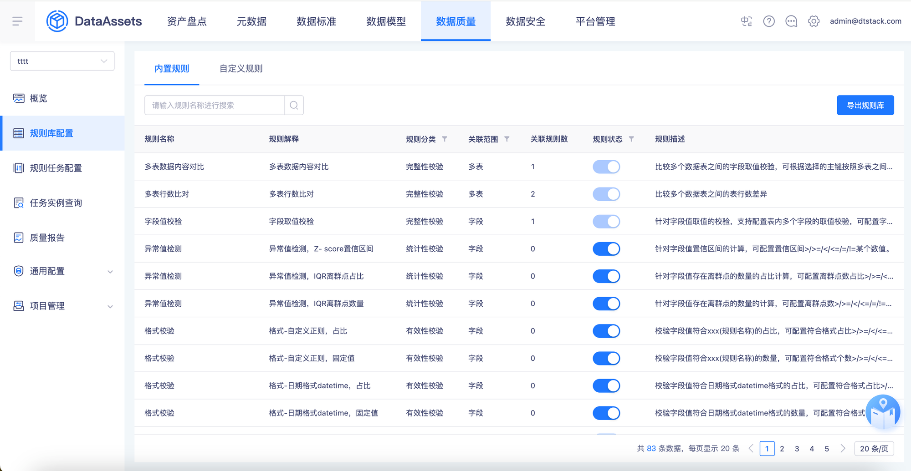
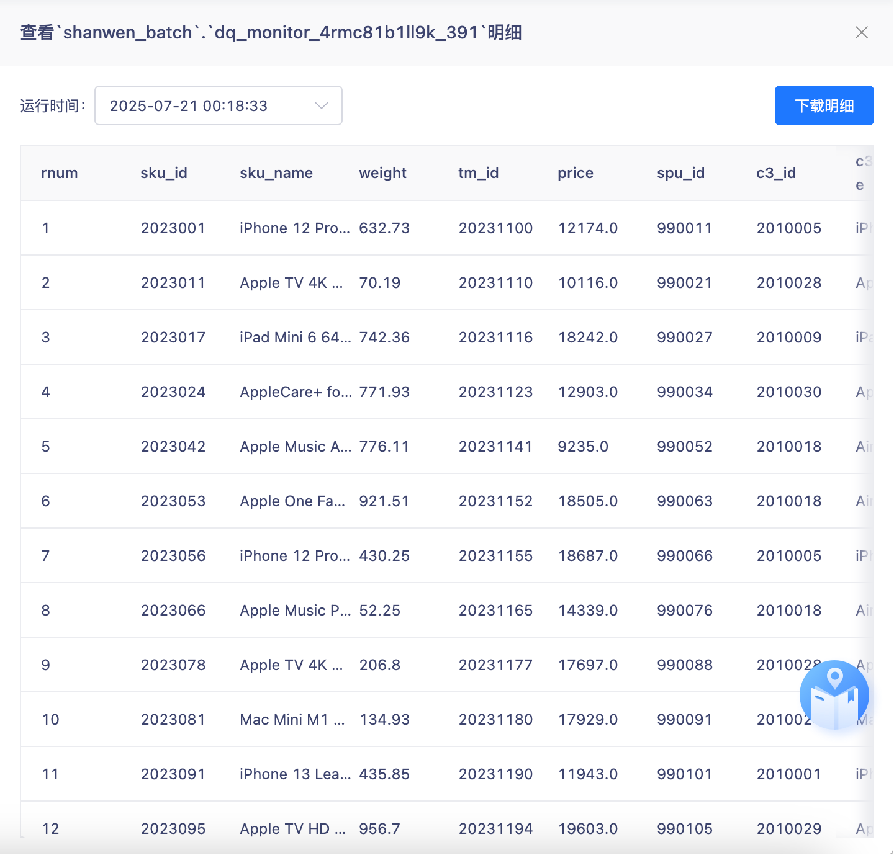
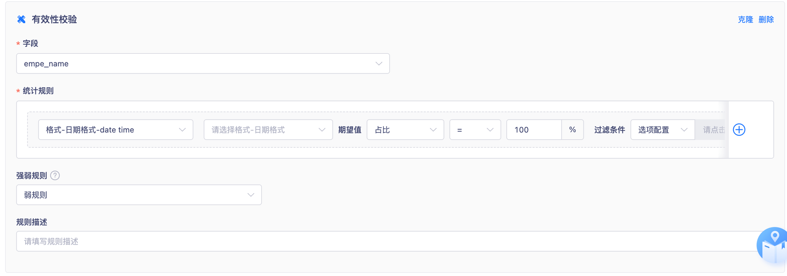
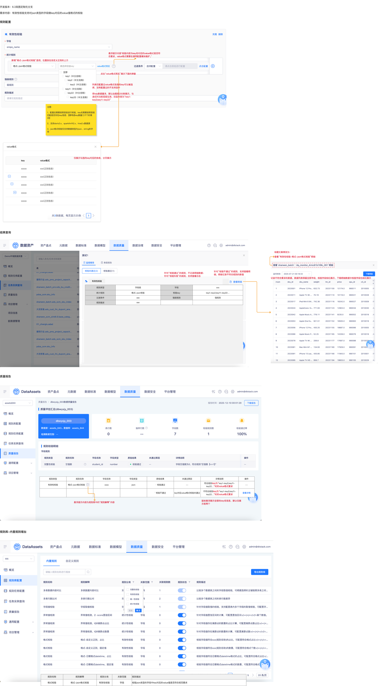

# 【内置规则丰富】有效性，json中key对应的value值格式校验

## 页面元素截图

## 控件文本

开发版本：6.3岚图定制化分支需求内容：有效性校验支持对json类型的字段做key对应的value值格式的校验 | 规则配置 | 结果查询 | 针对“校验不通过”的规则，支持查看明细，明细记录不符合规则的数值 | 查看“有效性校验-格式-json格式校验”明细 | 记录不符合要求的数据，数据列表保留全部字段，校验字段标红展示，下载明细数据中校验字段也标红展示 | 标题文案修改为： | 针对“校验通过”的规则，不记录明细数据；针对“校验失败”的规则，支持查看日志 | 规则类型 | 字段级 | 字段 | xxx | 统计规则 | 格式-json校验 | 校验key | key1-key2;key11-key22… | 过滤条件 | 强弱规则 | 强规则 | 规则描述

## 整页截图

## 页面完整文本

开发版本：6.3岚图定制化分支

需求内容：有效性校验支持对json类型的字段做key对应的value值格式的校验

规则配置

结果查询

针对“校验不通过”的规则，支持查看明细，明细记录不符合规则的数值

查看“有效性校验-格式-json格式校验”明细

记录不符合要求的数据，数据列表保留全部字段，校验字段标红展示，下载明细数据中校验字段也标红展示

标题文案修改为：

针对“校验通过”的规则，不记录明细数据；

针对“校验失败”的规则，支持查看日志

规则类型

字段级

字段

xxx

统计规则

格式-json校验

校验key

key1-key2;key11-key22…

过滤条件

xxx

强弱规则

强规则

规则描述

xxx

有效性校验

质量报告

规则类型

规则名称

字段名称

字段类型

质检结果

未通过原因

详情说明

操作

有效性校验

  格式-json格式校验

xxxx

json

· 校验通过

- -

符合规则key为“key1-key2;key11-key22…”时的value格式要求

- -

` 校验不通过

key对应value格式校验未通过

不符合规则key为“key1-key2;key11-key22…”时的value格式要求

查看详情

规则名称

规则解释

规则分类

关联范围

规则描述

格式校验

格式-json格式校验

有效性校验

字段

校验json类型的字段中key对应的value值是否符合规范要求

规则库-内置规则增加

悬浮提示内容为规则库中的“规则解释”内容

格式-json格式校验

新增“格式-json格式校验”选项，位置放在自定义正则的上方

请选择校验key

全部

key1（中文名称）

key2（中文名称）

key3（中文名称）

key11（中文名称）

key22（中文名称）

key33（中文名称）

注意：

1、配置后需要按照层级进行校验，key名需要按照层级匹配是否存在key信息；【要考虑key数量几千个的情况】

2、支持doris3.x、sparkthrift2.x、hive2.x数据源

3、json格式校验仅支持数据类型为json、string的字段

value格式预览

悬浮提示内容“校验内容为key名对应的value格式是否符合要求，value格式需要在通用配置模块维护。”

value格式

key

xxxxx

xxxxx

xxxxx

xxxxx

xxxxx

value格式

xxx(正则信息)

xxx(正则信息)

xxx(正则信息)

xxx(正则信息)

xxx(正则信息)

仅展示勾选的key对应的信息，分页展示

点击“value格式预览”展示下面的弹窗

列表仅配置过value格式信息的key可以被选择，没有配置过的不支持选中

若key数据量多，默认加载前200条展示，勾选仅对当前层级生效，回显内容为“key1-key2;key11-key22”

鼠标悬浮展示全部的key名信息，默认仅展示前两个
