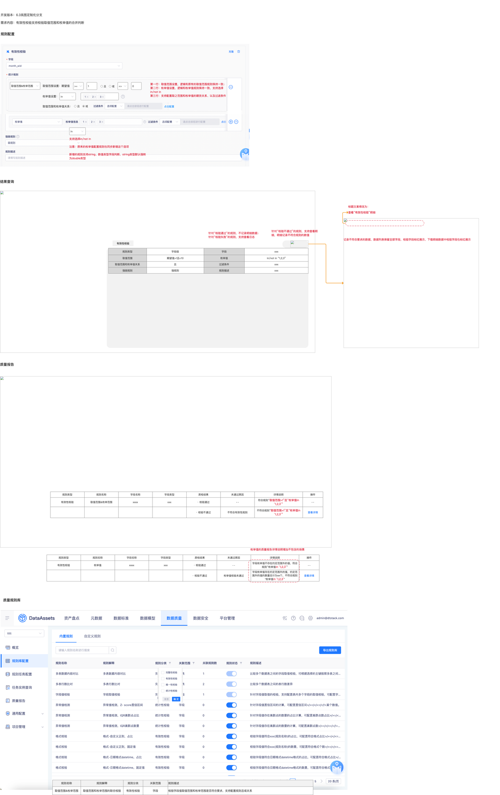

# 【内置规则丰富】有效性，支持设置字段多规则的且或关系

## 页面元素截图

## 控件文本

开发版本：6.3岚图定制化分支需求内容：有效性校验支持校验取值范围和枚举值的合并判断 | 规则配置 | 结果查询 | 针对“校验不通过”的规则，支持查看明细，明细记录不符合规则的数值 | 查看“有效性校验”明细 | 记录不符合要求的数据，数据列表保留全部字段，校验字段标红展示，下载明细数据中校验字段也标红展示 | 标题文案修改为： | 针对“校验通过”的规则，不记录明细数据；针对“校验失败”的规则，支持查看日志 | 规则类型 | 字段级 | 字段 | xxx | 取值范围 | 期望值>1且<10 | 枚举值 | in/not in “1,2,3” | 取值范围和枚举值关系 | 且 | 过滤条件 | 强弱规则

## 整页截图

## 页面完整文本

开发版本：6.3岚图定制化分支

需求内容：有效性校验支持校验取值范围和枚举值的合并判断

规则配置

结果查询

针对“校验不通过”的规则，支持查看明细，明细记录不符合规则的数值

查看“有效性校验”明细

记录不符合要求的数据，数据列表保留全部字段，校验字段标红展示，下载明细数据中校验字段也标红展示

标题文案修改为：

针对“校验通过”的规则，不记录明细数据；

针对“校验失败”的规则，支持查看日志

规则类型

字段级

字段

xxx

取值范围

期望值>1且<10

枚举值

in/not in “1,2,3”

取值范围和枚举值关系

且

过滤条件

xxx

强弱规则

强规则

规则描述

xxx

有效性校验

质量报告

规则类型

规则名称

字段名称

字段类型

质检结果

未通过原因

详情说明

操作

有效性校验

取值范围&枚举范围

xxxx

xxx

· 校验通过

- -

符合规则“取值范围>1”且“枚举值in ‘1,2,3’”

- -

· 校验不通过

不符合有效性规则

不符合规则“取值范围>1”且“枚举值in ‘1,2,3’”

查看详情

规则类型

规则名称

字段名称

字段类型

质检结果

未通过原因

详情说明

操作

有效性校验

枚举值

xxxx

xxx

· 校验通过

- -

字段枚举值不存在约定范围外的值，符合规则“枚举值in ‘1,2,3’”

- -

· 校验不通过

枚举值校验未通过

字段枚举值存在约定范围外的值，约定范围外的值的数量总计为xx个，不符合规则“枚举值in ‘1,2,3’”

查看详情

枚举值的质量报告详情说明增加不包含的场景

 取值范围&枚举范围

 >=

取值范围设置：期望值

 1

且

或

 <=

 0

枚举值设置：

 in

取值范围和枚举值关系：

且

或

点击配置

 in

支持选择in/not in

注意：原来的枚举值配置规则也同步新增这个选项

新增的规则支持string、数值类型字段判断，string类型默认强转为double类型

第一行：取值范围设置，逻辑和原有的取值范围规则保持一致；

第二行：枚举值设置，逻辑和枚举值规则保持一致，支持选择in/not in

第三行：支持配置取之范围和枚举值的期货关系、以及过滤条件

质量规则库

规则名称

规则解释

规则分类

关联范围

规则描述

取值范围&枚举范围

取值范围和枚举范围的联合校验

有效性校验

字段

校验字段值取值范围和枚举范围是否符合要求，支持配置规则且或关系
