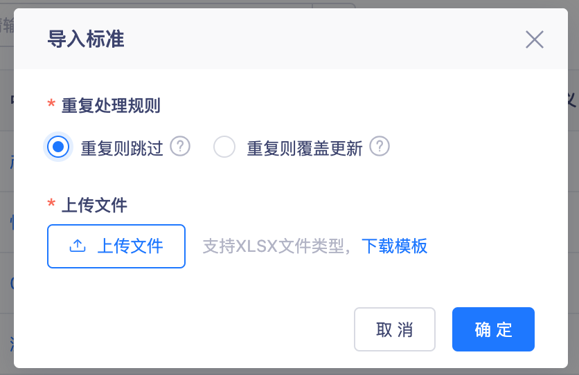
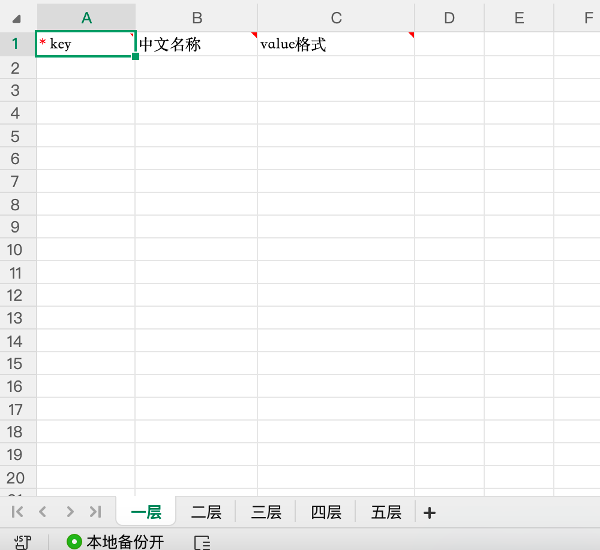
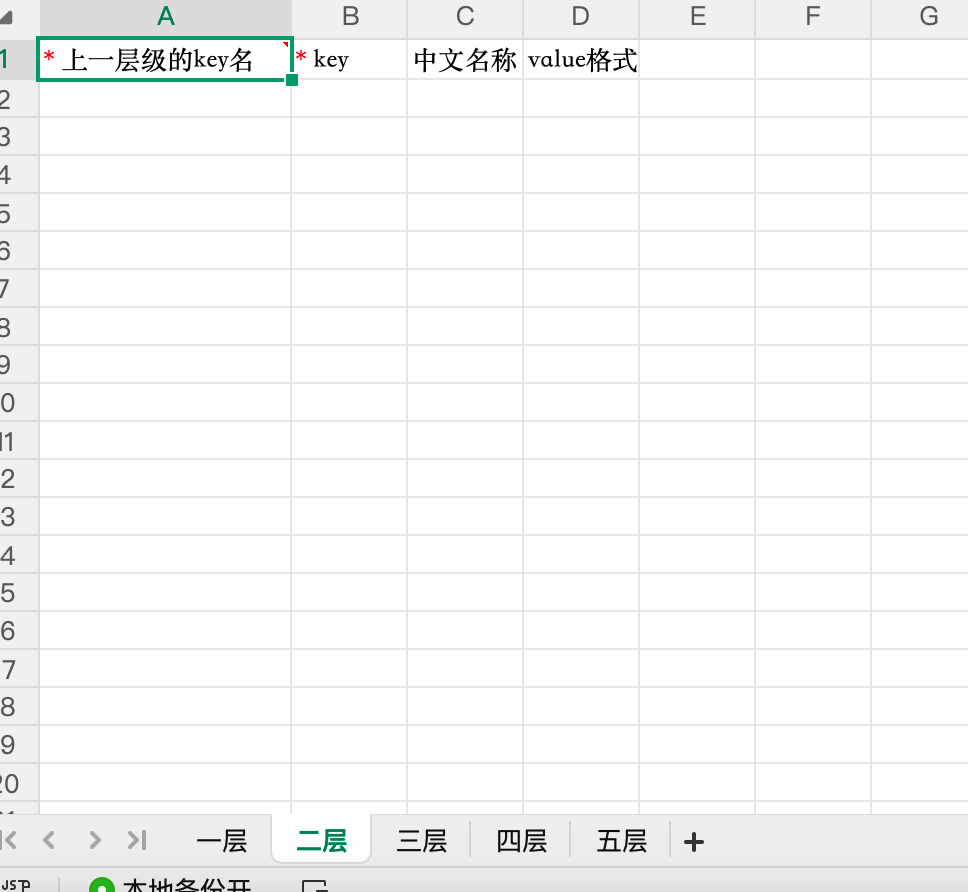
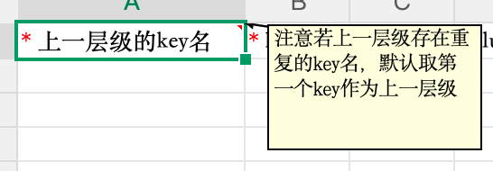
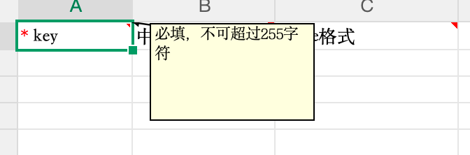
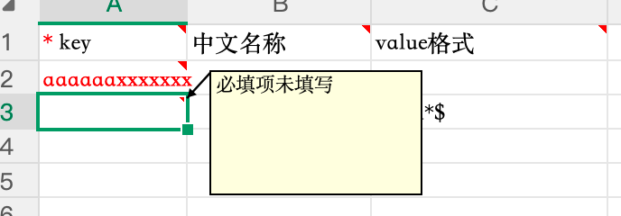
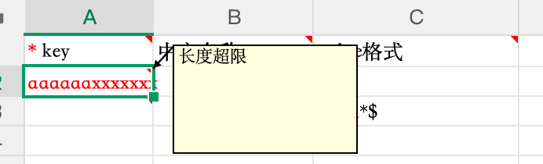
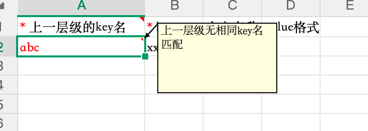
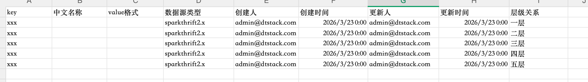
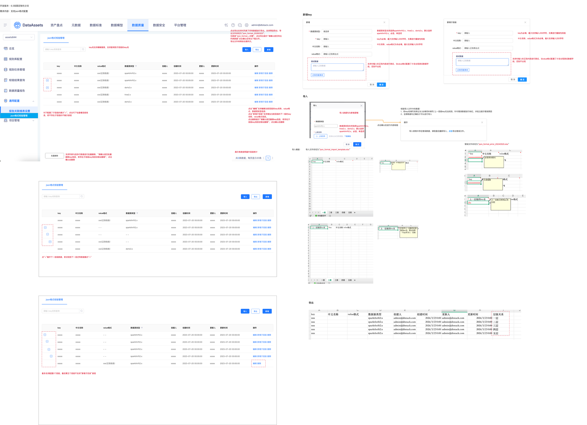

# 【通用配置】json格式配置

## 页面元素截图

## 控件文本

开发版本：6.3岚图定制化分支需求内容：支持json格式配置 | json格式校验管理 | 请输入key名称查询 | 创建人

xxxxxxxxxxxxxxxxxxxxxxxxx | 创建人 | xxxxxxxxxxxxxxxxxxxxxxxxx | 操作

编辑 新增子层级 删除编辑 新增子层级 删除编辑 新增子层级 删除编辑 新增子层级 删除编辑 新增子层级 删除 | 操作 | 编辑 新增子层级 删除编辑 新增子层级 删除编辑 新增子层级 删除编辑 新增子层级 删除编辑 新增子层级 删除 | 导入 | 导出 | key

xxxxxxxxxxxxxxxxxxxxxxxxx | key | value格式

xxx(正则信息)xxx(正则信息)xxx(正则信息)xxx(正则信息)xxx(正则信息) | value格式 | xxx(正则信息)xxx(正则信息)xxx(正则信息)xxx(正则信息)xxx(正则信息) | 创建时间 | 2023-07-20 00:00:002023-07-20 00:00:002023-07-20 00:00:002023-07-20 00:00:002023-07-20 00:00:00 | 更新时间 | 新增

## 整页截图

## 页面完整文本

开发版本：6.3岚图定制化分支

需求内容：支持json格式配置

json格式校验管理

请输入key名称查询

 

创建人

xxxxx

xxxxx

xxxxx

xxxxx

xxxxx

操作

编辑 新增子层级 删除

编辑 新增子层级 删除

编辑 新增子层级 删除

编辑 新增子层级 删除

编辑 新增子层级 删除

导入

导出

key

xxxxx

xxxxx

xxxxx

xxxxx

xxxxx

value格式

xxx(正则信息)

xxx(正则信息)

xxx(正则信息)

xxx(正则信息)

xxx(正则信息)

创建时间

2023-07-20 00:00:00

2023-07-20 00:00:00

2023-07-20 00:00:00

2023-07-20 00:00:00

2023-07-20 00:00:00

更新时间

2023-07-20 00:00:00

2023-07-20 00:00:00

2023-07-20 00:00:00

2023-07-20 00:00:00

2023-07-20 00:00:00

新增

json格式校验管理

数据源类型

sparkthrift2.x

sparkthrift2.x

doris3.x

hive2.x

doris3.x

请输入key名称查询

 

创建人

xxxxx

xxxxx

xxxxx

xxxxx

xxxxx

操作

编辑 新增子层级 删除

编辑 新增子层级 删除

编辑 新增子层级 删除

编辑 新增子层级 删除

编辑 新增子层级 删除

导入

导出

key

xxxxx

xxxxx

xxxxx

xxxxx

xxxxx

value格式

xxx(正则信息)

- -

- -

xxx(正则信息)

xxx(正则信息)

创建时间

2023-07-20 00:00:00

2023-07-20 00:00:00

2023-07-20 00:00:00

2023-07-20 00:00:00

2023-07-20 00:00:00

更新时间

2023-07-20 00:00:00

2023-07-20 00:00:00

2023-07-20 00:00:00

2023-07-20 00:00:00

2023-07-20 00:00:00

新增

json格式校验管理

数据源类型

sparkthrift2.x

sparkthrift2.x

- -

- -

doris3.x

更新人

xxxxx

xxxxx

xxxxx

xxxxx

xxxxx

更新人

xxxxx

xxxxx

xxxxx

xxxxx

xxxxx

请输入key名称查询

 

创建人

xxxxx

xxxxx

xxxxx

xxxxx

xxxxx

操作

编辑 新增子层级 删除

编辑 新增子层级 删除

编辑 新增子层级 删除

编辑 新增子层级 删除

编辑 删除

导入

导出

key

xxxxx

xxxxx

xxxxx

xxxxx

xxxxx

value格式

- -

- -

- -

- -

xxx(正则信息)

创建时间

2023-07-20 00:00:00

2023-07-20 00:00:00

2023-07-20 00:00:00

2023-07-20 00:00:00

2023-07-20 00:00:00

更新时间

2023-07-20 00:00:00

2023-07-20 00:00:00

2023-07-20 00:00:00

2023-07-20 00:00:00

2023-07-20 00:00:00

新增

json格式校验管理

数据源类型

sparkthrift2.x

sparkthrift2.x

sparkthrift2.x

sparkthrift2.x

sparkthrift2.x

更新人

xxxxx

xxxxx

xxxxx

xxxxx

xxxxx

对于配置了子层级的展示“+”，点击可下钻查看层级信息，若不存在子层级的不展示按钮

展示条数按照最外层级统计

点击“编辑”支持编辑当前层级的key名称、value格式、数据源类型信息；

点击“新增子层级”支持增加当前层级的下一级的key名称、value格式信息。

点击删除提示“请确认是否删除key信息，若存在子层级key信息会联动删除”，点击确认后删除

点“+”展开下一层级数据，若识别到下一层还有数据展示“+”

最多支持配置5个层级，最后第五个层级不支持“新增子目录”按钮

导入模版：

提示

导入表格中存在错误数据，请检查后重新导入，点击导出错误文件。

导入

校验导入文件中的数据：

1、若key名填写名称过长/必填项未填写/上一层级key无法找到，针对错误数据进行标红，并批注提示错误原因

2、全部数据均正确后才可以进行导入

点击确认后进行内容校验

错误文件命名为“json_format_error_20240520.xlsx”

导入文件命名为“json_format_import_template.xlsx”

数据源类型

sparkthrift2.x

数据源类型支持选择sparkthrift2.x、hive2.x、doris3.x，默认选择sparkthrift2.x，必选、单选项

新增

确 定

取 消

16

16

请输入

* key：

 

请输入正则表达式

value格式：

 

请选择

* 数据源类型：

 

新增子层级

确 定

取 消

16

16

请输入

* key：

 

请输入正则表达式

value格式：

 

中文名称

xxxxx

xxxxx

xxxxx

xxxxx

xxxxx

中文名称

xxxxx

xxxxx

xxxxx

xxxxx

xxxxx

请输入

中文名称：

 

请输入

中文名称：

 

中文名称

xxxxx

xxxxx

xxxxx

xxxxx

xxxxx

数据源类型支持选择sparkthrift2.x、hive2.x、doris3.x，默认选择sparkthrift2.x，必选、单选项

key为必填，最大支持输入255字符，无需进行重复性校验

中文名称、value格式为非必填，最大支持输入255字符

key为必填，最大支持输入255字符，无需进行重复性校验

中文名称、value格式为非必填，最大支持输入255字符

支持对输入的正则内容进行测试，当value格式配置了才会出现测试数据字段，否则不出现

支持对输入的正则内容进行测试，当value格式配置了才会出现测试数据字段，否则不出现

批量删除

支持列表勾选多行数据进行批量删除，“请确认是否批量删除key信息，若存在子层级key信息会联动删除”，点击确认后删除

点击导出支持对列表下所有数据进行导出，支持筛选导出，导出文件命名为“json_format_20260323”,

也就是“json_format_+日期”，点击导出提示“请确认是否导出列表数据”点击确认后导出下载文件。

导出文件样例如右侧所示。

新增key

导入

导出

导入数据均为新增逻辑

key名支持模糊搜索，支持查询到子层级的key名
