## 基本信息

| 项目 | 内容 |
|------|------|
| **迭代编号** | 13 |
| **发布日期** | 2026-03-05 |
| **责任人** | 刘一力 |
| **需求类型** | 新增功能详细设计 |

## 修改摘要

新增功能详细设计：

1. **流程中心** - 数据标准制定流程、数据集成共享流程、数据开放共享流程、数据质量需求与规则关联流程
2. **流程中心** - 流程列表（同上）
3. **数据质量** - 质量需求台账

---

## 一、流程中心 - 流程发起

### 1.1 数据标准-数据标准制定流程

#### 程序描述

数据标准制定流程分为**新增、变更、作废**三种子类型。

分别可对以下内容进行新增、变更、作废申请：
- 参考数据标准（即标准代码）
- 主数据/业务数据标准（即基础标准）
- 业务术语（即命名词典）

#### 业务逻辑

审批通过后，系统根据过程数据（字段设计（见下方附录6内容）），维护数据标准结果底表（字段设计（见附录3））。

完成后，调用datablau的开放接口，推送表单对应实体ID的结果数据，对datablau的标准代码、基础标准、命名词典数据进行新增、维护或删除。

**删除规则：**
- 仅限对业务数据即命名词典的作废进行逻辑删除
- 基础标准、标准代码的作废只做发布状态字段的维护

#### 系统逻辑流程图

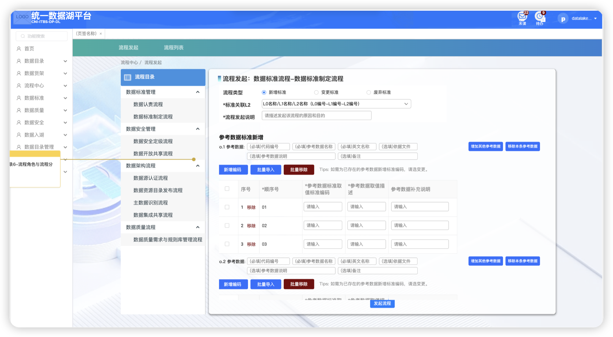

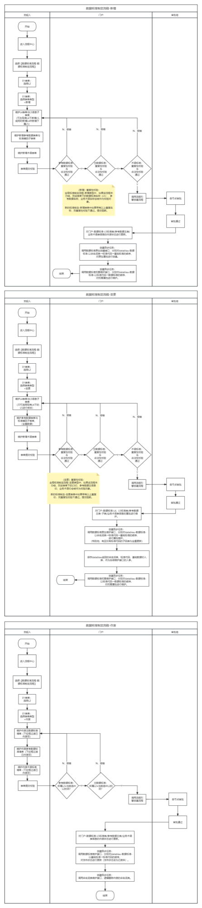

（双击图片放大查看，顺序为新增、变更、作废）

---

### 1.2 数据架构-数据集成共享流程

#### 程序描述

用户在本页面先填写抬头表，选择：
- 是否已制定数据标准
- 选择L2
- 选择数据责任公司
- 申请理由

再填写行列明细表（明细表结构根据抬头表中'是否已制定数据标准'的值而不同）。

#### 页面原型

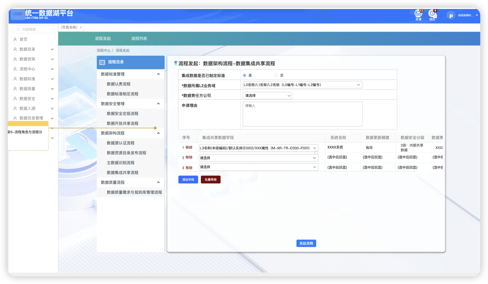

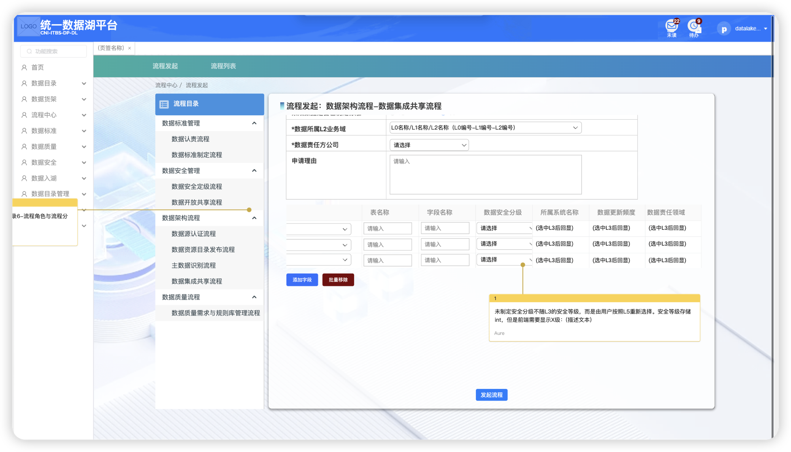

#### 功能说明

- 表单设计（见下方附录6内容）数据架构流程-数据集成共享流程
- 点击【添加字段按钮时】，行列表增加一行
- 点击【移除】时，删除本行
- 表单页的所有内容在提交时保存name入表，确保数据不会因为其他模块的维护操作导致任何变动

#### 特殊变量

本流程存在**'数据安全等级最大值'**这一变量，取值于行列表中'数据安全分级'中的最大值。该变量用于后续流程中的部分审批的跳过判定。

#### 流程节点设计

流程节点设计（见下方附录6内容）数据架构流程-数据集成共享流程。

---

### 1.3 数据安全-数据开放共享流程

#### 程序描述

用户在本页面先填写抬头表，包含：
- 是否已制定数据标准
- 选择数据主题（L2）

再填写行列明细表（明细表结构根据抬头表中'是否已制定数据标准'的值而不同）。

#### 页面原型

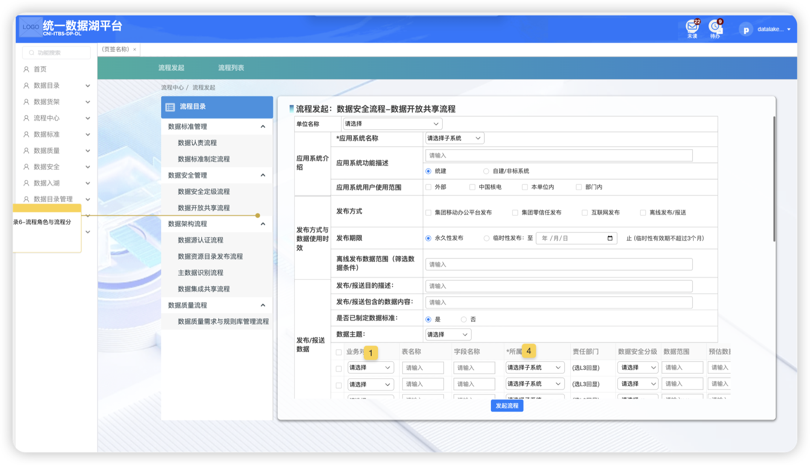

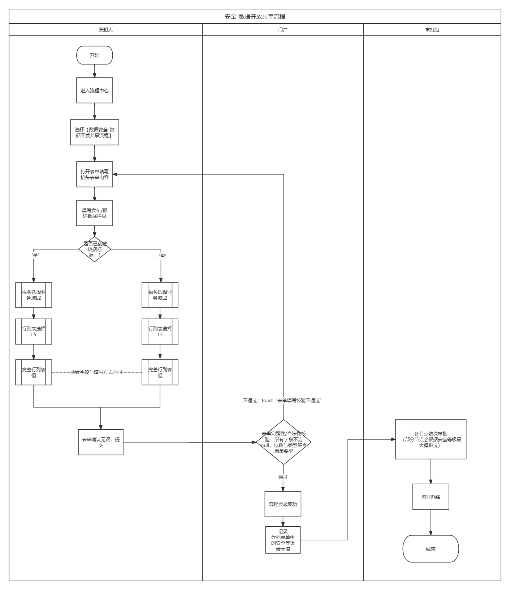

#### 功能说明

- 表单设计（见下方附录6内容）数据安全流程-数据开放共享流程
- 点击【添加字段按钮时】，行列表增加一行
- 点击【移除】时，删除本行
- 表单页的所有内容在提交时保存name入表，确保数据不会因为其他模块的维护操作导致任何变动

#### 特殊变量

本流程存在**'数据安全等级最大值'**这一变量，取值于行列表中'数据安全分级'中的最大值。该变量用于后续流程中的部分审批的跳过判定。

#### 流程节点设计

流程节点设计（见下方附录6内容）数据安全流程-数据开放共享流程。

---

### 1.4 数据质量-数据质量需求与规则管理流程

#### 程序描述

用户在本页面先填写抬头表（表单设计（见下方附录6内容）数据质量流程-数据质量需求与规则管理流程），其中**关联业务对象为单选**。

在那之后，填写质量需求行列明细表。

#### 页面原型

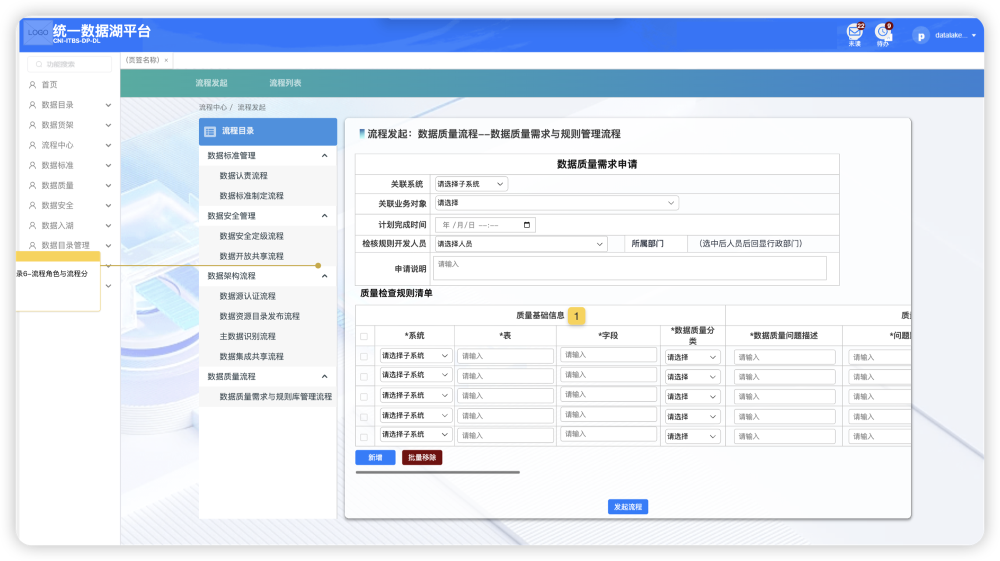

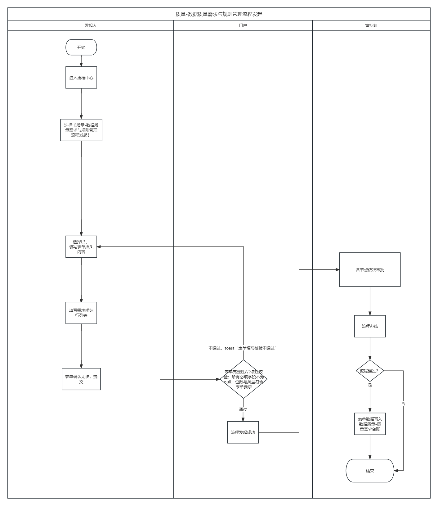

#### 功能说明

- 点击【新增】，行列表增加一行
- 点击【移除】时，删除本行
- 表单页的所有内容在提交时保存name入表，确保数据不会因为其他模块的维护操作导致任何变动

#### 流程节点设计

流程节点设计（见下方附录6内容）数据质量流程-数据开放共享流程。

#### 后续处理

流程审批通过后，表单内容将作为结果数据写入**数据质量-数据需求台账**。

---

## 二、流程中心 - 流程列表

### 2.1 程序描述

本模块调用云研平台-流程中心的公共组件搭建。用于在多个口径下查询流程列表信息。用户可以下载至详情页进行进一步查看或办理操作。

### 2.2 需控制的菜单-按钮权限项

| 一级模块 | 二级模块 | 三级页面 | 权限项 | 页面/按扭 |
|----------|----------|----------|--------|-----------|
| 流程中心 | 流程列表 | / | 我的流程 | 页面 |
| | | / | 我的待办 | 页面 |
| | | / | 我的已办 | 页面 |
| | | / | 我的待阅 | 页面 |
| | | / | 我的转办 | 页面 |
| | | / | 我的委托 | 页面 |
| | | / | 我的受托 | 页面 |
| | | 流程详情 | 三级页面本体 | 页面 |

### 2.3 功能详细设计

#### 流程口径TAB-目录-列表

该部分嵌入云研平台-流程中心开放的流程列表。流程记录显示流程与云研平台-流程中心中的同一口径一致，**但是过滤掉门户流程目录（门户流程目录（见下方附录6内容））之外**的流程。

**搜索功能：**
- 支持对流程标题（包含关键字）+流程目录（单选）进行搜索（and逻辑）

**TAB切换：**
- 支持点击TAB切换口径，口径包括：
  - 我的流程
  - 我的待办
  - 我的已办
  - 我的待阅
  - 我的转办
  - 我的委托
  - 我的受托

#### 流程详情页

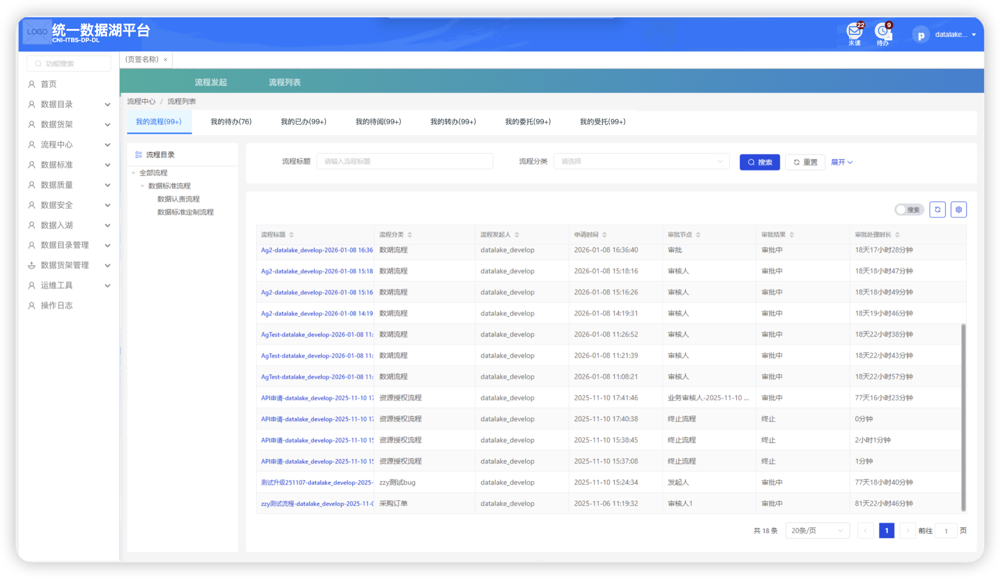

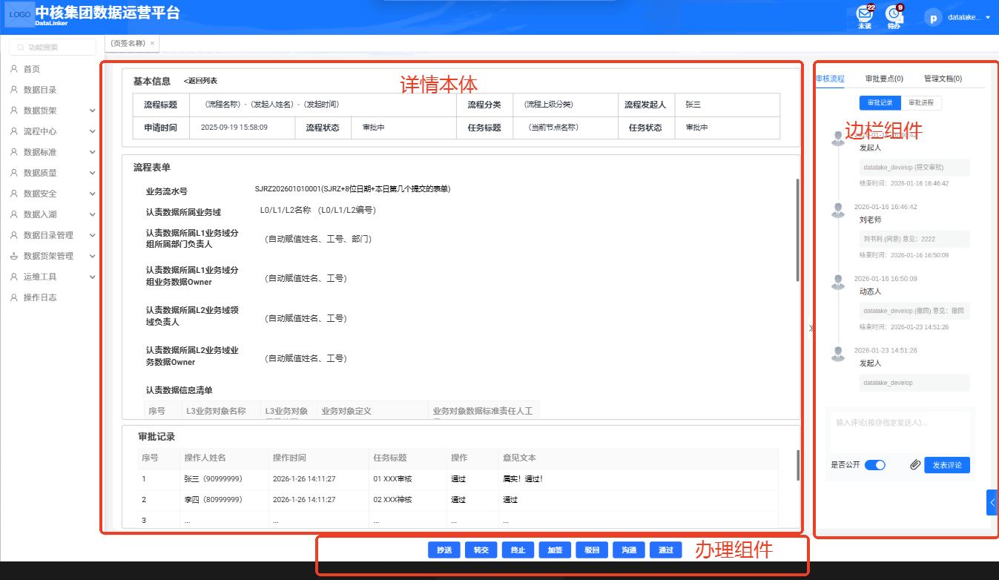

流程详情页包含三个部分：

**①办理组件（原生集成）**

办理组件包括七个按钮：
- 抄送
- 转交
- 终止
- 加签
- 驳回
- 沟通
- 通过

该能力所有流程通用。按钮权限受云研平台流程引擎根据当前用户信息与流程节点配置控制。

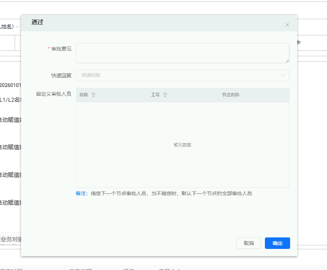
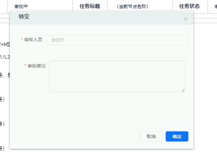
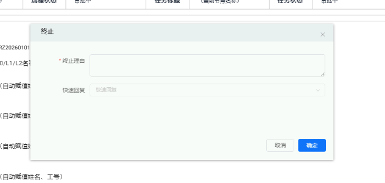
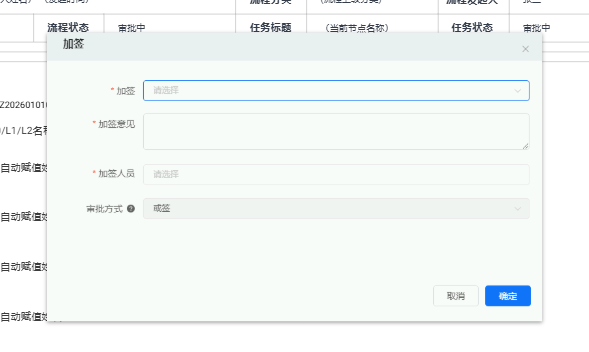
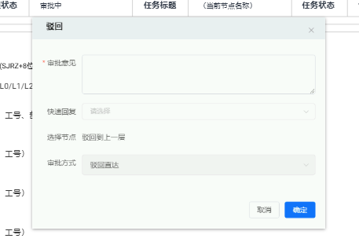
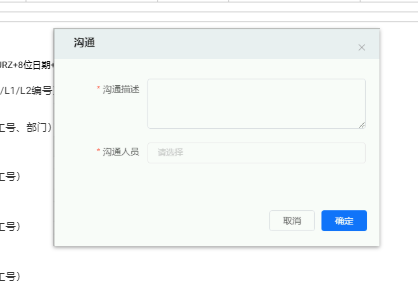
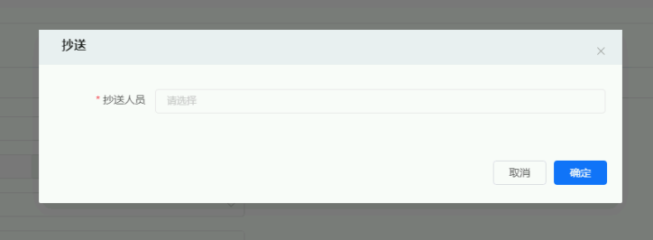

**②边栏组件（原生集成）**

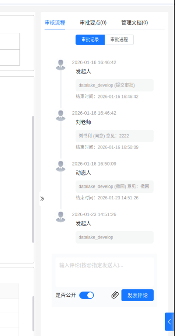

包括三个按钮：
- 审核流程
- 审核要点
- 管理文档

该能力所有流程通用。按钮权限受云研平台流程引擎根据当前用户信息与流程节点配置控制。

**③详情本体**

该模块由门户搭建并嵌入至此位置。点击【返回列表】，则返回【流程中心-流程列表】模块。

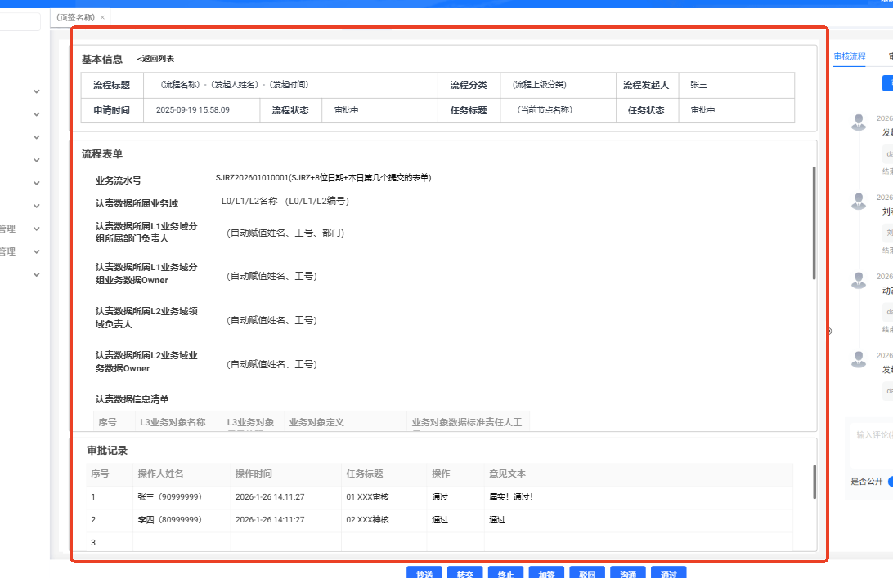

- **基本信息与审批记录**栏全流程通用（字段信息（见下方附录6内容））
- **流程表单**则根据具体流程显示对应表单内容（字段信息详见附件6-#3）
- 该页面中前端需要展示所有信息，不可有折叠、省略或分页。超出内容可以用滚动条纵向展开

**④流程特别说明**

- **数据认责流程**：额外显示业务流水号（该字段不来自表单填报，而是流程创建成功时自动复制）

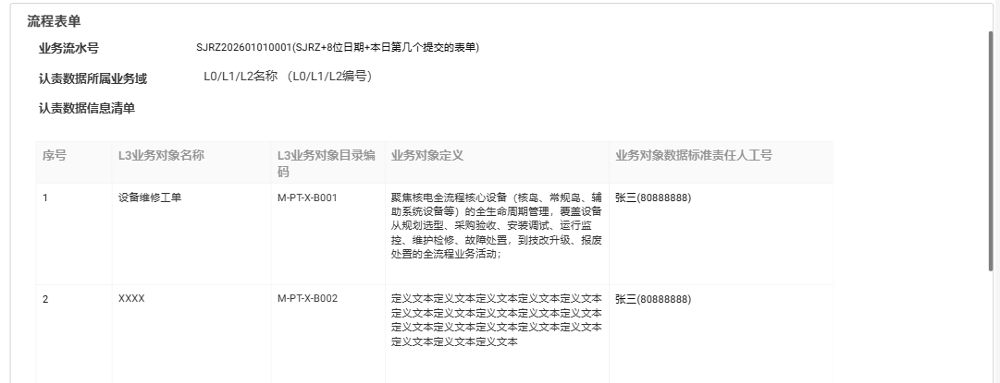

- **安全定级/数据源认证/主数据识别/数据目录发布流程/数据标准制定流程/数据开放共享流程/数据集成共享流程/数据质量需求与规则管理流程**：额外显示业务流水号

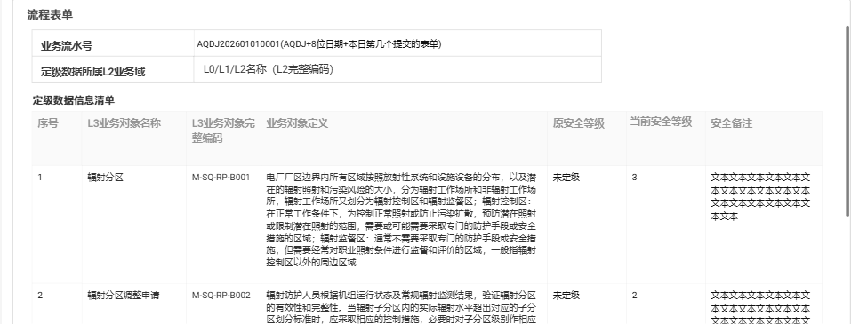
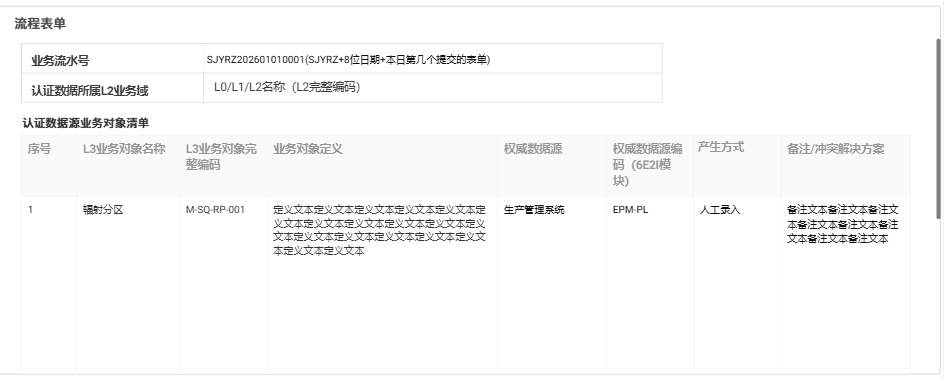
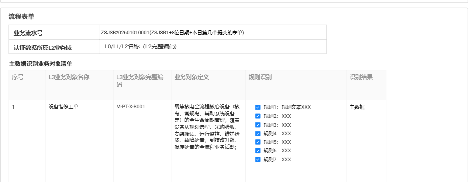
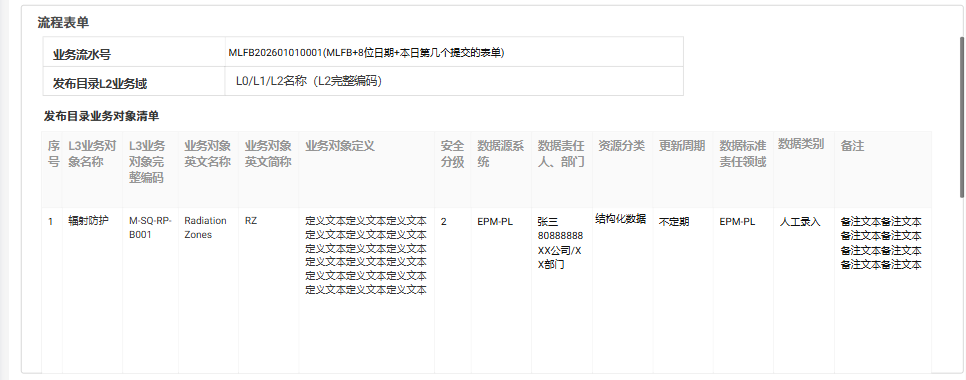

---

## 三、数据质量 - 质量需求台账

### 3.1 程序描述

本页面为数据运营平台的质量需求台账页面，用于展示和查询数据质量需求与规则管理流程中生成的台账记录，支持多维度条件查询和数据导出，为数据质量问题的跟踪与分析提供支撑。

### 3.2 页面原型

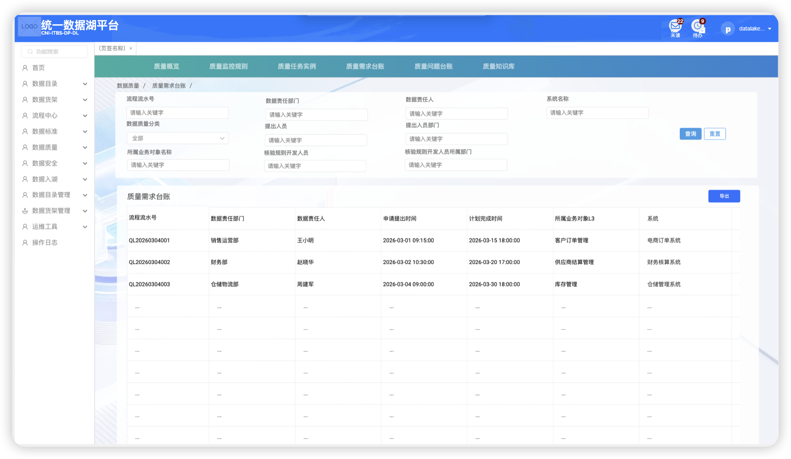

### 3.3 需控制的菜单-按钮权限项

| 一级模块 | 二级模块 | 三级页面 | 权限项 | 页面/按钮 |
|----------|----------|----------|--------|-----------|
| 数据质量 | 质量需求台账 | 质量需求台账列表页 | 二级页面本体 | 页面 |
| | | 质量需求台账列表页 | 【查询】 | 按钮 |
| | | 质量需求台账列表页 | 【重置】 | 按钮 |
| | | 质量需求台账列表页 | 【导出】 | 按钮 |

### 3.4 功能详细设计

#### 质量需求搜索

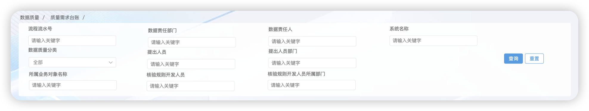

| 序号 | 字段 | 字段类型 |
|------|------|----------|
| 1 | 流程流水号 | 文本 |
| 2 | 数据责任部门（名称） | 文本 |
| 3 | 数据责任人（姓名） | 文本 |
| 4 | 系统（名称） | 文本 |
| 5 | 数据质量分类 | 字典 |
| 6 | 提出人员（姓名） | 文本 |
| 7 | 提出人员所属部门（名称） | 文本 |
| 8 | 业务表单 | 文本 |
| 9 | 所属业务对象 L3 | 文本 |
| 10 | 检核规则开发人员 | 文本 |
| 11 | 检核规则开发人员所属部门 | 文本 |

**操作按钮：**
- **查询**：触发查询请求，根据输入条件筛选台账记录
- **重置**：清空所有查询条件，恢复初始状态

#### 质量需求列表

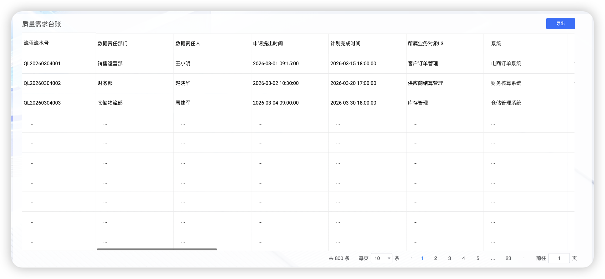

数据在质量需求与规则管理流程结束后插入：

| 序号 | 字段 | 字段类型 | 业务意义 | 备注 |
|------|------|----------|----------|------|
| 1 | 流程流水号 | 文本 | 唯一流水编号 | 含日期+单位前缀，自动生成，不可重复，台账内容不可维护 |
| 2 | 数据责任部门 | 文本 | 承担该数据质量问题整改责任的业务或技术部门 | 关联组织架构，台账内容不可维护 |
| 3 | 数据责任人 | 文本 | 负责该数据质量问题整改的责任人姓名 | 关联用户中心，台账内容不可维护 |
| 4 | 申请提出时间 | datetime | 需求首次提交的时间 | 自动生成，台账内容不可维护 |
| 5 | 计划完成时间 | datetime | 预计完成整改的时间节点 | 支持日期选择控件，台账内容不可维护 |
| 6 | 所属业务对象 L3 | 文本 | 该质量问题所归属的 L3 级业务对象名称 | 支持下拉选择，台账内容不可维护 |
| 7 | 系统 | 文本 | 描述问题关联的业务系统名称 | 支持下拉选择，台账内容不可维护 |
| 8 | 业务表单 | 文本 | 描述问题关联的业务对象（即业务表英文名） | 支持下拉选择，台账内容不可维护 |
| 9 | 字段 | 文本 | 描述数据库表中关联质量问题的具体字段的名称 | 支持下拉选择，台账内容不可维护 |
| 10 | 数据质量分类 | 字典 | 描述问题分类信息，包括完备性、准确性、合规性、有效性、一致性、唯一性和及时性等 | 枚举值，驱动流程控制，台账内容不可维护 |
| 11 | 数据质量问题描述 | 文本 | 描述具体发现的问题点，比如数据缺失、数据值重复、格式不正确等 | 支持多行文本，台账内容不可维护 |
| 12 | 问题影响描述 | 文本 | 描述如果出现数据质量问题，会有什么负面影响，如对业务决策、系统运行等数据应用影响 | 支持多行文本，台账内容不可维护 |
| 13 | 数据标准要求 | 文本 | 描述基于数据质量问题，进行对数据进行标准定义，如业务规则/值域/数据约束条件等方面进行规则明确 | 支持多行文本，台账内容不可维护 |
| 14 | 检核周期 | 字典 | 定义检查数据质量的频率，如每日、每周、每月等 | 枚举值，驱动流程控制，台账内容不可维护 |
| 15 | 提出人员 | 文本 | 描述负责监督或发现数据质量问题人员的姓名 | 关联用户中心，台账内容不可维护 |
| 16 | 提出人员所属部门 | 文本 | 描述提出人员所归属部门 | 关联组织架构，台账内容不可维护 |
| 17 | 检核规则开发人员 | 文本 | 描述负责数据质量检查规则的技术人员姓名 | 关联用户中心，台账内容不可维护 |
| 18 | 检核规则开发人员所属部门 | 文本 | 描述检核规则开发人员所归属部门 | 关联组织架构，台账内容不可维护 |
| 19 | 库名_表名 | 文本 | 描述数据库和数据表的名称，用于定位数据源 | 自动生成，不可重复，台账内容不可维护 |
| 20 | 表中文名 | 文本 | 描述该质量问题所在的表中文名 | 支持下拉选择，台账内容不可维护 |
| 21 | 字段名 | 文本 | 描述数据库表中关联质量问题的具体字段的名称 | 自动生成，不可重复，台账内容不可维护 |
| 22 | 字段中文名 | 文本 | 描述该数据质量问题所在的字段中文名 | 支持下拉选择，台账内容不可维护 |
| 23 | 技术规则标准 | 文本 | 描述将基于数据标准内容以技术语言进行描述，如字段类型、非空约束、正则表达式、枚举值等 | 支持多行文本，台账内容不可维护 |
| 24 | 检核脚本 | 文本 | 描述针对当前质量问题，实现质量检核的 SQL 语句或脚本 | 支持多行文本，台账内容不可维护 |

#### 其他功能

- **导出**：提供【导出】按钮，支持将当前查询结果导出(所见即所得)
- **分页**：支持翻页及每页条数设置（如每页10条）
- **排序**：以业务流水号字段文本降序排序

---

## 附录

### 附录6-流程设计文档

详细流程设计文档请参考：[https://www.kdocs.cn/l/cebyzXb6BSNz](https://www.kdocs.cn/l/cebyzXb6BSNz)

### 相关导入模板

模板1-数据目录管理-管理域数据目录-导入新增：[https://www.kdocs.cn/l/caZNRcwDafwb](https://www.kdocs.cn/l/caZNRcwDafwb)

---

## 附录6内容（已从附录6文档嵌入）

### 流程分类

| 流程分类 | 流程大类 | 备注 |
|----------|----------|------|
| 数据标准流程 | 数据认责流程 | 可在流程中心发起 |
| 数据标准流程 | 数据标准制定流程 | 可在流程中心发起 |
| 数据质量流程 | 数据质量需求与规则管理流程 | 可在流程中心发起 |
| 数据安全流程 | 数据开放共享流程 | 可在流程中心发起 |
| 数据安全流程 | 数据分级流程 | 可在流程中心发起 |
| 数据架构流程 | 数据集成共享流程 | 可在流程中心发起 |
| 数据架构流程 | 主数据识别流程 | 可在流程中心发起 |
| 数据架构流程 | 数据源认证流程 | 可在流程中心发起 |
| 数据架构流程 | 数据资源目录发布流程 | 可在流程中心发起 |
| 数据资源申请流程 | API申请流程 | 只可通过数据货架发起,不在【流程中心-流程发起中显示】 |

### 数据标准制定流程 - 节点设计

| 节点名称 | 审批人 | 表单 |
|----------|----------|------|
| 01 表单填写 |  | 标准-数据标准制定流程-01表单 |
| 02 L2业务数据负责人确认 | 表单关联L2的业务数据负责人 | 标准-数据标准制定流程-详情 |
| 03 L1业务数据Owner确认 | 表单关联L2所属的L1的数据Owner | 标准-数据标准制定流程-详情 |

### 数据集成共享流程 - 节点设计

| 节点名称 | 审批人 | 表单 |
|----------|----------|------|
| 01 表单填写 |  | 架构-数据集成共享流程-01表单 |
| 02 数据需求方部门负责人 | 申请人所在行政组织（departmentID）的[测试·部门负责人]岗位 | 架构-数据集成共享流程-详情 |
| 03 数据需求方分管领导 | 申请人所在行政组织（companyID）的[测试·分管领导]岗位 | 架构-数据集成共享流程-详情 |
| 04 数据责任人【待确认】 | 表单关联的L3的数据责任人（集合） | 架构-数据集成共享流程-详情 |
| 05 业务数据负责人 | 表单关联L2的业务数据负责人 | 架构-数据集成共享流程-详情 |
| 06 业务数据owner | 表单关联L2所属的L1的数据Owner | 架构-数据集成共享流程-详情 |
| 07 数据需求方公司总经理 | 申请人所在行政组织（companyID）的[测试·总经理]岗位 | 架构-数据集成共享流程-详情 |
| 08 数据责任方公司总经理 | 表单关联L2的业务数据部门的公司（companyID）的[测试·总经理]岗位 | 架构-数据集成共享流程-详情 |
| 09 数据需求方公司董事长 | 申请人所在行政组织（companyID）的[测试·董事长]岗位 | 架构-数据集成共享流程-详情 |
| 10 数据责任方公司董事长 | 表单关联L2的业务数据部门的公司（companyID）的[测试·董事长]岗位 | 架构-数据集成共享流程-详情 |
| 11 申请人确认 | 申请人 | 架构-数据集成共享流程-详情 |

### 数据开放共享流程 - 节点设计

| 节点名称 | 审批人 | 表单 |
|----------|----------|------|
| 01 表单填写 |  | 安全-数据开放共享流程-01表单 |
| 02 申请部门审批 | 申请人所在行政组织（departmentID）的[测试·部门责任人]岗位 | 安全-数据开放共享流程-详情 |
| 03 数据安全审查 | [测试·数据治理推进组人员]流程角色。 | 安全-数据开放共享流程-详情 |
| 04 申请部门分管领导审批 | 申请人所在行政组织（companyID）的[测试·分管领导]岗位 | 安全-数据开放共享流程-详情 |
| 05 申请单位总经理审批 | 申请人所在行政组织（companyID）的[测试·总经理]岗位 | 安全-数据开放共享流程-详情 |
| 06 申请单位董事长审批 | 申请人所在行政组织（companyID）的[测试·董事长]岗位 | 安全-数据开放共享流程-详情 |
| 07 数据责任人审查 | 表单关联的L3的数据责任人（集合） | 安全-数据开放共享流程-详情 |
| 08 业务数据负责人审查 | 表单关联L2的业务数据负责人 | 安全-数据开放共享流程-详情 |
| 09 业务数据owner审查 | 表单关联L2所属的L1的数据Owner | 安全-数据开放共享流程-详情 |
| 10 数据owner分管领导审批 | 表单关联L2的业务数据部门的公司（companyID）的[测试·分管领导]岗位 | 安全-数据开放共享流程-详情 |
| 11 总经理审批 | 表单关联L2的业务数据部门的公司（companyID）的[测试·总经理]岗位 | 安全-数据开放共享流程-详情 |
| 12 董事长审批 | 表单关联L2的业务数据部门的公司（companyID）的[测试·董事长]岗位 | 安全-数据开放共享流程-详情 |
| 13 申请人确认 | 申请人 | 安全-数据开放共享流程-详情 |

### 数据质量需求与规则管理流程 - 节点设计

| 节点名称 | 审批人 | 表单 |
|----------|----------|------|
| 01 表单填写 |  | 数据质量需求与规则管理流程-01表单 |
| 02 L3数据责任人确认 | 表达关联L3的数据责任人 | 数据质量需求与规则管理流程-详情 |
| 03 L2业务数据负责人确认 | 表单关联L2的业务数据负责人 | 数据质量需求与规则管理流程-详情 |
| 04 L1业务数据Owner确认 | 表单关联L2所属的L1的数据Owner | 数据质量需求与规则管理流程-详情 |
| 05 申请人确认完成 | 申请人 | 数据质量需求与规则管理流程-详情 |

### 数据标准制定流程 - 表单字段设计

#### 数据标准制定流程底表

| 字段名称 | 字段类型 | 表单填报组件/数据来源 | 是否必填 | 其他约束 |
|----------|----------|----------------------|----------|----------|
| 业务流水号 | 文本 | 提交时赋予自动赋值 | / | (BZZD+8位日期+本日第几个提交的表单) |
| 流程id | 文本 | 不可维护。 | / | 流程引擎返回 |
| 流程发起人ID | 文本 | 不可维护。 | / | 流程引擎返回 |
| 流程状态 | 文本 | 不可维护。 | / | 流程引擎返回 |
| 流程发起时间 | 文本 | 不可维护。 | / | 流程引擎返回 |
| 表单类型 | 字典 | 新增/变更/作废 | √ | 三选一，必选，加载时默认选中新增。 |
| （L1）标准所属业务域分组ID | 字典 | 数据目录选择器（L0-L2） | √ | 根据所选的L2来回溯L1信息 |
| （L1）标准业务域分组名称 | 字典 | 数据目录选择器（L0-L2） | √ | 根据所选的L2来回溯L1信息 |
| （L1）标准业务域分组完整编码 | 字典 | 数据目录选择器（L0-L2） | √ | 根据所选的L2来回溯L1信息 |
| （L2）标准业务域ID | 字典 | 数据目录选择器（L0-L2） | √ | 根据所选的L2来回溯L1信息 |
| （L2）标准业务域名称 | 字典 | 数据目录选择器（L0-L2） | √ | 单选。回显L0/L1/L2名称，以及L0/L1/L2编码。提交时落表保存L2ID。 |
| （L2）标准业务域完整编码 | 字典 | 数据目录选择器（L0-L2） | √ | 单选。回显L0/L1/L2名称，以及L0/L1/L2编码。提交时落表保存L2ID。 |
| 标准所属L1业务域分组业务数据Owner | 文本 | 发起时查询 | / | 根据表单的L2的上级L1的业务域分组业务数据Owner（姓名与工号）。提交时落表保存姓名与工号。 |
| 标准所属L2业务数据负责人 | 文本 | 发起时查询 | / | 根据表单的L2后，显示该L2的业务数据负责人（姓名、工号、组织）。提交时落表保存该用户姓名与工号、以及组织机构名称。 |

#### 数据标准制定流程底表-新增-主数据标准信息

| 字段名称 | 字段类型 | 表单填报组件/数据来源 | 是否必填 | 其他约束 |
|----------|----------|----------------------|----------|----------|
| 所属流程id | 文本 | 提交时赋予自动赋值 | / | 外键 |
| 所属L3业务对象ID | 文本 | 用户选择 | √ | 新增时由用户选择，L4标准所关联的业务对象名称ID |
| 所属数据L4实体名称 | 文本 | 用户填写 | √ | 新增时由用户填写。长度限制：1-100字符。流程通过后，如果L4名称在该L3下不存在，则新建L4数据。 |
| L4本级编码 | 文本 | 新增表单里没有此字段 | / |  |
| L4完整编码 | 文本 | 新增表单里没有此字段 | / |  |
| 表名 | 文本 | 用户填写 | √ | 新增时由用户填写，长度限制：1-64字符。 |
| 关联L5名称 | 文本 | 用户维护 | √ | 新增时由用户填写，同父级下唯一。 |
| L5本级编码 | 文本 | 新增表单里没有此字段 | √ | insert时由系统赋予，从FXXX开始赋值，XXX=该L4下的历史L5数。 |
| 数据标准名称 | 文本 | 用户填写 | √ | 长度限制：1-100字符。新增时由用户填写，同父级下唯一。 |
| 数据标准编号（L5完整编码） | 文本 | 新增表单里没有此字段 | / | insert时由系统赋予，L0~L5本级编码用‘-’串联。完整编码 |
| 数据标准英文名称 | 文本 | 用户填写 | √ | 长度限制：1-100字符。新增时由用户填写，同父级下唯一。 |
| 数据标准描述 | 文本 | 用户填写 | / | ①长度限制：0-500字符 |
| 业务规则 | 文本 | 用户填写 |  | ①长度限制：1-1000字符 |
| 标准依据 | 字典 | 用户维护 |  | 单选：国际标准、国家标准、行业标准、团体标准、实践标准 |
| 备注 | 文本 | 用户填写 |  | ①长度限制：0-500字符 |
| 数据安全等级 | int | 用户维护 | √ | 单选，1 级：板块共享数据；2 级：内部共享数据；3 级：内部限制数据；4级：重要数据；5级：核心数据。 |
| 引用数据标准ID | 字典 | 用户维护 |  | 单选，新增时由用户选择，回显数据标准名称。 |
| 引用参考数据ID | 字典 | 用户维护 |  | 单选，新增时由用户选择，回显参考数据名称。 |
| 管理层级 | 字典 | 用户维护 |  | 单选.枚举：集团级、二级单位、三级单位等 |
| 数据标准责任人ID | 字典 | 用户维护 | √ | 单选,人员选择器。名称需要被落表固化。 |
| 数据标准责任部门ID | 字典 | 用户维护 |  | 根据被选择的标准责任人，带出departmenmtID并独立存储。名称需要被落表固化。 |
| 是否可以为空 | 布尔 | 用户维护 |  | 单选，默认为true |
| 值域类型 | 字典 | 用户填写 |  | 取值范围（区间、独立值集区间、值集视图）、枚举、参考数据、布尔型、编码型 |
| 值域描述 | 文本 | 用户填写 |  | 0-2000字符, 未填写时文本框回显以下文案：
如果值域类型为区间值，格式为{区间范围起,区间范围止};
如果值域类型为枚举值，格式为{枚举值1,枚举值2,枚举值3....};
如果值域类型为值集，直接填写值集编码 |
| 数据类型 | 字典 | 用户维护 |  | 整数型、浮点型、日期型、枚举型、字符串、布尔型、编码型等 |
| 数据格式 | 文本 | 用户填写 | √ | 0-2000字符 |
| 字段长度 | int | 用户填写 |  | 0-4000 |
| 字段精度 | int | 用户填写 | √ | 数值范围：0-10 |
| 是否作废 | 布尔 | 新增表单里没有此字段 |  | 初始为false |

#### 数据标准制定流程底表-新增-参考数据标准-主表

| 字段名称 | 字段类型 | 表单填报组件/数据来源 | 是否必填 | 其他约束 |
|----------|----------|----------------------|----------|----------|
| 所属L2业务域ID | 文本 | 新增时由用户选择 | √ | ①关联L2业务域必须存在且有效，L4标准所关联的业务对象名称ID |
| 代码编号(参考数据编码) | 文本 | 新增时由用户填写 | √ | ①全局唯一②长度限制：1-50字符③只包含字母/数字 |
| 参考数据名称 | 文本 | 新增时由用户填写 | √ | ①全局唯一②长度限制：1-100字符③禁止包含特殊字符：<>/&#124;*?" |
| 参考数据ID | 文本 | insert时由系统赋予 |  | / |
| 英文名称 | 文本 | 新增时由用户填写 | √ | ①全局唯一 ②长度限制：1-100字符 ③仅允许字母、数字、下划线 |
| 参考数据说明 | 文本 | 新增时由用户填写 | √ | ①长度限制：0-500字符 |
| 依据文件 | 文本 | 新增时由用户填写 |  | ①长度限制：0-200字符 |
| 备注 | 文本 | 新增时由用户填写 |  | ①长度限制：0-500字符 |
| 是否作废 | 布尔 | 初始为false |  | / |
| 参考数据说明 | 文本 | 新增时由用户填写 | √ | ①长度限制：0-500字符 |
| 参考数据说明 | 文本 | 作废表单只回显，不可修改 |  | 存储入表作为流程详情回显的依据 |

#### 数据标准制定流程底表-新增-参考数据标准-子表

| 字段名称 | 字段类型 | 表单填报组件/数据来源 | 是否必填 | 其他约束 |
|----------|----------|----------------------|----------|----------|
| 所属参考数据ID | 文本 | insert时由系统赋予，全局唯一 | √ | / |
| 顺序号 | int | 自动按顺序赋值 | √ |  |
| 参考数据标准取值标准编码 | 文本 | 1-8位，同一个参考数据内唯一。 | √ | ①同一参考数据ID内唯一②长度限制：1-8字符③符合编码规范（字母/数字） |
| 参考数据取值描述 | 文本 | 新增时由用户填写 | √ | ①长度限制：1-200字符②禁止包含特殊字符：<>/&#124;*?" |
| 参考数据补充说明 | 文本 | 新增时由用户填写 | √ | ①长度限制：1-2000字符 |

#### 数据标准制定流程底表-新增-术语标准

| 字段名称 | 字段类型 | 表单填报组件/数据来源 | 是否必填 | 其他约束 |
|----------|----------|----------------------|----------|----------|
| 业务术语ID | 文本 | 新增时由用户填写 | √ | 全局唯一 |
| 术语名称 | 文本 | 新增时由用户填写 | √ | 全局唯一，1-20位 |
| 术语英文名称 | 文本 | 新增时由用户填写 | √ | 全局唯一，1-100位。 |
| 术语定义 | 文本 | 新增时由用户填写 | √ | ①长度限制：0-500字符 |
| 依据文件 | 文本 | 新增时由用户填写 | √ | ①长度限制：0-200字符 |
| 备注 | 文本 | 新增时由用户填写 |  | ①长度限制：0-500字符 |
| 是否作废 | 布尔 | 新增表单里没有此字段 |  |  |

#### 数据标准制定流程底表-变更-主数据标准信息

| 字段名称 | 字段类型 | 表单填报组件/数据来源 | 是否必填 | 其他约束 |
|----------|----------|----------------------|----------|----------|
| 所属流程id | 文本 | 提交时赋予自动赋值 | / | 外键 |
| 所属L3业务对象ID | 文本 | 变更表单只回显，不可修改 | √ | L3-L5选择器。选中后回显。 |
| 所属数据L4实体名称 | 文本 | 变更表单只回显，不可修改 | √ | L3-L5选择器。选中后回显。 |
| 表名 | 文本 | 用户填写 | √ | 新增时由用户填写，长度限制：1-64字符 |
| 关联L5名称 | 文本 | 用户填写 | √ | 新增时由用户填写，同父级下唯一。 |
| L5本级编码 | 文本 | 变更表单只回显，不可修改 | √ | L3-L5选择器。选中后回显。 |
| 数据标准名称 | 文本 | 用户填写 | √ | 变更时由用户填写，同父级下唯一。 |
| 数据标准编号（L5完整编码） | 文本 | 变更表单只回显，不可修改 | / | L3-L5选择器。选中后回显。 |
| 数据标准英文名称 | 文本 | 用户填写 | √ | 长度限制：1-100字符。新增时由用户填写，同父级下唯一。 |
| 数据标准描述 | 文本 | 用户填写 | / | ①长度限制：0-500字符 |
| 业务规则 | 文本 | 用户填写 |  | ①长度限制：1-1000字符 |
| 标准依据 | 字典 | 用户维护 |  | 单选：国际标准、国家标准、行业标准、团体标准、实践标准 |
| 备注 | 文本 | 用户填写 |  | ①长度限制：0-500字符 |
| 数据安全等级 | int | 用户维护 | √ | 单选，1 级：板块共享数据；2 级：内部共享数据；3 级：内部限制数据；4级：重要数据；5级：核心数据。 |
| 引用数据标准ID | 字典 | 用户维护 |  | 单选，新增时由用户选择，回显数据标准名称。 |
| 引用参考数据ID | 字典 | 用户维护 |  | 单选，新增时由用户选择，回显参考数据名称。 |
| 管理层级 | 字典 | 用户维护 |  | 单选.枚举：集团级、二级单位、三级单位等 |
| 数据标准责任人ID | 字典 | 用户维护 | √ | 单选,人员选择器。名称需要被落表固化。 |
| 数据标准责任部门ID | 字典 | 用户维护 |  | 根据被选择的标准责任人，带出departmenmtID并独立存储。名称需要被落表固化。 |
| 是否可以为空 | 布尔 | 用户维护 |  | 单选，默认为true |
| 值域类型 | 字典 | 用户填写 |  | 取值范围（区间、独立值集区间、值集视图）、枚举、参考数据、布尔型、编码型 |
| 值域描述 | 文本 | 用户填写 |  | 0-2000字符, 未填写时文本框回显以下文案：
如果值域类型为区间值，格式为{区间范围起,区间范围止};
如果值域类型为枚举值，格式为{枚举值1,枚举值2,枚举值3....};
如果值域类型为值集，直接填写值集编码 |
| 数据类型 | 字典 | 用户维护 |  | 整数型、浮点型、日期型、枚举型、字符串、布尔型、编码型等 |
| 数据格式 | 文本 | 用户填写 | √ | 0-2000字符 |
| 字段长度 | int | 用户填写 |  | 0-4000 |
| 字段精度 | int | 用户填写 | √ | 数值范围：0-10 |
| 是否作废 | 布尔 | 变更表单里没有此字段 |  | 初始为false |

#### 数据标准制定流程底表-变更-参考数据标准-主表

| 字段名称 | 字段类型 | 表单填报组件/数据来源 | 是否必填 | 其他约束 |
|----------|----------|----------------------|----------|----------|
| 所属L2业务域ID | 文本 | 变更表单只回显，不可修改 | √ | / |
| 代码编号(参考数据编码) | 文本 | 变更表单只回显，不可修改 | √ | ①全局唯一②长度限制：1-50字符③只包含字母/数字 |
| 参考数据名称 | 文本 | 新增时由用户填写 | √ | ①全局唯一②长度限制：1-100字符③禁止包含特殊字符：<>/&#124;*?" |
| 参考数据ID | 文本 | insert时由系统赋予 |  | / |
| 英文名称 | 文本 | 新增时由用户填写 | √ | ①全局唯一 ②长度限制：1-100字符 ③仅允许字母、数字、下划线 |
| 依据文件 | 文本 | 新增时由用户填写 |  | ①长度限制：0-200字符 |
| 备注 | 文本 | 新增时由用户填写 |  | ①长度限制：0-500字符 |
| 是否作废 | 布尔 | 变更表单里没有此字段 |  | / |

#### 数据标准制定流程底表-变更-参考数据标准-子表

| 字段名称 | 字段类型 | 表单填报组件/数据来源 | 是否必填 | 其他约束 |
|----------|----------|----------------------|----------|----------|
| 所属参考数据ID | 文本 | insert时由系统赋予，全局唯一，变更维护底表时，以此子表对目标参考数据进行全量更新 | √ | / |
| 顺序号 | int | 自动按顺序赋值 | √ |  |
| 参考数据标准取值标准编码 | 文本 | 1-8位，同一个参考数据内唯一。 | √ | ①同一参考数据ID内唯一②长度限制：1-8字符③符合编码规范（字母/数字） |
| 参考数据取值描述 | 文本 | 新增时由用户填写 | √ | ①长度限制：1-200字符②禁止包含特殊字符：<>/&#124;*?" |
| 参考数据补充说明 | 文本 | 新增时由用户填写 | √ | ①长度限制：1-2000字符 |

#### 数据标准制定流程底表-变更-术语标准

| 字段名称 | 字段类型 | 表单填报组件/数据来源 | 是否必填 | 其他约束 |
|----------|----------|----------------------|----------|----------|
| 业务术语ID | 文本 | 新增时由用户填写 | √ | 全局唯一 |
| 术语名称 | 文本 | 新增时由用户填写 | √ | 全局唯一，1-20位 |
| 术语英文名称 | 文本 | 变更表单只回显，不可修改 | √ | 全局唯一，1-100位。 |
| 术语定义 | 文本 | 新增时由用户填写 | √ | ①长度限制：0-500字符 |
| 依据文件 | 文本 | 新增时由用户填写 | √ | ①长度限制：0-200字符 |
| 备注 | 文本 | 新增时由用户填写 |  | ①长度限制：0-500字符 |
| 是否作废 | 布尔 | 变更表单里没有此字段 |  |  |

#### 数据标准制定流程底表-作废-主数据标准信息

| 字段名称 | 字段类型 | 表单填报组件/数据来源 | 是否必填 | 其他约束 |
|----------|----------|----------------------|----------|----------|
| 所属流程id | 文本 | 提交时赋予自动赋值 |  | 外键 |
| 所属L3业务对象ID | 文本 | 用户选择 |  | L3-L5选择器 |
| 所属数据L4实体名称 | 文本 | 作废表单只回显，不可修改 |  | 存储入表作为流程详情回显的依据 |
| 所属数据L4ID | 文本 | 用户选择 | √ | L3-L5选择器 |
| L4本级编码 | 文本 | 作废表单只回显，不可修改 |  | 存储入表作为流程详情回显的依据 |
| L4完整编码 | 文本 | 作废表单只回显，不可修改 |  | 存储入表作为流程详情回显的依据 |
| 表名 | 文本 | 作废表单只回显，不可修改 |  | 存储入表作为流程详情回显的依据 |
| 关联L5名称 | 文本 | 作废表单只回显，不可修改 |  | 存储入表作为流程详情回显的依据 |
| L5本级编码 | 文本 | 作废表单只回显，不可修改 |  | 存储入表作为流程详情回显的依据 |
| 数据标准名称 | 文本 | 用户选择 | √ | L3-L5选择器 |
| 数据标准编号（L5完整编码） | 文本 | 作废表单只回显，不可修改 |  | 存储入表作为流程详情回显的依据 |
| 数据标准英文名称 | 文本 | 作废表单只回显，不可修改 |  | 存储入表作为流程详情回显的依据 |
| 数据标准描述 | 文本 | 作废表单只回显，不可修改 |  | 存储入表作为流程详情回显的依据 |
| 业务规则 | 文本 | 作废表单只回显，不可修改 |  | 存储入表作为流程详情回显的依据 |
| 标准依据 | 字典 | 作废表单只回显，不可修改 |  | 存储入表作为流程详情回显的依据 |
| 备注 | 文本 | 作废表单只回显，不可修改 |  | 存储入表作为流程详情回显的依据 |
| 数据安全等级 | int | 作废表单只回显，不可修改 |  | 存储入表作为流程详情回显的依据 |
| 引用数据标准ID | 字典 | 作废表单只回显，不可修改 |  | 存储入表作为流程详情回显的依据 |
| 引用参考数据ID | 字典 | 作废表单只回显，不可修改 |  | 存储入表作为流程详情回显的依据 |
| 管理层级 | 字典 | 作废表单只回显，不可修改 |  | 存储入表作为流程详情回显的依据 |
| 数据标准责任人ID | 字典 | 作废表单只回显，不可修改 |  | 存储入表作为流程详情回显的依据 |
| 数据标准责任部门ID | 字典 | 作废表单只回显，不可修改 |  | 存储入表作为流程详情回显的依据 |
| 是否可以为空 | 布尔 | 作废表单只回显，不可修改 |  | 存储入表作为流程详情回显的依据 |
| 值域类型 | 字典 | 作废表单只回显，不可修改 |  | 存储入表作为流程详情回显的依据 |
| 值域描述 | 文本 | 作废表单只回显，不可修改 |  | 存储入表作为流程详情回显的依据 |
| 数据类型 | 字典 | 作废表单只回显，不可修改 |  | 存储入表作为流程详情回显的依据 |
| 数据格式 | 文本 | 作废表单只回显，不可修改 |  | 存储入表作为流程详情回显的依据 |
| 字段长度 | int | 作废表单只回显，不可修改 |  | 存储入表作为流程详情回显的依据 |
| 字段精度 | int | 作废表单只回显，不可修改 |  | 存储入表作为流程详情回显的依据 |
| 是否作废 | 布尔 | ’=是 |  |  |

#### 数据标准制定流程底表-作废-参考数据标准-主表

| 字段名称 | 字段类型 | 表单填报组件/数据来源 | 是否必填 | 其他约束 |
|----------|----------|----------------------|----------|----------|
| 所属L2业务域ID | 文本 | 作废表单只回显，不可修改 |  | 存储入表作为流程详情回显的依据 |
| 代码编号(参考数据编码) | 文本 | 作废表单只回显，不可修改 |  | 存储入表作为流程详情回显的依据 |
| 参考数据名称 | 文本 | 用户选择 | √ | L2-参考数据名称选择器 |
| 参考数据ID | 文本 | 作废表单只回显，不可修改 |  | 存储入表作为流程详情回显的依据 |
| 英文名称 | 文本 | 作废表单只回显，不可修改 |  | 存储入表作为流程详情回显的依据 |
| 依据文件 | 文本 | 作废表单只回显，不可修改 |  | 存储入表作为流程详情回显的依据 |
| 备注 | 文本 | 作废表单只回显，不可修改 |  | 存储入表作为流程详情回显的依据 |
| 是否作废 | 布尔 | ’=是 |  | / |

#### 数据标准制定流程底表-作废-参考数据标准-子表

| 字段名称 | 字段类型 | 表单填报组件/数据来源 | 是否必填 | 其他约束 |
|----------|----------|----------------------|----------|----------|
| 所属参考数据ID | 文本 | 作废表单只回显，不可修改 |  | 存储入表作为流程详情回显的依据 |
| 顺序号 | int | 作废表单只回显，不可修改 |  | 存储入表作为流程详情回显的依据 |
| 参考数据标准取值标准编码 | 文本 | 作废表单只回显，不可修改 |  | 存储入表作为流程详情回显的依据 |
| 参考数据取值描述 | 文本 | 作废表单只回显，不可修改 |  | 存储入表作为流程详情回显的依据 |
| 参考数据补充说明 | 文本 | 作废表单只回显，不可修改 |  | 存储入表作为流程详情回显的依据 |

#### 数据标准制定流程底表-作废-术语标准

| 字段名称 | 字段类型 | 表单填报组件/数据来源 | 是否必填 | 其他约束 |
|----------|----------|----------------------|----------|----------|
| 业务术语ID | 文本 | 作废表单只回显，不可修改 |  | 存储入表作为流程详情回显的依据 |
| 术语名称 | 文本 | 作废表单只回显，不可修改 |  | 存储入表作为流程详情回显的依据 |
| 术语英文名称 | 文本 | 用户选择 | √ | 下拉选择器 |
| 术语定义 | 文本 | 作废表单只回显，不可修改 |  | 存储入表作为流程详情回显的依据 |
| 依据文件 | 文本 | 作废表单只回显，不可修改 |  | 存储入表作为流程详情回显的依据 |
| 备注 | 文本 | 作废表单只回显，不可修改 |  | 存储入表作为流程详情回显的依据 |
| 是否作废 | 布尔 | ’=是 |  |  |

### 数据集成共享流程 - 表单字段设计

#### 数据集成共享流程底表

| 字段名称 | 字段类型 | 表单填报组件/数据来源 | 是否必填 | 其他约束 |
|----------|----------|----------------------|----------|----------|
| 业务流水号 | 文本 | 提交时赋予自动赋值 |  | (JCGX+8位日期+本日第几个提交的表单) |
| 流程id | 文本 | 不可维护。 |  | 流程引擎返回 |
| 流程发起人ID | 文本 | 不可维护。 |  | 流程引擎返回 |
| 流程状态 | 文本 | 不可维护。 |  | 流程引擎返回 |
| 流程发起时间 | 文本 | 不可维护。 |  | 流程引擎返回 |
| （L1）数据所属业务域分组ID | 字典 | 数据目录选择器（L0-L2） | √ | 根据所选的L2来回溯L1信息 |
| （L1）数据所属业务域分组名称 | 字典 | 数据目录选择器（L0-L2） | √ | 根据所选的L2来回溯L1信息 |
| （L1）数据所属业务域分组完整编码 | 字典 | 数据目录选择器（L0-L2） | √ | 根据所选的L2来回溯L1信息 |
| （L2）数据所属业务域ID | 字典 | 数据目录选择器（L0-L2） | √ | 单选。回显L0/L1/L2名称，以及L0/L1/L2编码。提交时落表保存L2ID。 |
| （L2）数据所属业务域名称 | 字典 | 数据目录选择器（L0-L2） | √ | 单选。回显L0/L1/L2名称，以及L0/L1/L2编码。提交时落表保存L2ID。 |
| （L2）数据所属业务域完整编码 | 字典 | 数据目录选择器（L0-L2） | √ | 单选。回显L0/L1/L2名称，以及L0/L1/L2编码。提交时落表保存L2ID。 |
| 数据所属L1业务域分组业务数据Owner | 文本 | 发起时查询 | √ | 根据表单的L2的上级L1的业务域分组业务数据Owner（姓名与工号）。提交时落表保存姓名与工号。 |
| 数据所属L2业务数据负责人 | 文本 | 发起时查询 | √ | 根据表单的L2后，显示该L2的业务数据负责人（姓名、工号、组织）。提交时落表保存该用户姓名与工号、以及组织机构名称。 |
| 集成数据是否已制定标准 | 布尔 | 用户选择 | √ | 默认为是 |
| 申请理由 | 文本 | 用户填写 |  | 0-2000位文本。 |
| 数据责任方公司 | 字典 | 行政机构选择器（到company（公司）级） | √ | 只可以选公司级（第一级），可多选 |
| 安全分级最大值 | int | 提交时根据子表明细的‘数据安全等级’取最大值 |  | 0-2000位文本。 |

#### 数据集成共享流程-数据明细（已制定标准）

| 字段名称 | 字段类型 | 表单填报组件/数据来源 | 是否必填 | 其他约束 |
|----------|----------|----------------------|----------|----------|
| 共享数据字段（L5） | 字典 | 用户选择 | √ | L3-L4-L5选择器，单选,单一表单内L5不可重复。从主数据标准表中实时查询该L2下的L3~L5.(单一表单最多1000个L5。) |
| 共享数据L4-表名 | 字典 | 用户选择 | √ | L3-L4-L5选择器，单选,单一表单内L5不可重复。从主数据标准表中实时查询该L2下的L3~L5.(单一表单最多1000个L5。) |
| 共享数据L3-业务对象 | 字典 | 用户选择 | √ | L3-L4-L5选择器，单选,单一表单内L5不可重复。从主数据标准表中实时查询该L2下的L3~L5.(单一表单最多1000个L5。) |
| 所属系统 | 字典 | 用户选择 | √ | 单选，选项来自数据入湖-源系统明细。 |
| 数据更新频度 | 字典 | 选择L5后自动回显（来自数据目录-L3子表） |  | 选择L5后自动回显 |
| 数据安全分级 | int | 选择L5后自动回显（来自数据标准-主数据标准-L5子表） |  | 选择L5后自动回显 |
| 数据责任领域 | 文本 | 选择L5后自动回显（来自数据目录-L3子表） |  | 选择L5后自动回显 |

#### 数据集成共享流程-数据明细（未制定标准）

| 字段名称 | 字段类型 | 表单填报组件/数据来源 | 是否必填 | 其他约束 |
|----------|----------|----------------------|----------|----------|
| 共享数据字段（L5） | 文本 | 用户填写 | √ | 1-100位,同一L3且同一表名下字段名不可重复。 |
| 共享数据表名 | 文本 | 用户填写 | √ | 1-100位 |
| 共享数据业务对象（L3） | 字典 | 用户选择 | √ | L3，单选,单一表单内不可重复。从主数据标准表中实时查询该L2下的L3~L5.(单一表单最多1000个L5。) |
| 所属系统 | 字典 | 用户选择 | √ | 单选，选项来自数据入湖-源系统明细。 |
| 数据更新频度 | 字典 | 选择L3后自动回显（来自数据目录-L3子表） |  | 根据选中L3回显 |
| 数据安全分级 | int | 用户选择 | √ | 单选：1,2,3,4,5 |
| 数据责任领域 | 文本 | 选择L3后自动回显（来自数据目录-L3子表） |  | 根据选中L3回显 |

### 数据开放共享流程 - 表单字段设计

#### 数据开放共享流程底表

| 字段名称 | 字段类型 | 表单填报组件/数据来源 | 是否必填 | 其他约束 |
|----------|----------|----------------------|----------|----------|
| 业务流水号 | 文本 | 提交时赋予自动赋值 |  | (KFGX+8位日期+本日第几个提交的表单) |
| 流程id | 文本 | 不可维护。 |  | 流程引擎返回 |
| 流程发起人ID | 文本 | 不可维护。 |  | 流程引擎返回 |
| 流程状态 | 文本 | 不可维护。 |  | 流程引擎返回 |
| 流程发起时间 | 文本 | 不可维护。 |  | 流程引擎返回 |
| （L1）数据所属业务域分组ID | 字典 | 数据目录选择器（L0-L2） | √ | 根据所选的L2来回溯L1信息 |
| （L1）数据所属业务域分组名称 | 字典 | 数据目录选择器（L0-L2） | √ | 根据所选的L2来回溯L1信息 |
| （L1）数据所属业务域分组完整编码 | 字典 | 数据目录选择器（L0-L2） | √ | 根据所选的L2来回溯L1信息 |
| （L2）数据所属业务域ID | 字典 | 数据目录选择器（L0-L2） | √ | 单选。回显L0/L1/L2名称，以及L0/L1/L2编码。提交时落表保存L2ID。 |
| （L2）数据所属业务域名称 | 字典 | 数据目录选择器（L0-L2） | √ | 单选。回显L0/L1/L2名称，以及L0/L1/L2编码。提交时落表保存L2ID。 |
| （L2）数据所属业务域完整编码 | 字典 | 数据目录选择器（L0-L2） | √ | 单选。回显L0/L1/L2名称，以及L0/L1/L2编码。提交时落表保存L2ID。 |
| 数据所属L1业务域分组业务数据Owner | 文本 | 发起时查询 | √ | 根据表单的L2的上级L1的业务域分组业务数据Owner（姓名与工号）。提交时落表保存姓名与工号。 |
| 数据所属L2业务数据负责人 | 文本 | 发起时查询 | √ | 根据表单的L2后，显示该L2的业务数据负责人（姓名、工号、组织）。提交时落表保存该用户姓名与工号、以及组织机构名称。 |
| 集成数据是否已制定标准 | 布尔 | 用户选择 | √ | 默认为是 |
| 单位名称 | 字典 | 用户选择 | √ | 回显所有该用户的行政组织（companyID）选择其中一只。 |
| 申请理由 | 文本 | 用户填写 |  | 0-2000位文本。 |
| 安全分级最大值 | int | 提交时根据数据明细的‘数据安全等级’取最大值 |  | 1,2,3,4,5 |
| 应用系统-模块名称 | 字典 | 用户选择 |  | 系统-模块选择器，单选，可选系统父级、也可以选择模块子级。 |
| 所属系统 | 字典 | 用户选择 | √ | 单选，选项来自数据入湖-源系统明细。 |
| 应用系统功能描述 | 文本 | 用户填写 |  | 1-2000位 |
| 统建或自建非标系统 | 字典 | 用户选择 | √ | 单选：统建/自建非标系统 |
| 应用系统用户使用范围 | 字典 | 复选框 | √ | 多选至少选其一：外部、中国核电、本单位内、部门内。  |
| 发布方式 | 字典 | 复选框 | √ | 多选至少选其一：集团移动办公平台发布、集团零信任发布、互联网发布、离线发布/报送 |
| 发布期限类型 | 字典 | 单选器 | √ | 单选：临时性发布、永久性发布 |
| 临时发布截止时间 | date | 日期选择器 YYYY-MM-DD |  | 发布期限类型=临时性发布时此项可填且必填。最多选择外来91天内的日期 |
| 离线发布数据范围（筛选数据条件） | 文本 | 用户填写 | √ | 1-2000位 |
| 发布或报送目的描述 | 文本 | 用户填写 | √ | 1-2000位 |
| 发布或报送包含的数据内容 | 文本 | 用户填写 | √ | 1-2000位 |
| 是否已制定数据标准 | 布尔 | 单选器 |  | 默认选中'是' |

#### 数据开放共享流程发布数据子表（已制定标准）

| 字段名称 | 字段类型 | 表单填报组件/数据来源 | 是否必填 | 其他约束 |
|----------|----------|----------------------|----------|----------|
| 共享数据字段（L5） | 字典 | 用户选择 | √ | L3-L4-L5选择器，单选,单一表单内L5不可重复。从主数据标准表中实时查询该L2下的L3~L5.(单一表单最多1000个L5。) |
| 共享数据L4-表名 | 字典 | 用户选择 | √ | L3-L4-L5选择器，单选,单一表单内L5不可重复。从主数据标准表中实时查询该L2下的L3~L5.(单一表单最多1000个L5。) |
| 共享数据L3-业务对象 | 字典 | 用户选择 | √ | L3-L4-L5选择器，单选,单一表单内L5不可重复。从主数据标准表中实时查询该L2下的L3~L5.(单一表单最多1000个L5。) |
| 所属系统 | 字典 | 用户选择 | √ | 单选，选项来自数据入湖-源系统明细。 |
| 数据安全分级（L5） | int | 系统回显 |  | 选择L5时回显该L5的数据安全分级 |
| 责任部门 | 字典 | 系统回显 |  | 选择L5时回显该L5上游L2的责任部门 |
| 数据范围 | 文本 | 用户选择 |  | 0-2000位文本。 |
| 预估数据量 | 文本 | 用户选择 |  | 0-100位文本。 |

#### 数据开放共享流程发布数据子表（未制定标准）

| 字段名称 | 字段类型 | 表单填报组件/数据来源 | 是否必填 | 其他约束 |
|----------|----------|----------------------|----------|----------|
| 共享数据字段（L5） | 文本 | 用户填写 | √ | 1-100位,同一L3且同一表名下字段名不可重复。 |
| 共享数据表名 | 文本 | 用户填写 | √ | 1-100位 |
| 共享数据业务对象（L3） | 字典 | 用户选择 | √ | L3，单选,单一表单内不可重复。从主数据标准表中实时查询该L2下的L3~L5.(单一表单最多1000个L5。) |
| 所属系统 | 字典 | 用户选择 | √ | 单选，选项来自数据入湖-源系统明细。 |
| 数据安全分级（L5） | int | 系统回显 |  | 选择L3时组件选中该L3的数据安全分级，可进一步调整1~5. |
| 责任部门 | 字典 | 系统回显 |  | 选择L5时回显该L5上游L2的责任部门 |
| 数据范围 | 文本 | 用户选择 |  | 0-2000位文本。 |
| 预估数据量 | 文本 | 用户选择 |  | 0-100位文本。 |

### 流程基本信息字段

| 业务实体 | 字段名称 |
|----------|----------|
| 流程基本信息 | 流程标题 |
| 流程基本信息 | 流程ID |
| 流程基本信息 | 流程分类 |
| 流程基本信息 | 流程发起人ID |
| 流程基本信息 | 流程发起人姓名 |
| 流程基本信息 | 流程发起人工号 |
| 流程基本信息 | 申请时间 |
| 流程基本信息 | 任务标题 |
| 流程基本信息 | 任务状态 |
| 流程基本信息 | 流程状态 |
| 审批记录信息 | 流程ID |
| 审批记录信息 | 操作序号 |
| 审批记录信息 | 任务标题 |
| 审批记录信息 | 操作类型 |
| 审批记录信息 | 意见文本 |
| 审批记录信息 | 操作人 |
| 审批记录信息 | 操作开始时间 |
| 审批记录信息 | 操作完成时间（操作时间） |
