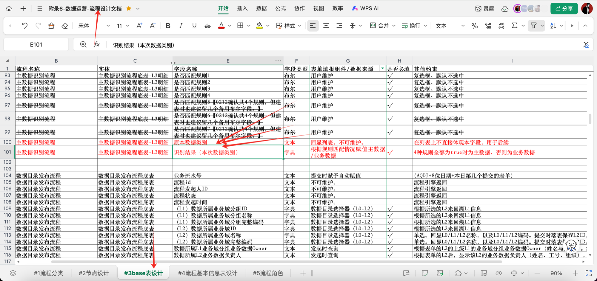
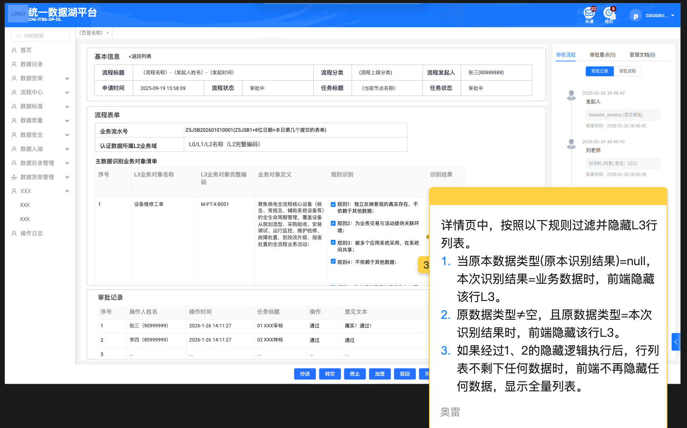
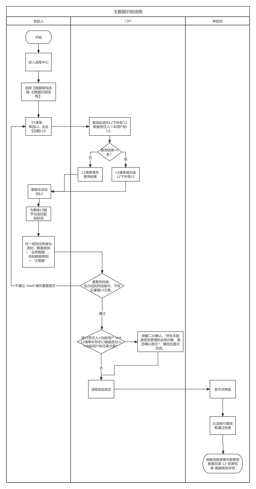

## 基本信息

| 项目 | 内容 |
|------|------|
| **迭代编号** | 19 |
| **发布日期** | 2026-03-09 |
| **责任人** | 刘一力 |
| **需求类型** | 功能变更 |

## 修改摘要

【流程中心-流程发起-主数据识别流程】
【流程中心-流程列表-主数据识别流程详情】

- 发起表单提交时，对每个 L3 各自存储「原本数据类别」（主数据/业务数据/null）；
- 详情表单根据「原本数据类别」与「本次识别结果」，折叠部分 L3 行列表的记录。

**定位方式**：搜索 `20260309` 定位变更内容

---

## 一、功能变更说明

### 1.1 变更模块

**模块路径**：流程中心 → 流程发起 → 主数据识别流程（及对应流程列表详情页）

### 1.2 变更内容

**【20260309】变更**

本次变更包含两个子能力：

1. **发起表单提交时，记录每个 L3 的「原本数据类别」**
2. **详情表单中根据对比结果，前端折叠部分 L3 行记录**

---

## 二、功能详细设计

### 2.1 发起表单 - 提交时存储「原本数据类别」

#### 功能说明

发起表单提交时，系统对行列表中每个 L3，各自存储其**当前的数据类别**（即"原本数据类别"）。

| 字段 | 取值范围 | 说明 |
|------|---------|------|
| 原本数据类别 | 主数据 / 业务数据 / null | 取提交时该 L3 在系统中的现有数据类别值 |

**注意**：
- 该变量**不直接回显给用户**，仅作为后端存储的过程数据
- 用于后续详情页中的折叠逻辑判断



### 2.2 详情表单 - L3 行列表折叠逻辑

#### 功能说明

详情表单展示时，根据**「原本数据类别」**与**「本次识别结果」**的对比，前端对部分 L3 行记录进行折叠处理。

**折叠判断逻辑如图**：





#### 逻辑说明

- 当「原本数据类别」= 「本次识别结果」时：该 L3 行记录默认**折叠**（表示无变化）
- 当「原本数据类别」≠ 「本次识别结果」时：该 L3 行记录**展开显示**（表示有变化，需关注）
- 当「原本数据类别」= null 时：按照无原始分类处理，具体折叠规则见上图

### 2.3 主数据识别流程背景说明

用户在本页面只选择 L2。根据选择的 L2 内容，回显其他所有必填项。填写内容详见附件 6-#3-主数据识别流程。

提交时需要做表单的完整性校验（可能回显 null，提交时阻断）、或者重复性校验（当前未办结的同一流程中，不可有重复的 L3）。

流程通过后，将附录 1-#2-L3-资源信息（数据类别字段）根据表单的「识别结果」的值进行维护。

---

## 三、影响范围

### 3.1 影响的功能点

- 流程中心 → 流程发起 → 主数据识别流程：提交时新增「原本数据类别」字段存储
- 流程中心 → 流程列表 → 主数据识别流程详情：L3 行列表根据对比结果执行折叠

### 3.2 数据流

```
发起表单提交
  ↓
系统读取每个 L3 当前的数据类别 → 存储为「原本数据类别」（后端，不回显）
  ↓
流程审批通过 → 更新 L3 数据类别为「本次识别结果」
  ↓
详情页展示
  ↓
前端比对「原本数据类别」vs「本次识别结果」→ 控制 L3 行折叠/展开
```

### 3.3 注意事项

- 「原本数据类别」为后端存储字段，不在任何页面直接展示给用户
- 折叠逻辑仅为前端展示效果，不影响数据本身
- 需确保在发起表单提交时准确采集各 L3 的现有数据类别

---

## 四、验收标准

| 序号 | 验收项 | 预期结果 |
|------|--------|----------|
| 1 | 发起主数据识别流程并提交 | 系统后台为每个 L3 记录「原本数据类别」（主数据/业务数据/null） |
| 2 | 进入主数据识别流程详情页 | L3 行列表中，原本数据类别=本次识别结果的行默认折叠 |
| 3 | 详情页展示有变化的 L3 | 原本数据类别≠本次识别结果的 L3 行保持展开状态 |
| 4 | 验证「原本数据类别」不回显 | 发起表单和详情表单均不直接展示「原本数据类别」列 |
| 5 | 验证原本数据类别=null 的情况 | 折叠逻辑符合设计图中的 null 分支处理规则 |
