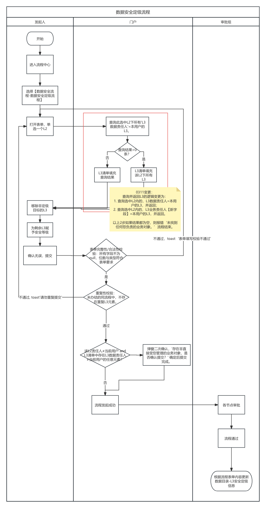
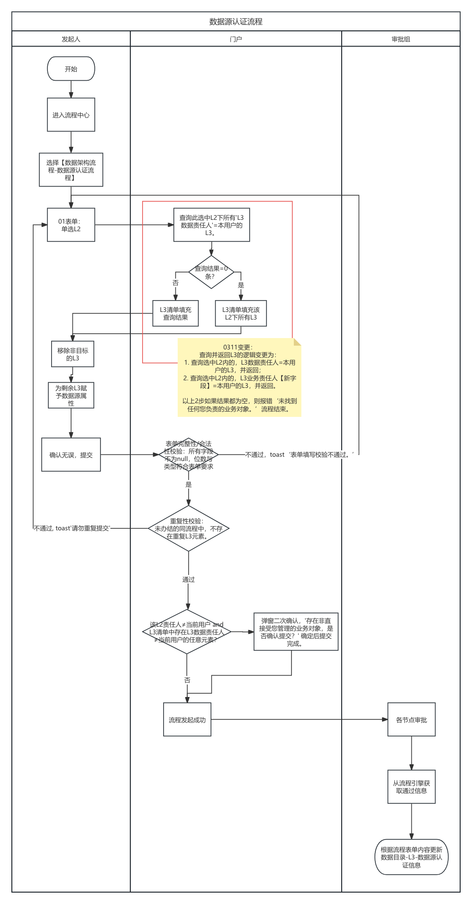
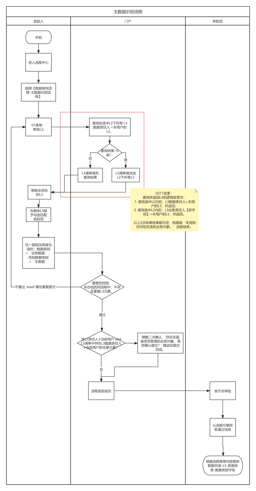

## 基本信息

| 项目 | 内容 |
|------|------|
| **迭代编号** | 22 |
| **发布日期** | 2026-03-11 |
| **责任人** | 刘一力 |
| **需求类型** | 功能变更 |

## 修改摘要

【流程中心-流程发起】

以下流程表单，选中 L2 后加载 L3 明细逻辑变更、且在提交后新增 L3 数据责任人审批节点：

- 数据安全定级流程
- 数据源认证流程
- 主数据识别流程
- 数据目录发布流程

**定位方式**：搜索 `20260311` 定位变更内容

---

## 一、功能变更说明

### 1.1 变更模块

**模块路径**：流程中心 → 流程发起（以下四个流程）

| 所属分类 | 流程名称 |
|---------|---------|
| 数据安全流程 | 数据安全定级流程 |
| 数据架构流程 | 数据源认证流程 |
| 数据架构流程 | 主数据识别流程 |
| 数据架构流程 | 数据目录发布流程 |

### 1.2 变更内容

**【20260311】变更**

以上四个流程统一新增以下两点变更：

| 变更点 | 详情 |
|--------|------|
| ① 选中 L2 后加载 L3 明细逻辑变更 | 逻辑见下图，详见附录 6-#2 |
| ② 提交后新增 L3 数据责任人审批节点 | 会签并行，全部通过后至下一节点，详见附录 6-#2 |

---

## 二、功能详细设计

### 2.1 变更一：选中 L2 后加载 L3 明细逻辑变更

#### 变更说明

四个流程发起表单在用户选中 L2 后，系统加载该 L2 下属 L3 明细列表的逻辑发生变更。

**变更后加载逻辑（见下图）**：

#### 各流程加载逻辑

**数据安全定级流程**：

**数据源认证流程**：

**主数据识别流程**：

**数据目录发布流程**：

### 2.2 变更二：提交后新增 L3 数据责任人审批节点

#### 节点设计

| 属性 | 配置 |
|------|------|
| 节点名称 | L3 数据责任人审批 |
| 审批方式 | 会签并行 |
| 通过条件 | 全部审批人通过后，流转至下一节点 |
| 详细配置 | 详见附录 6-#2（各流程节点设计） |

#### 影响的流程节点设计

本次变更需同步更新附录 6-#2 中以下四个流程的节点设计图：

1. 数据安全定级流程节点设计
2. 数据源认证流程节点设计
3. 主数据识别流程节点设计
4. 数据目录发布流程节点设计

### 2.3 各流程变更前后对比

#### 数据安全定级流程（含 20260309 变更）

**原有逻辑**：用户在本页面只选择 L2。根据选择的 L2 内容，回显其他所有必填项。填写内容详见附件 6-#3-数据安全定级流程。提交时需要做表单的完整性校验（可能回显 null，提交时阻断）、或者重复性校验（当前未办结的同一流程中，不可有重复的 L3）。流程通过后，将附录 1-#2-L3-安全信息根据表单内容进行维护。

**【20260311】新增**：
- 选中 L2 后加载 L3 明细逻辑变更（见上图）
- 提交后新增 L3 数据责任人审批节点（会签并行、全部通过后至下一节点）

---

#### 数据源认证流程（含 20260309 变更）

**原有逻辑**：用户在本页面只选择 L2。根据选择的 L2 内容，回显其他所有必填项。填写内容详见附件 6-#3-数据源认证流程。提交时需要做表单的完整性校验（可能回显 null，提交时阻断）、或者重复性校验（当前未办结的同一流程中，不可有重复的 L3）。流程通过后，将附录 1-#2-L3-数据源认证信息根据表单内容进行维护。

**【20260311】新增**：
- 选中 L2 后加载 L3 明细逻辑变更（见上图）
- 提交后新增 L3 数据责任人审批节点（会签并行、全部通过后至下一节点）

---

#### 主数据识别流程（含 20260309 变更）

**原有逻辑**：用户在本页面只选择 L2。根据选择的 L2 内容，回显其他所有必填项。填写内容详见附件 6-#3-主数据识别流程。提交时需要做表单的完整性校验（可能回显 null，提交时阻断）、或者重复性校验（当前未办结的同一流程中，不可有重复的 L3）。流程通过后，将附录 1-#2-L3-资源信息（数据类别字段）根据表单的「识别结果」的值进行维护。

**【20260311】新增**：
- 选中 L2 后加载 L3 明细逻辑变更（见上图）
- 提交后新增 L3 数据责任人审批节点（会签并行、全部通过后至下一节点）

---

#### 数据目录发布流程

**原有逻辑**：用户在本页面只选择 L2。根据选择的 L2 内容，回显其他所有必填项。填写内容详见附件 6-#3-数据目录发布流程。提交时需要做表单的完整性校验（可能回显 null，提交时阻断）、或者重复性校验（当前未办结的同一流程中，不可有重复的 L2）。流程通过后，将附录 1-#2 与 L3 相关的多个值按照表单填写进行维护。

**【20260311】新增**：
- 选中 L2 后加载 L3 明细逻辑变更（见上图）
- 提交后新增 L3 数据责任人审批节点（会签并行、全部通过后至下一节点）

---

## 三、影响范围

### 3.1 影响的功能点

| 功能模块 | 变更项 |
|---------|--------|
| 流程中心 → 流程发起 → 数据安全定级流程 | L3 加载逻辑变更；新增数据责任人审批节点 |
| 流程中心 → 流程发起 → 数据源认证流程 | L3 加载逻辑变更；新增数据责任人审批节点 |
| 流程中心 → 流程发起 → 主数据识别流程 | L3 加载逻辑变更；新增数据责任人审批节点 |
| 流程中心 → 流程发起 → 数据目录发布流程 | L3 加载逻辑变更；新增数据责任人审批节点 |
| 附录 6-#2 节点设计 | 以上四个流程的节点设计图均需更新 |

### 3.2 注意事项

- L3 数据责任人审批节点采用会签并行方式，所有责任人**全部**通过后才流转至下一节点
- 本次变更中，「数据责任人」即为 L3 节点的数据标准责任人（详见附录 6-#2）
- 与迭代 21 联动：若迭代 21 引入了「业务责任人」，需确认本节点的审批人范围
- 节点设计详情以附录 6-#2 为准

---

## 四、验收标准

| 序号 | 验收项 | 预期结果 |
|------|--------|----------|
| 1 | 发起数据安全定级流程，选择 L2 | L3 明细列表按新逻辑加载（符合逻辑图规则） |
| 2 | 发起数据源认证流程，选择 L2 | L3 明细列表按新逻辑加载 |
| 3 | 发起主数据识别流程，选择 L2 | L3 明细列表按新逻辑加载 |
| 4 | 发起数据目录发布流程，选择 L2 | L3 明细列表按新逻辑加载 |
| 5 | 提交数据安全定级流程 | 流程节点中出现 L3 数据责任人会签并行审批节点 |
| 6 | 提交数据源认证流程 | 流程节点中出现 L3 数据责任人会签并行审批节点 |
| 7 | 提交主数据识别流程 | 流程节点中出现 L3 数据责任人会签并行审批节点 |
| 8 | 提交数据目录发布流程 | 流程节点中出现 L3 数据责任人会签并行审批节点 |
| 9 | 审批节点 - 部分责任人通过 | 流程不流转，等待全部通过 |
| 10 | 审批节点 - 全部责任人通过 | 流程流转至下一节点 |
