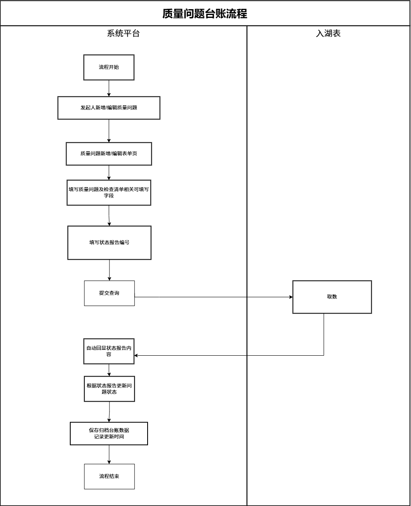
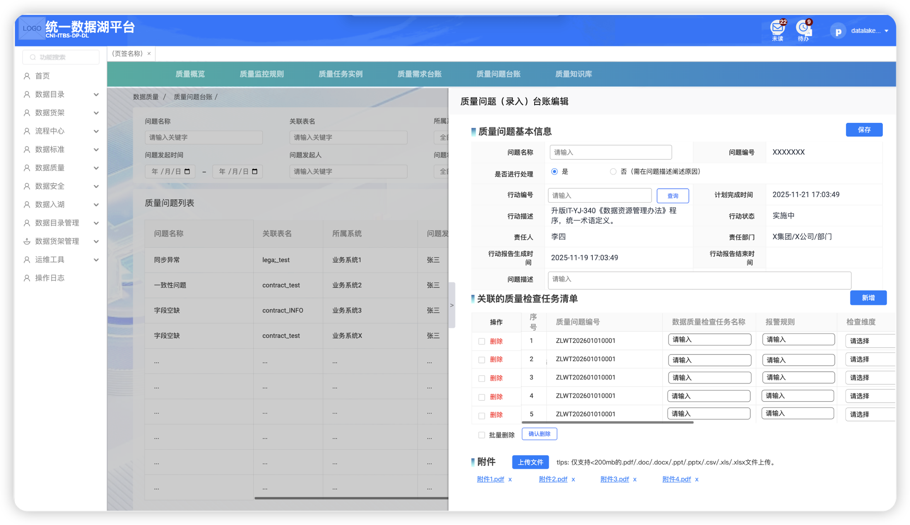
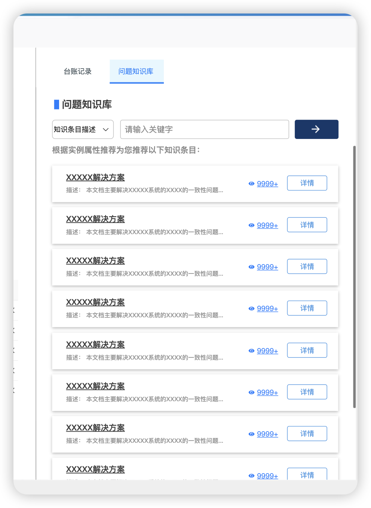

<!-- enhanced-at: 2025-07-25T00:00:00+08:00 -->

### 1.1.1【待投研】

#### 1.1.1.1. 程序描述

本模块用于管理质量问题台账。支持质量问题的创建、编辑，实现质量问题从发现到解决的管理。台账数据来源于数据运营平台，可与外部处理系统联动。
 

> **[图片描述 — 质量问题台账模块整体页面概览]**
> - **左侧导航栏**：展开「数据质量」模块，下含子菜单：质量概览 / 质量监控规则 / 质量任务实例 / 质量需求台账 / **质量问题台账**（当前高亮）/ 质量知识库
> - **顶部 Tab 栏**：与左侧导航一致的 6 个功能 Tab，当前选中「质量问题台账」
> - **主内容区**：展示质量问题台账列表页，包含搜索筛选区和数据表格区

#### 1.1.1.2. 需控制的菜单-按钮权限项

| 一级模块 | 二级模块   | 三级页面 | 权限项    | 页面/按钮 |
| ---- | ------ | ---- | ------ | ----- |
| 数据标准 | 落标问题台账 | /    | 二级页面本体 | 页面    |
|      |        | 列表页  | 创建     | 按钮    |
|      |        | 列表页  | 编辑     | 按钮    |

> **⚠️ 命名不一致说明**：权限表中二级模块名为「落标问题台账」，但正文与截图中均使用「质量问题台账」，以正文为准。

#### 1.1.1.3. **流程逻辑**

 

> **[图片描述 — 质量问题台账业务流程图]**
> - **业务流程**：创建质量问题 → 关联质量检查任务 → 提交 → 审批流程
> - **状态流转**：未处理 → 状态报告进程 → 已解决 / 已关闭
> - **关键节点**：问题创建后初始状态为「未处理」，提交后进入「状态报告进程」，最终根据处理结果进入「已解决」或「已关闭」

#### 1.1.1.4. 功能详细设计

本模块包含以下功能：

质量问题台账列表

本页面用于展示问题编号、状态、名称、问题描述摘要、发起人、关联任务、更新时间等。
 

> **[图片描述 — 质量问题台账列表页]**
> - **表格列头**：问题名称 / 关联表名 / 所属系统 / 问题发...(截断) / 操作
> - **操作列**：每行右侧提供「详情」「编辑」「删除」三个操作按钮
> - **分页控件**：表格底部有分页导航
> - **整体布局**：上方搜索区 + 下方数据表格，标准列表页样式
> - **注意**：截图中列头包含「关联表名」「所属系统」等字段，可能与 PRD 附录字段有差异

每条记录右侧配置【详情】【编辑】【删除】操作按钮，便于用户快速查看、修改或移除问题（操作权限依状态动态控制），列表支持分页浏览。

搜索
 

> **[图片描述 — 质量问题台账搜索筛选区域]**
> - **搜索字段**：可见字段包括 问题名称 / 关联表名 / 所属系统 / 以及更多展开字段
> - **操作按钮**：「查询」和「重置」按钮
> - **可展开区域**：搜索区支持展开/收起，展开后显示全部 12 个搜索字段
> - **注意**：截图显示的字段名称（关联表名/所属系统）与 PRD 搜索字段表不完全一致，以 PRD 表格为准

页面顶部提供结构化搜索区域，搜索字段为：

| 字段       | 输入组件类型  | 备注                        |
| -------- | ------- | ------------------------- |
| 行动编号     | 文本输入框   |                           |
| 问题名称     | 文本输入框   |                           |
| 问题编号     | 文本输入框   |                           |
| 问题状态     | 下拉选择框   | 枚举值：【待确认-与下游平台对状态报告的状态一致】 |
| 问题发起人    | 文本输入框   |                           |
| 问题发起部门   | 文本输入框   |                           |
| 问题处理人    | 文本输入框   |                           |
| 问题处理单位组织 | 文本输入框   |                           |
| 是否进行处理   | 下拉选择框   | 枚举值：是/否                   |
| 问题发起时间   | 日期范围选择器 | 起止日期双控件                   |
| 问题更新时间   | 日期范围选择器 | 起止日期双控件                   |
| 我发起的     | 复选框     | 默认不选中                     |

字段详见附录8-问题台账。

质量问题新增表单页

该页面用于创建新的质量问题。用户可填写问题名称、描述、行动编号、选择是否进行处理，填写处理人及所属部门等等。
 

> **[图片描述 — 质量问题新增表单页]**
> - **基本信息区**：
>   - 问题名称（文本输入框）
>   - 问题编号（自动生成，灰色只读）
>   - 是否进行处理（单选按钮：是 / 否）
>   - 行动编号（文本输入框）+ 「查询」按钮（点击后从外部平台获取数据）
> - **外部平台回填只读字段**（查询行动编号后自动填充）：
>   - 行动描述、计划完成时间、行动状态、责任人、责任部门、行动报告生成时间、行动报告关闭时间
> - **问题描述**：多行文本域（textarea），1-500 字
> - **关联质量检查任务清单子表**：
>   - 列头：序号 / 质量问题编号 / 数据质量检查任务名称 / 报警规则 / 检查维度
>   - 支持新增行和删除行
> - **附件上传区域**：支持上传附件
> - **底部按钮**：「保存」和「取消」

质量问题编辑表单页  
该页面用于修改已存在的质量问题记录。页面显示问题的基本信息（如名称、编号、状态、发起人、时间等），支持编辑字段。
 

> **[图片描述 — 质量问题编辑表单页]**
> - **整体布局**：与新增表单页结构一致，但已有数据回填
> - **字段可编辑性**：根据问题状态不同，部分字段可能为只读
> - **评估退回原因区域**：页面中显示「评估退回原因」区域（只读），当有退回记录时展示
> - **底部按钮**：与新增页一致，提供「保存」和「取消」

状态报告进程：部分字段可编辑，提供【保存】【上传文件】和【新增】关联质量检查任务详情按钮。

未处理：全字段可编辑，提供【保存】【上传文件】和【新增】关联质量检查任务详情按钮。

字段未通过校验

> **[图片描述 — 字段校验失败提示示例]**
> - **提示位置**：在「问题描述」字段下方显示红色错误提示
> - **提示内容**：「您好，请重新检查填写字段」
> - **提示行为**：1000ms 后自动隐藏
> - **触发条件**：字段校验失败或必填项缺失时触发

提示框弹窗：在"问题描述"下方出现提示："您好，请重新检查填写字段"，表示当前存在校验失败或必填项缺失，1000ms后自动隐藏。

展示"评估退回原因"（只读）。

质量问题详情页

> **[图片描述 — 质量问题详情页展示]**
> - **基础信息区**：只读展示所有字段信息
> - **关联质量检查任务清单**：子表展示，带「导出」按钮
> - **附件区域**：展示已上传附件列表（如 附件1.pdf ~ 附件4.pdf），可点击查看
> - **右侧标签页**：
>   - 「台账记录」Tab：操作日志表格，列头为 操作 / 操作人员 / 操作时间，记录「发布」和「编辑」操作，底部有分页（1,2,3,4,5）
>   - 「问题知识库」Tab：关联的知识库条目
> - **整体为只读页面**，无编辑功能

完整展示问题信息：基础信息、关联任务清单、附件等等。

【导出】按钮：点击导出关联的质量任务检查清单，所见即所得。  
日志：记录了对台账的每次操作，包括操作类型、执行人员和操作时间，用于追溯数据变更历史，在创建时插入操作=发布的日志记录。后续任意标记操作保存，插入操作=编辑的日志记录。

问题知识库：默认显示与本问题台账【关联实例（明细表）】与所【关联规则】绑定的质量知识条目。用户可通过输入关键字或选择知识目录进行检索。详见字段3.6.3质量知识库，附录5-#1-质量知识条目信息表。列表展示只是条目名称、知识条目描述、查看次数。点击【详情】则展开详情。

> **[图片描述 — 问题知识库关联展示区域]**
> - **标签页视图**：位于详情页右侧的「问题知识库」Tab 下
> - **搜索功能**：支持按关键字和知识目录筛选
> - **列表展示**：条目名称 / 知识条目描述 / 查看次数
> - **操作按钮**：每条记录提供「详情」按钮，点击可展开查看完整内容

### 附录8-问题台账
#### 质量问题台账数据逻辑

| 分类           | 字段中文名称   | 字段类型     | 是否为主键 | 不可为空 | 校验限制         | 枚举值 (单选)                | 说明                              | 数据来源              |
| ------------ | -------- | -------- | ----- | ---- | ------------ | ----------------------- | ------------------------------- | ----------------- |
| 质量问题基本信息表    | 问题编号     | 文本       | √     | √    | /            | /                       | 质量问题台账主表唯一主键                    | 外部数据平台            |
|              | 问题名称     | 文本       |       | √    | 1-30位        | /                       | 台账名称，建议格式：时间 (yyyy/MM/dd)+ 任务名  | 表单输入              |
|              | 是否进行处理   | 布尔       |       | √    | /            | 是,否                     | 该问题是否需要处理；若为"否"，问题描述需填写未处理原因    | 表单输入              |
|              | 问题状态     | 字典       |       | √    | /            | /                       | 与状态报告的枚举关联，通过编号在入湖表查询并返回，用户不可维护 | 外部数据平台，根据行动编号同步   |
|              | 问题发起人    | 文本       |       | √    | 必须在组织架构信息中存在 | /                       | 负责该问题的数据质量管理员姓名                 | 表单输入              |
|              | 问题发起人部门  | 文本       |       | √    | /            | /                       | 问题发起人所在部门名称                     | 外部数据平台，根据问题发起人同步  |
|              | 行动编号     | 文本       |       | √    | 1-100位，主表内唯一 | /                       | 状态报告的唯一编号                       | 表单输入              |
|              | 行动描述     | 文本       |       | √    | /            | /                       | 行动描述                            | 外部数据平台，根据行动编号请求查询 |
|              | 计划完成时间   | datetime |       | √    | /            | /                       | 计划完成该行动的日期                      | 外部数据平台，根据行动编号请求查询 |
|              | 责任部门     | 文本       |       | √    | /            | /                       | 负责执行该行动的组织                      | 外部数据平台，根据行动编号请求查询 |
|              | 责任人      | 文本       |       | √    | /            | /                       | 行动负责人姓名                         | 外部数据平台，根据行动编号请求查询 |
|              | 行动报告生成时间 | datetime |       | √    | /            | /                       | 上传或创建该方案的时间                     | 外部数据平台，根据行动编号请求查询 |
|              | 行动报告关闭时间 | datetime |       | /    | /            | /                       | 行动实际关闭的时间戳                      | 外部数据平台，根据行动编号请求查询 |
|              | 行动状态     | 文本       |       | √    | /            | /                       | 当前的行动生命周期状态                     | 外部数据平台，根据行动编号请求查询 |
|              | 问题发起时间   | datetime |       | √    | /            | /                       | 问题台账的发起时间                       | 平台自动更新            |
|              | 更新时间     | datetime |       | √    | /            | /                       | 质量问题台账的最新更新时间                   | 平台自动更新            |
|              | 问题描述     | 文本       |       | √    | 1-500位       | /                       | 问题核心及待处理事项的描述                   | 表单输入              |
|              |          |          |       |      |              |                         |                                 |                   |
| 关联质量检查任务清单子表 | 清单ID     | 文本       | √     | √    | /            | /                       | 清单唯一标识（主键）                      | 外部数据平台            |
|              | 问题编号     | 文本       |       | √    | /            | /                       | 外键，关联主表"problem_id"             | 外部数据平台            |
|              | 展示序号     | 整数       |       | √    | /            | /                       | 流水序号（按展示顺序生成）                   | 外部数据平台            |
|              | 质量任务编号   | 文本       |       | √    | /            | /                       | 数据质量检查任务编号                      | 外部数据平台            |
|              | 质量任务名称   | 文本       |       | √    | 1-30位        | /                       | 与任务编号一一对应                       | 表单输入              |
|              | 报警规则     | 文本       |       | √    | 1-500位       | /                       | 报警判定条件                          | 表单输入              |
|              | 检查维度     | 字典       |       | √    | /            | 准确性、完整性、一致性、时效性、唯一性、有效性 | 质量检查方向                          | 表单输入              |
|              | 数据库实例    | 文本       |       | √    | 取质量任务实例模块的记录 | /                       | 从DataWorks获取的数据源+表（检查对象）        | 表单输入              |
|              | 规则字段     | 文本       |       | √    | 1-50位        | /                       | 具体检查的字段名                        | 表单输入              |
|              | 任务问题描述   | 文本       |       | √    | 1-500位       | /                       | 该任务发现的具体质量问题                    | 表单输入              |
|              |          |          |       |      |              |                         |                                 |                   |
| 台账操作日志子表     | 日志ID     | 文本       | √     | √    | /            | /                       | 日志唯一标识（系统生成）                    | 外部数据平台            |
|              | 问题编号     | 文本       |       | √    | /            | /                       | 外键                              | 外部数据平台            |
|              | 操作       | 文本       |       | √    | /            | /                       | 操作类型：发布/编辑                      | 外部数据平台            |
|              | 操作人员ID   | 文本       |       | √    | /            | /                       | 存储用户 ID，页面展示带出姓名                | 外部数据平台            |
|              | 操作时间     | datetime |       | √    | /            | /                       | 操作发生的时间                         | 平台自动更新            |

---

## PRD 增强摘要

### 核心功能模块

1. **列表页**：展示质量问题台账记录，支持分页，每行有详情/编辑/删除操作
2. **搜索筛选**：12 个搜索字段（4 文本 + 2 下拉 + 2 日期范围 + 1 复选框 + 3 文本）
3. **新增表单页**：创建质量问题，包含基本信息、行动编号查询回填、关联任务子表、附件上传
4. **编辑表单页**：修改已有记录，按状态区分可编辑范围（未处理=全部可编辑，状态报告进程=部分可编辑）
5. **详情页**：只读展示全部信息 + 导出任务清单 + 台账日志 + 问题知识库

### 关键业务规则

- **状态流转**：未处理 → 状态报告进程 → 已解决/已关闭（状态由外部平台同步，用户不可直接修改）
- **行动编号查询**：输入编号 → 点击查询 → 从外部数据平台获取并回填 7 个只读字段
- **是否进行处理 = 否**：问题描述变为必填（需填写未处理原因）
- **字段校验失败**：在问题描述下方显示红色提示，1000ms 自动消失
- **操作日志**：创建时记录「发布」，后续编辑记录「编辑」
- **附件限制**：单文件 <200MB，格式限 pdf/doc/docx/ppt/pptx/csv/xls/xlsx

### 权限模型

| 权限项 | 类型 | 控制范围 |
|--------|------|----------|
| 二级页面本体 | 页面 | 控制是否可访问质量问题台账页面 |
| 创建 | 按钮 | 控制列表页「创建」按钮可见性 |
| 编辑 | 按钮 | 控制列表页「编辑」按钮可见性 |

### 数据来源分类

- **表单输入**：问题名称、是否进行处理、问题发起人、行动编号、问题描述
- **外部数据平台（行动编号查询）**：行动描述、计划完成时间、行动状态、责任人、责任部门、行动报告生成/关闭时间
- **外部数据平台（自动同步）**：问题编号、问题状态、问题发起人部门
- **平台自动更新**：问题发起时间、更新时间
