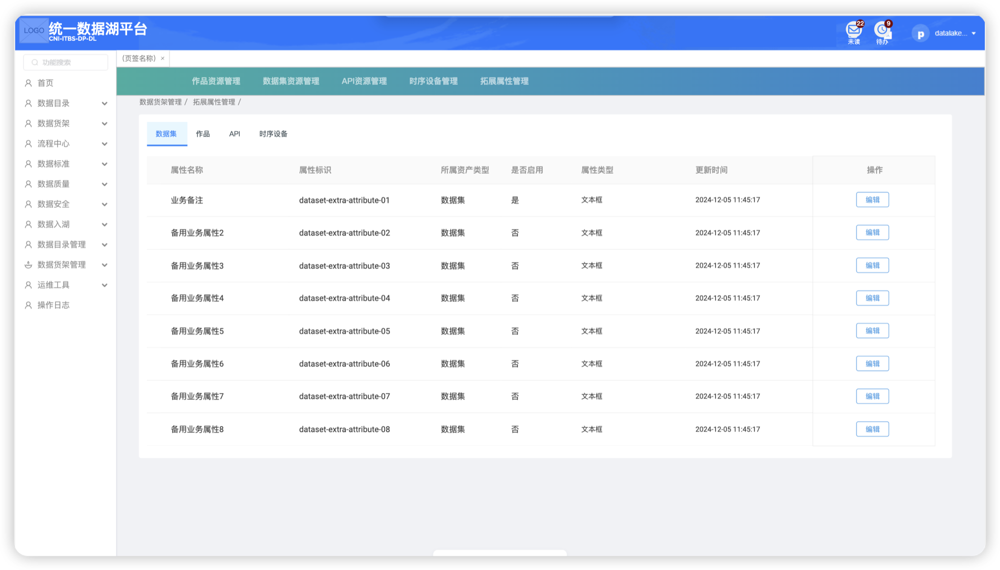
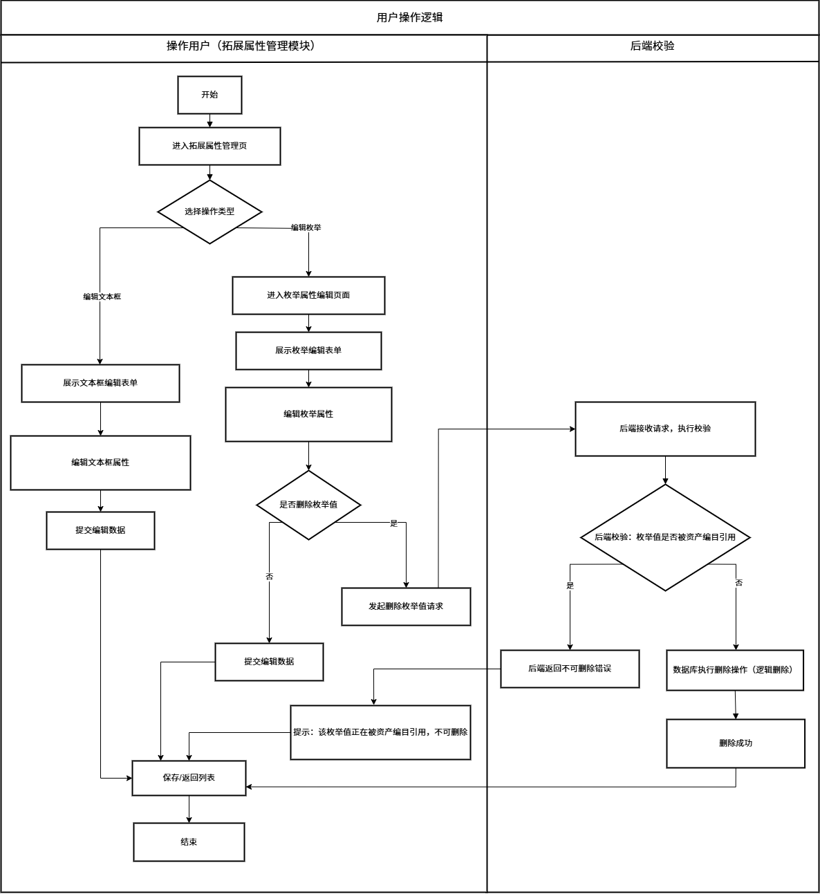
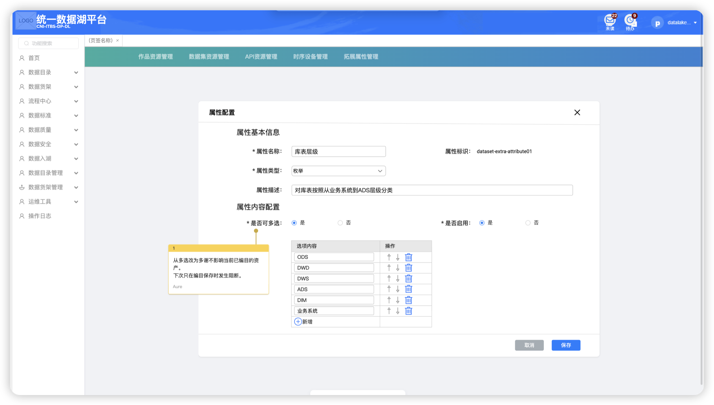

### 1.1.1. 拓展属性管理

#### 1.1.1.1.  **程序描述**

提供统一的入口，用于定义和管理各类资产（数据集、作品、API、时序设备等）的自定义业务属性。支持配置属性名称、标识、类型（文本框、枚举等）及选项内容。
 

#### 1.1.1.2.  **需控制的菜单-按钮权限项**

| 一级模块   | 二级模块   | 三级页面 | 权限项       | 页面/按钮 |
| ------ | ------ | ---- | --------- | ----- |
| 数据货架管理 | 拓展属性管理 | /    | 二级页面本体    | 页面    |
|        |        | /    | 【编辑】      | 按钮    |
|        |        | /    | 【新增（枚举项）】 | 按钮    |
|        |        | /    | 【保存】      | 按钮    |
|        |        | /    | 【取消】      | 按钮    |

#### 1.1.1.3. **流程逻辑**
 

#### 1.1.1.4. **功能详细设计**

属性列表

Tab切换：按资产类型分页签展示（数据集、作品、API、时序设备）。

列表字段：

| 序号  | 字段     | 类型  | 业务意义              |
| --- | ------ | --- | ----------------- |
| 1   | 属性名称   | 文本  | 展示拓展属性的业务名称       |
| 2   | 属性标识   | 文本  | 展示属性唯一标识          |
| 3   | 所属资产类型 | 字典  | 展示该属性归属的资产类型      |
| 4   | 是否启用   | 布尔  | 展示属性当前启用状态        |
| 5   | 属性类型   | 字典  | 展示属性为文本框类型或枚举类型   |
| 6   | 更新时间   | 时间  | 展示属性最后一次修改时间      |
| 7   | 操作     | 按钮  | 提供【编辑】入口，进入对应编辑页面 |

点击【编辑】进入对应编辑页面。

属性编辑（枚举）

对枚举类型的拓展属性进行配置维护，支持设置属性基础信息、是否可多选，并维护枚举选项列表（新增、排序、删除），完成后保存至系统。

字段（相比列表新增）：

| 序号  | 字段    | 类型  | 业务意义         |
| --- | ----- | --- | ------------ |
| 1   | 是否必填  | 布尔  | 设置该属性是否必须填写  |
| 2   | 属性描述  | 文本  | 描述该属性的业务含义   |
| 3   | 是否可多选 | 布尔  | 设置枚举选项是否支持多选 |
| 4   | 选项内容  | 文本  | 新增 / 编辑枚举选项值 |
| 5   | 选项排序号 | 整型  | 控制枚举选项展示顺序   |

字段设计详见附录7-#1。

属性编辑（文本框）

对文本框类型的拓展属性进行配置维护，支持设置属性基础信息、属性描述等内容，配置完成后保存至系统。当拓展属性为文本框时，编目数用户可输入1-100位文本。高级搜索时拓展属性可以使用文本类搜索器进行搜索。

### 附录7-#1 拓展属性管理

| 分类           | 字段中文名称 | 主键  | 类型       | 不可为空 | 校验限制      | 枚举              | 说明                       | 数据来源          |
| ------------ | ------ | --- | -------- | ---- | --------- | --------------- | ------------------------ | ------------- |
| 拓展属性主表       | 属性标识   | √   | 文本       | √    | /         | /               | 系统生成的唯一标识                | 平台自动生成        |
|              | 属性名称   |     | 文本       | √    | 1-50 位字符  | /               | 拓展属性的业务名称，如 “业务备注”“库表层级” | 表单输入          |
|              | 所属资产类型 |     | 字典       | √    | /         | 数据集、作品、API、时序设备 | 标识该拓展属性归属的资产类别           | 平台自动同步        |
|              | 是否启用   |     | 布尔       | √    | /         | 是、否             | 标识该属性是否在资产编辑 / 展示中生效     | 表单输入          |
|              | 属性类型   |     | 字典       | √    | /         | 文本框、枚举          | 标识属性的输入控件类型              | 表单输入          |
|              | 更新时间   |     | datetime | √    | /         | /               | 该属性配置的最后修改时间             | 平台自动生成(编辑后同步) |
|              | 属性描述   |     | 文本       |      | 1-200 位字符 | /               | 对该属性业务含义的说明文字            | 表单输入          |
|              | 是否必填   |     | 布尔       | √    | /         | 是、否             | 标识资产录入时该属性是否必须填写         | 表单输入          |
|              |        |     |          |      |           |                 |                          |               |
| 拓展属性配置子表（枚举） | 选项ID   | √   | 文本       | √    | /         | /               | 主键                       | 平台自动生成        |
|              | 属性标识   |     | 文本       | √    | /         | /               | 系统生成的唯一标识，不可编辑,外键        | 平台自动生成        |
|              | 是否可多选  |     | 布尔       | √    | /         | 是、否             | 标识枚举选项是否支持多选             | 表单输入          |
|              | 选项是否删除 |     | 布尔       | √    | /         | 是、否             | 标识枚举选项是否已经删除             | 表单输入          |
|              | 选项内容   |     | 文本       | √    | 1-50 位字符  | /               | 枚举选项列表，支持新增、排序、删除        | 表单输入          |
|              | 选项排序号  |     | 整型       | √    | /         | /               | 非负整数，选项展示顺序（按大小升序）       | 表单输入          |