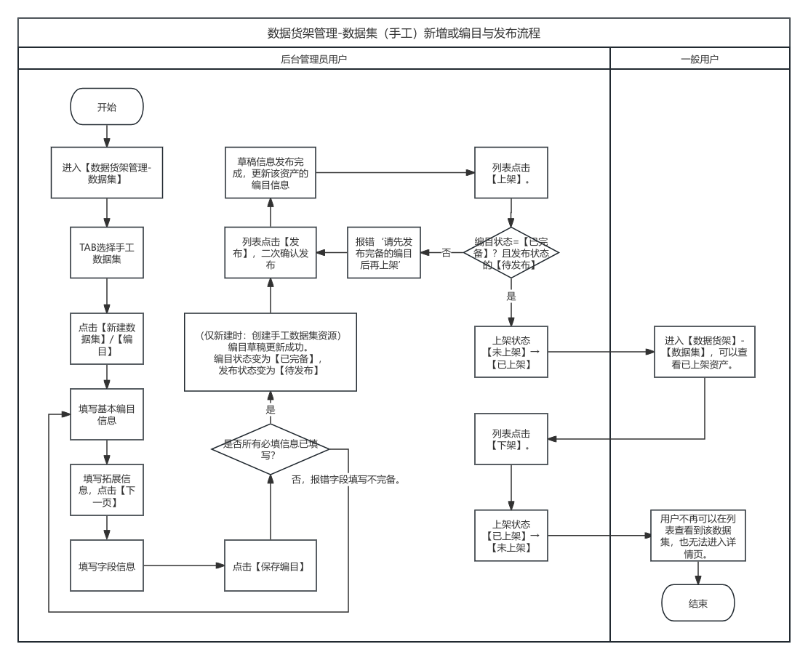
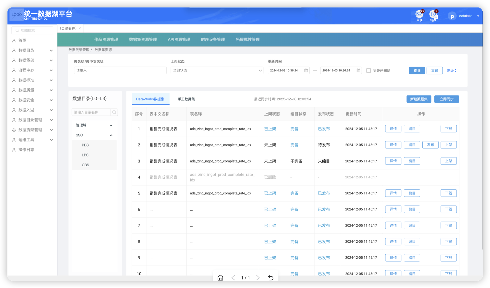
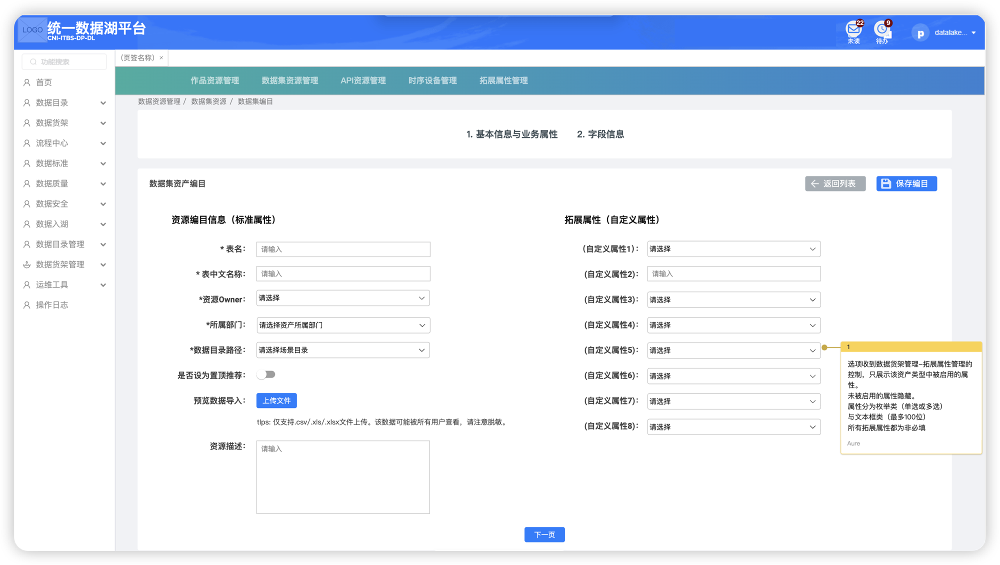
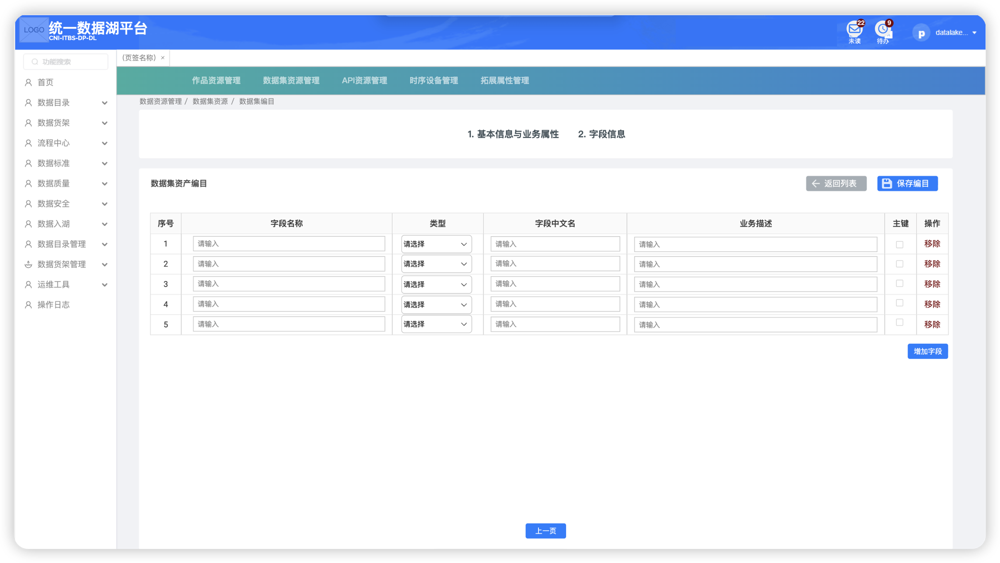

### 1.1.1. 数据集管理

#### 1.1.1.1.  **程序描述**

数据集管理用于管理从中台同步、手工创建的数据集的资产元数据。保障数据资产在前台的分类符合业务实际。

#### 1.1.1.2.  **需控制的菜单-按钮权限项**

| 一级模块   | 二级模块 | 三级页面 | 权限项     | 页面/按钮 |
| ------ | ---- | ---- | ------- | ----- |
| 数据货架管理 | 数据集  | /    | 二级页面本体  | 页面    |
|        |      | /    | 【详情】    | 按钮    |
|        |      | /    | 【立即同步】  | 按钮    |
|        |      | /    | 【编目】    | 按钮    |
|        |      | /    | 【发布】    | 按钮    |
|        |      | /    | 【上架/下架】 | 按钮    |
|        |      | /    | 【新建数据集】 | 按钮    |

#### 1.1.1.3. 流程逻辑

 

#### 1.1.1.4. **功能详细设计**

手工数据集列表

按照编目更新时间倒序排序。列表显示详见原型与附录7—#3。

包含以下功能：

新增手工数据集

打开新增页，用户可以新建一个手工数据集，通过校验后保存编目草稿，用于后续发布。

详见原型与附录7—#3。

 

编目

打开编目页，加载草稿数据。用户可以对已有资源的编目进行修改后保存，通过校验后保存编目草稿，用于后续发布。编目保存完成后，编目状态=完备、发布状态=待发布。

详见原型与附录7—#3。

发布

二次确认发布后，将草稿数据写入正式表中，用于支撑详情展示，在那之后发布状态变为已发布，并清除草稿数据。

上架/下架

对于发布状态=已发布、编目状态=完备的，可以进行上架操作。对于上架状态=已上架的，可以进行下架操作。

该状态决定用户是否可以在前台数据货架模块看到对应资产列表卡片与详情页。

### 附录7-#3-手工数据集信息

| 分类        | 字段中文名称           | 字段类型     | 是否为主键 | 不可为空 | 校验限制                  | 枚举值         | 说明                | 数据来源    |
| --------- | ---------------- | -------- | ----- | ---- | --------------------- | ----------- | ----------------- | ------- |
| 资源基础信息主表  | 数据集ID            | 字符串      | 是     | 是    | /                     | /           | 数据集唯一标识           | 系统生成    |
|           | 表名               | 字符串      | /     | 是    | 长度1-128个字符            | /           | 数据集的英文名称，数据集唯一标识  | 表单输入    |
|           | 表中文名称            | 字符串      | /     | 是    | 长度1-128个字符            | /           | 数据集的中文名称          | 表单输入    |
|           | 资源Owner          | 字典       | /     | 是    | 必须在组织架构信息中存在          |             | 资源负责人             | 表单输入    |
|           | 所属部门             | 字典       | /     | 是    | 必须在组织架构信息中存在          |             | 资源所属部门            | 表单输入    |
|           | 数据目录路径(关联L3业务对象) | 字典       | /     | 是    | 必须为系统中已存在的数据目录路径,单选L3 |             | 资源在数据目录中的层级路径     | 表单输入    |
|           | 是否置顶推荐           | 布尔       | /     | /    | /                     | 是/否         | 是否在列表置顶推荐，默认为否    | 表单输入    |
|           | 收藏数量             | 整型       | /     | /    | /                     | /           | 被用户收藏的总次数         | 系统统计    |
|           | 观看数量             | 整型       | /     | /    | /                     | /           | 资源详情页被访问的总次数      | 系统统计    |
|           | 上架状态             | 字典       | /     | /    | /                     | 已上架/未上架/已删除 | 控制是否对外展示（类似商品上下架） | 用户操作    |
|           | 编目状态             | 字典       | /     | /    | /                     | 完备/不完备      | 描述编目流程当前阶段        | 用户操作    |
|           | 发布状态             | 字典       | /     | /    | /                     | 未发布/已发布     | 是否已正式对外发布，初始为未发布。 | 用户操作    |
|           | 资源描述             | 文本       | /     | /    | 1-500字符               | /           | 资源的业务含义、用途说明      | 表单输入    |
|           | 资源类型             | 字典       | /     | /    | /                     | 手工数据集/中台数据集 | 用于标识数据资源的来源       | 表单输入    |
|           | 更新时间             | datetime | /     | /    | /                     | /           | 最后一次编辑或更新的时间      | 系统生成    |
|           | 元数据同步时间          | datetime | /     | /    | /                     | /           | 最后一次元数据同步时间的时间    | 系统生成    |
|           |                  |          |       |      |                       |             |                   |         |
| 数据集拓展属性子表 | 拓展属性ID           | 字符串      | 是     | 是    | /                     | /           | 拓展属性记录唯一标识        | 系统生成    |
|           | 数据集ID            | 字符串      | /     | 是    | /                     | /           | 关联的数据集唯一标识,外键     | 关联数据集主表 |
|           | 属性名称             | 字符串      | /     | 是    | /                     | /           | 拓展属性名称            | 系统生成    |
|           | 属性值              | 字符串      | /     | 是    | 长度1-100个字符            | /           | 拓展属性对应的值          | 表单输入    |
|           | 属性类型             | 字典       | /     | 是    | /                     | 枚举/文本框      | 拓展属性对应的类型         | 表单输入    |