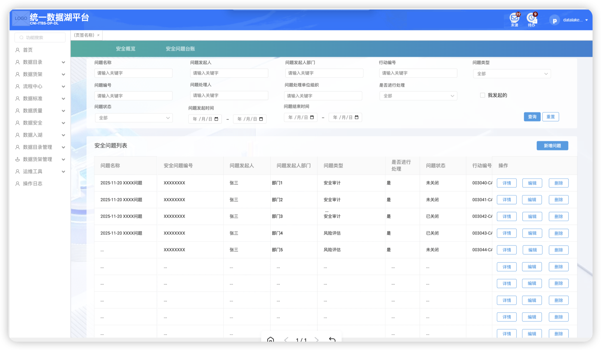
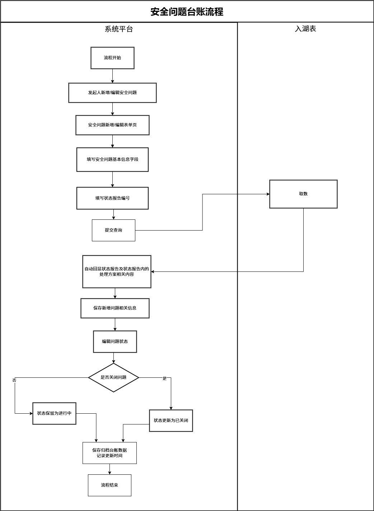
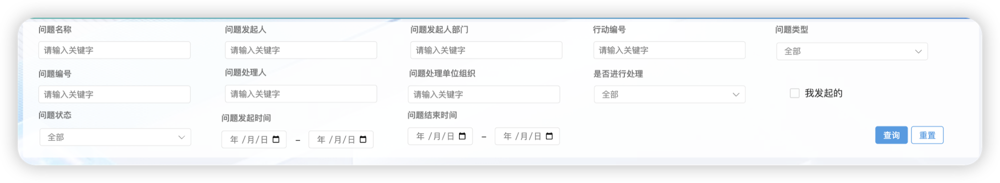
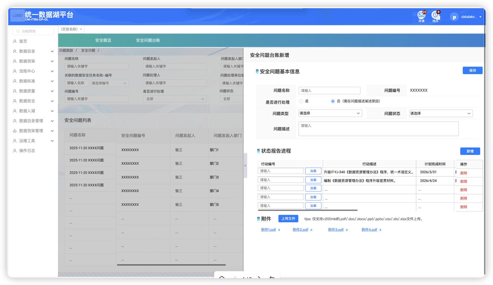
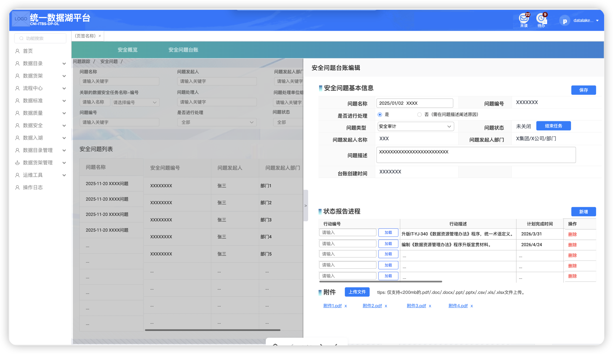
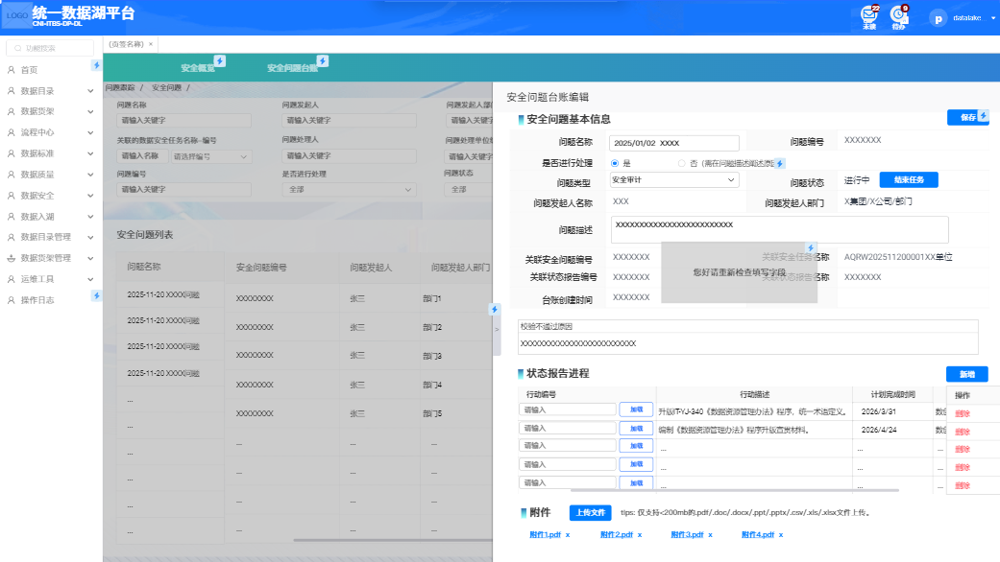
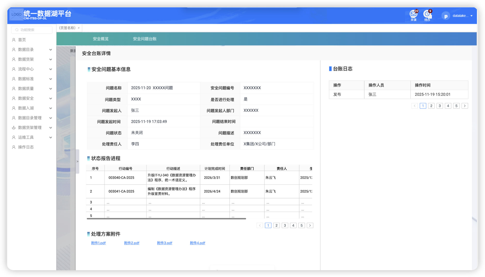

<!-- enhanced-at: 2026-03-26T03:30:00Z | images: 7/7 | health: 4 warnings -->

# PRD-27 数据安全-安全问题台账

## 1. 程序描述

本模块用于管理数据安全问题台账。支持安全问题的创建、编辑。台账数据来源于数据运营平台，与外部处理系统联动。

> **[AI图片描述]**
> 页面类型：列表页
> UI 布局：左侧导航栏 | 顶部标签页（安全概览 / 安全问题台账）| 搜索筛选区域 | 操作按钮区域 | 数据列表区域 | 分页区域
> 平台名称：统一数据湖平台（CNI-ITBS-DP-DL）
> 左侧导航菜单：首页、数据目录、数据货架、流程中心、数据标准、数据质量、数据安全、数据入湖、数据目录管理、数据货架管理、运维工具、操作日志
> 顶部标签页：安全概览 | **安全问题台账**（当前选中）
> 搜索字段（3行）：问题名称 | 问题发起人 | 问题发起人部门 | 行动编号 | 问题类型（下拉，默认"全部"）| 问题编号 | 问题处理人 | 问题处理单位组织 | 是否进行处理（下拉，默认"全部"）| 问题状态（下拉，默认"全部"）| 问题发起时间（日期范围）| 问题结束时间（日期范围）| ☐ 我发起的
> 按钮：【查询】（蓝色填充）【重置】（白色边框）【新增问题】（蓝色填充，位于列表标题右侧）
> 列表标题：安全问题列表
> 表格列：问题名称 | 安全问题编号 | 问题发起人 | 问题发起人部门 | 问题类型 | 是否进行处理 | 问题状态 | 行动编号 | 操作
> 操作列按钮：【详情】（蓝色文字）【编辑】（蓝色文字）【删除】（蓝色文字）
> 示例数据：问题类型含"安全审计""风险评估"；问题状态含"未关闭""已关闭"；是否进行处理均为"是"
> 分页：底部显示分页控件（当前 1/1）

## 2. 权限控制

| 一级模块 | 二级模块     | 三级页面 | 权限项     | 页面/按钮 |
| -------- | ------------ | -------- | ---------- | ---------- |
| 数据安全 | 安全问题台账 | /        | 二级页面本体 | 页面       |
|          |              | 列表页   | 创建       | 按钮       |
|          |              | 列表页   | 编辑       | 按钮       |

## 3. 流程逻辑

> **[AI图片描述]**
> 页面类型：流程图
> 流程标题：安全问题台账流程
> 泳道：系统平台 | 入湖表
> 流程节点（系统平台泳道）：
> 1. 流程开始 →
> 2. 发起人新增/编辑安全问题 →
> 3. 安全问题新增/编辑表单页 →
> 4. 填写安全问题基本信息字段 →
> 5. 填写状态报告编号 →（跨泳道至入湖表：取数）→
> 6. 提交查询 →
> 7. 自动回显状态报告及状态报告内的处理方案相关内容（←入湖表取数返回）→
> 8. 保存新增问题相关信息 →
> 9. 编辑问题状态 →
> 10. ◇ 是否关闭问题
>     - 否 → 状态保留为进行中 → 保存归档台账数据记录更新时间 → 流程结束
>     - 是 → 状态更新为已关闭 → 保存归档台账数据记录更新时间 → 流程结束
> 关键联动：填写状态报告编号后，系统向入湖表取数，自动回显状态报告及处理方案内容

## 4. 功能详细设计

### 4.1 安全问题台账

#### 4.1.1 列表页

##### 页面说明

> **[AI图片描述]**
> （同上方列表页全貌图，此处为同一张图片的重复引用）

该页面用于集中展示所有安全问题的概览信息，以表格形式呈现问题编号、名称、问题类型（风险评估/安全审计）、状态（未关闭/已关闭）、关联资产、发起人等关键字段。

每条记录右侧配置【详情】【编辑】【删除】操作按钮，便于用户快速查看、修改或移除问题（操作权限依状态动态控制），列表支持分页浏览。

##### 列表字段定义

| 列名         | 说明                             |
| ------------ | -------------------------------- |
| 问题名称     | 台账名称                         |
| 安全问题编号 | 唯一编号（主键）                 |
| 问题发起人   | 发起人名称                       |
| 问题发起人部门 | 发起人所在部门                 |
| 问题类型     | 风险评估问题 / 安全审计问题      |
| 是否进行处理 | 是 / 否                          |
| 问题状态     | 未关闭 / 已关闭                  |
| 行动编号     | 关联行动编号                     |
| 操作         | 【详情】【编辑】【删除】        |

##### 交互规则

- 点击【新增问题】按钮 → 页面右侧打开覆盖式录入面板（新增表单页）
- 点击【编辑】→ 页面右侧打开编辑面板，回显该记录已有信息
- 点击【详情】→ 进入安全台账详情页面（独立页面，非覆盖面板）
- 点击【删除】→ 删除该条记录（权限依状态动态控制）
- 列表支持分页浏览

##### 搜索筛选区域

> **[AI图片描述]**
> 页面类型：搜索筛选区域（列表页顶部）
> UI 布局：3 行搜索条件 + 右下角操作按钮 + 右上角复选框
> 搜索字段（第1行）：问题名称（文本，placeholder="请输入关键字"）| 问题发起人（文本，placeholder="请输入关键字"）| 问题发起人部门（文本，placeholder="请输入关键字"）| 行动编号（文本，placeholder="请输入关键字"）| 问题类型（下拉，默认"全部"）
> 搜索字段（第2行）：问题编号（文本，placeholder="请输入关键字"）| 问题处理人（文本，placeholder="请输入关键字"）| 问题处理单位组织（文本，placeholder="请输入关键字"）| 是否进行处理（下拉，默认"全部"）
> 搜索字段（第3行）：问题状态（下拉，默认"全部"）| 问题发起时间（日期范围，年/月/日 - 年/月/日）| 问题结束时间（日期范围，年/月/日 - 年/月/日）
> 复选框：☐ 我发起的（右上角位置，默认不选中）
> 按钮：【查询】（蓝色填充）【重置】（白色边框）

##### 搜索字段定义

| 字段           | 输入组件类型   | 备注                                 |
| -------------- | -------------- | ------------------------------------ |
| 问题名称       | 文本输入框     | placeholder="请输入关键字"           |
| 问题发起人     | 文本输入框     | placeholder="请输入关键字"           |
| 问题发起人部门 | 文本输入框     | placeholder="请输入关键字"           |
| 行动编号       | 文本输入框     | placeholder="请输入关键字"           |
| 问题类型       | 下拉选择框     | 枚举值："全部"/"风险评估问题"/"安全审计问题" |
| 问题编号       | 文本输入框     | placeholder="请输入关键字"           |
| 问题处理人     | 文本输入框     | placeholder="请输入关键字"           |
| 问题处理单位组织 | 文本输入框   | placeholder="请输入关键字"           |
| 是否进行处理   | 下拉选择框     | 枚举值："全部"/"是"/"否"             |
| 问题状态       | 下拉选择框     | 枚举值："全部"/"未关闭"/"已关闭"     |
| 问题发起时间   | 日期范围选择器 | 起止日期双控件                       |
| 问题结束时间   | 日期范围选择器 | 起止日期双控件                       |
| 我发起的       | 复选框         | 默认不选中                           |

> ⚠️ **[W001] 原始 PRD 中搜索区域最后一个日期字段名为"问题更新时间"，但 UI 原型图中显示为"问题结束时间"。以图片为准，采用"问题结束时间"。**

##### 搜索交互规则

- 点击【查询】按钮 → 根据当前输入条件筛选列表
- 点击【重置】按钮 → 清空所有搜索条件，恢复默认值
- 搜索条件为 AND 逻辑组合

字段详见附录8-问题台账。

---

#### 4.1.2 新增页

##### 页面说明

该页面用于创建新的安全问题记录。以覆盖式面板形式从右侧打开，左侧仍可见部分列表内容。

> **[AI图片描述]**
> 页面类型：表单页（右侧覆盖式面板）
> 面板标题：安全问题台账新增
> UI 布局：面板顶部标题 | 安全问题基本信息区 | 状态报告进程区 | 附件区
> 区域1 - ■ 安全问题基本信息：
> 按钮：【保存】（蓝色填充，区域右上角）
> 表单字段：
> - 问题名称（文本输入框，placeholder="请输入"）
> - 问题编号（只读，显示 XXXXXXX，系统自动生成）
> - 是否进行处理（单选按钮：○ 是 / ● 否（需在问题描述阐述原因），默认选中"否"）
> - 问题类型（下拉选择框，placeholder="请选择"）
> - 问题状态（下拉选择框，placeholder="请选择"）
> - 问题描述（多行文本域，placeholder="请输入"）
> 区域2 - ■ 状态报告进程：
> 按钮：【新增】（蓝色填充，区域右上角）
> 表格列：行动编号 | （无列头，【加载】按钮列）| 行动描述 | 计划完成时间 | 操作
> 行动编号列：文本输入框（placeholder="请输入"）+ 【加载】按钮（蓝色边框）
> 操作列：【删除】（红色文字）
> 示例数据：行动描述含"升版IT-YJ-340《数据资源管理办法》程序，统一术语定义.."（计划完成时间 2026/3/31）、"编制《数据资源管理办法》程序升版宣贯材料.."（2026/4/24）
> 区域3 - ■ 附件：
> 按钮：【上传文件】（蓝色填充）
> 提示文字：tips: 仅支持<200mb的.pdf/.doc/.docx/.ppt/.pptx/.csv/.xls/.xlsx文件上传。
> 已上传文件示例：附件1.pdf ×、附件2.pdf ×、附件3.pdf ×、附件4.pdf ×（每个文件名后有 × 删除图标）

##### 表单字段定义

| 字段名称     | 控件类型     | 是否必填 | 校验规则         | 枚举值/说明                                                     |
| ------------ | ------------ | -------- | ---------------- | --------------------------------------------------------------- |
| 问题名称     | 文本输入框   | 是       | /                | 建议格式"时间xxxx/xx/xx+任务名"                                 |
| 问题编号     | 只读文本     | 是       | 系统自动生成     | 唯一编号，不可编辑                                               |
| 是否进行处理 | 单选按钮     | 是       | /                | 是 / 否（选"否"时需在问题描述阐述原因），默认"否"                |
| 问题类型     | 下拉选择框   | 是       | /                | 风险评估问题 / 安全审计问题                                      |
| 问题状态     | 下拉选择框   | 是       | /                | 未关闭 / 已关闭                                                  |
| 问题描述     | 多行文本域   | 是       | 1-500 位字符     | 问题事项及未处理原因                                             |

##### 状态报告进程子表操作

| 操作     | 说明                                                                                                     |
| -------- | -------------------------------------------------------------------------------------------------------- |
| 【新增】 | 点击后在状态报告进程表格底部新增一行空白行                                                                 |
| 行动编号 + 【加载】 | 在行动编号输入框输入编号后，点击【加载】按钮，系统向入湖表取数，自动回显行动描述、计划完成时间等字段 |
| 【删除】 | 删除该行状态报告记录                                                                                     |

##### 附件操作

- 【上传文件】按钮：允许用户上传与安全问题相关的附件
- 支持格式：.pdf/.doc/.docx/.ppt/.pptx/.csv/.xls/.xlsx
- 文件大小限制：< 200MB
- 已上传文件可通过文件名后的 × 图标删除

##### 交互规则

- 点击【保存】按钮 → 校验表单必填项 → 通过则保存并关闭面板 → 列表刷新
- 校验不通过 → 显示校验失败提示
- 是否进行处理选择"否"时，问题描述需阐述不处理原因
- 状态报告进程：输入行动编号后点击【加载】→ 系统自动从入湖表取数回显行动描述、计划完成时间等
- 所有信息点击【保存】按钮时生效并保存

---

#### 4.1.3 编辑页

##### 页面说明

编辑页与新增页共用覆盖式面板布局，回显已有数据，支持修改。

> **[AI图片描述]**
> 页面类型：表单页（右侧覆盖式面板，编辑模式）
> 面板标题：安全问题台账编辑
> UI 布局：面板顶部标题 | 安全问题基本信息区 | 状态报告进程区 | 附件区
> 区域1 - ■ 安全问题基本信息：
> 按钮：【保存】（蓝色填充，区域右上角）
> 表单字段（回显数据）：
> - 问题名称（文本输入框，值="2025/01/02 XXXX"，可编辑）
> - 问题编号（只读，值="XXXXXXX"）
> - 是否进行处理（单选按钮：● 是 / ○ 否（需在问题描述阐述原因），当前选中"是"）
> - 问题类型（下拉选择框，值="安全审计"，可编辑）
> - 问题状态（只读文本，值="未关闭"）+ 【结束任务】（蓝色填充按钮，紧邻问题状态）
> - 问题发起人名称（只读文本，值="XXX"）
> - 问题发起人部门（只读文本，值="X集团/X公司/部门"）
> - 问题描述（多行文本域，值="XXXXXXXXXXXXXXXXXXX"，可编辑）
> - 台账创建时间（只读文本，值="XXXXXXX"）
> 区域2 - ■ 状态报告进程：
> 按钮：【新增】（蓝色填充）
> 表格结构同新增页，已有数据回显
> 区域3 - ■ 附件：
> 按钮：【上传文件】（蓝色填充）
> 已上传文件：附件1.pdf ×、附件2.pdf ×、附件3.pdf ×、附件4.pdf ×

##### 编辑页与新增页的差异

| 差异点             | 新增页               | 编辑页                                       |
| ------------------ | -------------------- | -------------------------------------------- |
| 面板标题           | 安全问题台账新增     | 安全问题台账编辑                             |
| 问题编号           | 系统自动生成（只读） | 回显已有编号（只读）                         |
| 问题状态           | 下拉选择框           | 只读文本 + 【结束任务】按钮                  |
| 问题发起人名称     | 不显示               | 只读文本，回显发起人                         |
| 问题发起人部门     | 不显示               | 只读文本，回显部门                           |
| 台账创建时间       | 不显示               | 只读文本，回显创建时间                       |
| 【结束任务】按钮   | 无                   | 当问题状态为"未关闭"时显示，点击可关闭任务   |

##### 校验失败提示

> **[AI图片描述]**
> 页面类型：表单页（编辑模式，校验失败状态）
> UI 布局：同编辑页面板，叠加校验错误提示
> 关键信息：
> - 表单区域显示带有错误状态的字段
> - 关联状态报告编号字段旁出现气泡提示，内容包含"关联安全任务 3条"及编号"AQRW202511200001XX单位"
> - 校验失败提示文案："您好,请重新检查各项填写字段"（以 tooltip/气泡形式出现）
> - 下方显示"校验不通过原因"区域，展示具体校验失败信息
> 其他关键信息：编辑页额外显示"关联安全问题编号"和"关联状态报告编号"字段（可能因滚动位置在常规截图中未完整展示）

##### 校验交互规则

- 点击【保存】时触发校验
- 校验不通过时：出现提示"您好，请重新检查填写字段"，以 tooltip/气泡形式展示
- 提示在 1000ms 后自动隐藏
- 存在必填项缺失或格式不符时阻断保存

##### 【结束任务】交互规则

- 仅当问题状态为"未关闭"时显示【结束任务】按钮
- 点击【结束任务】→ 问题状态从"未关闭"变更为"已关闭"
- 状态变更后【结束任务】按钮消失

---

#### 4.1.4 详情页

##### 页面说明

> **[AI图片描述]**
> 页面类型：详情页（独立页面，只读）
> 页面标题：安全台账详情
> UI 布局：左侧基本信息区 + 右侧台账日志区 | 下方状态报告进程区 | 底部处理方案附件区
> 区域1（左侧）- ■ 安全问题基本信息：
> 字段（表格式只读布局）：
> - 问题名称：2025-11-20 XXXXX问题
> - 安全问题编号：XXXXXXX
> - 问题类型：XXXX
> - 是否进行处理：是
> - 问题发起人：张三
> - 问题发起人部门：XXXXXX
> - 问题发起时间：2025-11-19 17:03:49
> - 问题结束时间：（空）
> - 问题状态：未关闭
> - 问题描述：XXXXXXX
> - 处理责任人：李四
> - 处理责任单位：X集团/X公司/部门
> 区域2（右侧）- ■ 台账日志：
> 表格列：操作 | 操作人员 | 操作时间
> 示例数据：发布 | 张三 | 2025-11-19 15:20:01
> 分页：1 2 3 4 5 >
> 区域3（下方）- ■ 状态报告进程：
> 表格列：序号 | 行动编号 | 行动描述 | 计划完成时间 | 责任部门 | 责任人 | 生成时间 | ...
> 示例数据：
> - 1 | 003040-CA-2025 | 升版IT-YJ-340《数据资源管理办法》程序，统一术语定义。| 2026/3/31 | 数创规划部 | 朱云飞 | 2025/1...
> - 2 | 003041-CA-2025 | 编制《数据资源管理办法》程序升版宣贯材料。| 2026/4/24 | 数创规划部 | 朱云飞 | 2025/1...
> 分页：1 2 3 4 5 >
> 区域4（底部）- ■ 处理方案附件：
> 附件列表：附件1.pdf、附件2.pdf、附件3.pdf、附件4.pdf（蓝色链接，可点击下载）

展示问题详细信息（只读）：基础信息、附件、状态报告进程、日志等。

##### 详情页字段定义（只读）

| 字段名称       | 说明                         |
| -------------- | ---------------------------- |
| 问题名称       | 台账名称                     |
| 安全问题编号   | 唯一编号                     |
| 问题类型       | 风险评估问题 / 安全审计问题  |
| 是否进行处理   | 是 / 否                      |
| 问题发起人     | 发起人名称                   |
| 问题发起人部门 | 发起人部门                   |
| 问题发起时间   | 问题首次创建时间             |
| 问题结束时间   | 问题处理完成后的结束时间     |
| 问题状态       | 未关闭 / 已关闭              |
| 问题描述       | 问题事项描述                 |
| 处理责任人     | 处理负责人姓名               |
| 处理责任单位   | 处理负责人所在单位           |

##### 台账日志

记录了对台账的每次操作，包括操作类型、执行人员和操作时间，用于追溯数据变更历史。

| 字段     | 说明               |
| -------- | ------------------ |
| 操作     | 操作类型（发布 / 编辑） |
| 操作人员 | 执行操作的用户     |
| 操作时间 | 操作发生的时间     |

- 创建时自动插入操作="发布"的日志记录
- 后续任意编辑保存，插入操作="编辑"的日志记录
- 日志列表支持分页

##### 状态报告进程（只读）

| 字段       | 说明                   |
| ---------- | ---------------------- |
| 序号       | 行序号                 |
| 行动编号   | 关联的行动编号         |
| 行动描述   | 行动内容描述           |
| 计划完成时间 | 计划完成日期         |
| 责任部门   | 负责执行的组织         |
| 责任人     | 行动负责人姓名         |
| 生成时间   | 创建该方案的时间       |
| 关闭时间   | 行动实际关闭的时间戳   |
| 行动状态   | 当前的行动生命周期状态 |

状态报告进程表格支持分页。

##### 处理方案附件

- 只读展示附件文件列表，蓝色链接可点击下载

---

## 5. 附录8-问题台账

### 数据安全台账数据逻辑

#### 主表字段

| 分类               | 字段中文名称 | 字段类型   | 是否为主键 | 不可为空 | 校验限制               | 枚举值 (单选)          | 说明                                       | 数据来源                    |
| ------------------ | ------------ | ---------- | ---------- | -------- | ---------------------- | ---------------------- | ------------------------------------------ | --------------------------- |
| 数据安全问题台账主表 | 问题编号     | 文本       | √          | √        | /                      | /                      | 问题台账的唯一编号                         | 外部数据平台                |
|                    | 问题名称     | 文本       |            | √        | /                      | /                      | 台账的名称，建议"时间xxxx/xx/xx+任务名"    | 表单输入                    |
|                    | 问题类型     | 字典       |            | √        | /                      | 风险评估问题,安全审计问题 | 具体问题类型                               | 外部数据平台                |
|                    | 问题描述     | 文本       |            | √        | 1-500 位字符           | /                      | 问题事项及未处理原因                       | 表单输入                    |
|                    | 问题状态     | 字典       |            | √        | /                      | 未关闭、已关闭         | 当前处理状态                               | 用户设置                    |
|                    | 问题发起人   | 文本       |            | √        | 必须在组织架构信息中存在 | /                      | 发起人的用户名称                           | 表单输入                    |
|                    | 问题发起部门 | 文本       |            | √        | /                      | /                      | 发起人所在部门名称                         | 外部数据平台，根据问题发起人同步 |
|                    | 问题发起时间 | datetime   |            | √        | /                      | /                      | 问题首次创建时间                           | 平台自动更新                |
|                    | 问题结束时间 | datetime   |            |          | /                      | /                      | 问题处理完成后的结束时间                   | 平台自动更新                |
|                    | 是否进行处理 | 布尔       |            | √        | /                      | 是,否                  | 是否需要处理该问题                         | 表单输入                    |
|                    | 台账更新时间 | datetime   |            | √        | /                      | /                      | 最后一次更新时间                           | 平台自动更新                |

#### 状态报告进程子表字段

| 分类             | 字段中文名称 | 字段类型   | 是否为主键 | 不可为空 | 校验限制 | 枚举值 | 说明                         | 数据来源                          |
| ---------------- | ------------ | ---------- | ---------- | -------- | -------- | ------ | ---------------------------- | --------------------------------- |
| 状态报告进程子表 | 序号         | 文本       | √          | √        | /        | /      |                              | 外部数据平台                      |
|                  | 问题编号     | 文本       |            | √        | /        | /      | 关联主表问题编号（外键）     | 外部数据平台                      |
|                  | 行动编号     | 文本       |            | √        | 1-100位  | /      | 手动输入编号                 | 表单输入                          |
|                  | 行动描述     | 文本       |            | √        | /        | /      | 行动描述                     | 外部数据平台，根据行动编号请求查询 |
|                  | 计划完成时间 | datetime   |            | √        | /        | /      | 计划完成该行动的日期         | 外部数据平台，根据行动编号请求查询 |
|                  | 责任部门     | 文本       |            | √        | /        | /      | 负责执行该行动的组织         | 外部数据平台，根据行动编号请求查询 |
|                  | 责任人       | 文本       |            | √        | /        | /      | 行动负责人姓名               | 外部数据平台，根据行动编号请求查询 |
|                  | 生成时间     | datetime   |            | √        | /        | /      | 上传或创建该方案的时间       | 外部数据平台，根据行动编号请求查询 |
|                  | 关闭时间     | datetime   |            | /        | /        | /      | 行动实际关闭的时间戳         | 外部数据平台，根据行动编号请求查询 |
|                  | 行动状态     | 文本       |            | √        | /        | /      | 当前的行动生命周期状态       | 外部数据平台，根据行动编号请求查询 |
