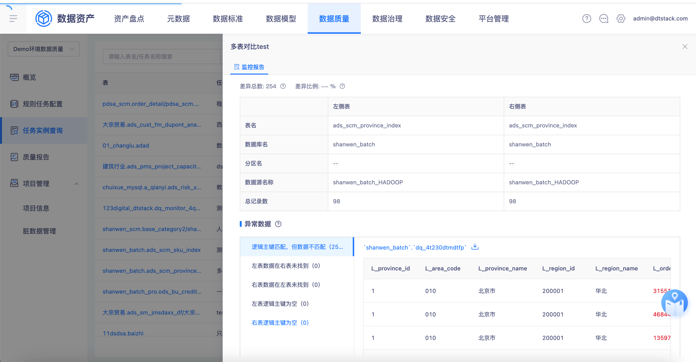
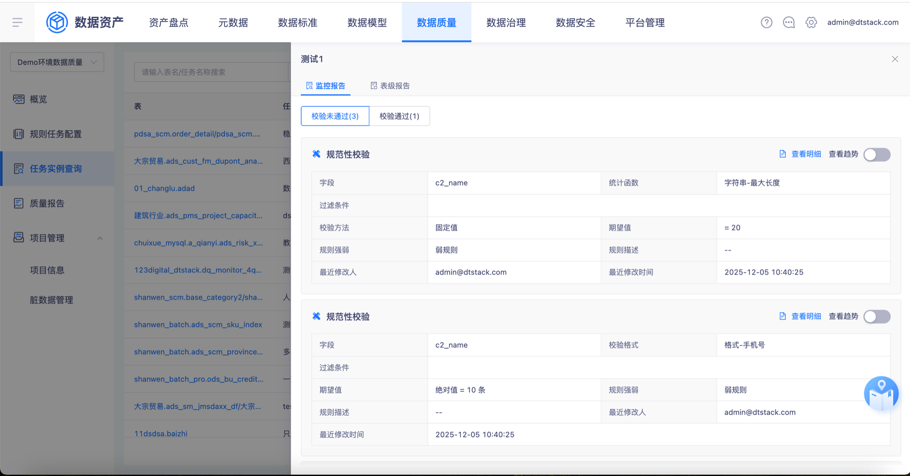
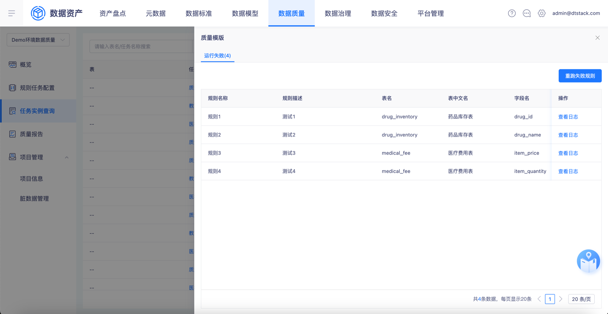
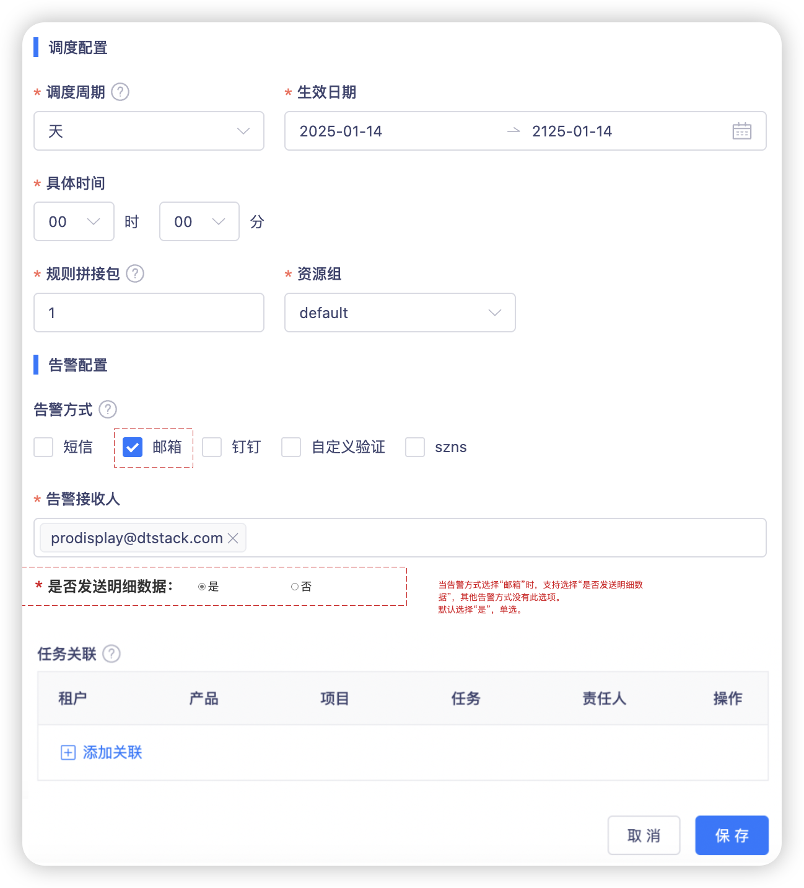

【数据质量】质量校验不通过时支持发送邮件，邮件信息需要包含未通过的明细数据

## 开发版本
>6.3东风商用车定制化分支

## 需求内容
>当质量任务实例校验不通过时，若开启了脏数据存储，且配置了告警接受方式为邮箱，则邮件内容附件形式发送不符合规则的明细数据。支持在告警配置时设置是否发送明细数据。

### 单表规则
> 将校验未通过的规则的明细数据以附件形式发送至告警接受人邮箱，一个校验子规则生成一个excel表格，命名为“规则类型_字段/表名_统计函数/校验格式”，多个明细数据表表格合并为一个zip包，zip包命名为“不符合规则的明细数据”

### 多表规则
> 将校验未通过的规则的明细数据以附件形式发送至告警接受人邮箱，多表有五类异常数据，每类异常数据生成一份excel表格，命名为“逻辑主键匹配，但数据不匹配/…”，用类型名称命名，多个明细数据表表格合并为一个zip包，zip包命名为“不符合规则的明细数据”

### 规则集
> 将校验未通过的规则的明细数据以附件形式发送至告警接受人邮箱，每个规则异常数据生成一份excel表格，命名为“XXXX(规则名称)”，用规则名称命名，多个明细数据表表格合并为一个zip包，zip包命名为“不符合规则的明细数据”

### 告警设置
涉及到质量模块所有配置调度的地方都需要调整，包括多表、单表、规则集的规则新增、编辑调度。

当告警方式选择“邮箱”时，支持选择“是否发送明细数据”，其他告警方式没有此选项。
默认选择“是”，单选。